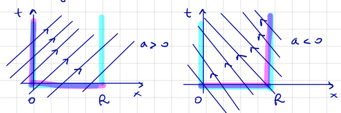

# 4.1 The transport equation

An equation of the type

$$u_t + (q \circ u)_x = 0, \quad x \in \R, \ t > 0$$

where $u = u(x, t)$ represents density (or concentration) of a physical quantity $Q$.
The incoming flux density $q \circ u$ of $Q$ is called a conservation law:

> The rate of variation of $Q$ in $(x, x + \Delta x)$ equals the flux of $Q$ through
> $x$ and $x + \Delta x$.

It expresses the conservation of $Q$ and can be written as a formula as

$$\frac{d}{dt} \int_x^{x + \Delta x} u(y, t) \, dy = q\circ u(x, t) - q\circ u(x + \Delta x, t).$$

Assuming $u, q$ are smooth, we may divide by $\Delta x$ and take the limit $\Delta x \to 0$ to
obtain

$$u_t = -(q \circ u)_x.$$

Depending on $q$, we obtain different scalar conservation laws. The simplest one is the
transport equation $q(u) = v \cdot u$ with $v \neq 0$ constant:

$$u_t + v u_x = 0.$$

This equation expresses the transportation of fluid in a river flowing with velocity $v$
along the $x$-axis. Without loss of generality, we may assume $v > 0$. Further, let
$\bm v = v e_1 + e_2$. Then we can express the equation in vector form as

$$\nabla u \cdot \bm v = 0.$$

So the gradient of $u$ is orthogonal to $\bm v$. It is also orthogonal to the level lines of
$u$. Thus, the level lines are parallel to $\bm v$. The family of straight lines
$x = vt + x_0$ is the lines of which $u$ is constant and are called characteristics.
Thus, assuming we know the initial profile

$$u(x, 0) = g(x),$$

we can determine $u$ by following the characteristics. First, we determine $x_0 = x_0(x, t)$
as a function of $x, t$ such that $x_0$ belongs to the characteristic passing through
$(x, t)$. This is clearly $x_o = x - v t$. Thus, the solution is

$$u(x, t) = u(x_0, 0) = g(x - v t).$$

The solution is therefore a progressive wave moving with velocity $v$ along the $x$-axis.

## The case of a distributed source

Assume additionally that $f(x, t)$ is a distributed source for $Q$:

$$
(P) \quad \begin{cases}
    u_t + v u_x = f \\
    u(x, 0) = g(x).
\end{cases}
$$

To compute $u(\overline{x}, \overline{t})$, consider the function $w(t):=u(x_0 + vt, t)$. In this case, $u$ is
not constant along $(x_0 + vt, t)$ and $w(t)$ solves

$$
\begin{cases}
    w'(t) = v u_x(x_0 + vt, t) + u_t(x_0 + vt, t) = f(x_0 + vt, t), \\
    w(0) = u(x_0, 0) = g(x_0).
\end{cases}
$$

So $w(\overline{t}) = g(x_0) + \int_0^{\overline{t}} f(x_0 + vs, s) \, ds$. Again, following the line
$x_0 = \overline{x} - v\overline{t}$, we obtain

$$u(\overline{x}, \overline{t}) = w(\overline{t}) = g(\overline{x} - v\overline{t}) + \int_0^{\overline{t}} f(\overline{x} - v(\overline{t} - s), s) \, ds. \quad (*)$$

If $f, g$, are regular enough, then $(*)$ is a solution of $(P)$. We can summarize this in
the following theorem:

???+ theorem "Theorem 4.1"
    $\begin{align*}
        \text{Let } & g \in C^1(\R) \\
        & f, f_x \in C(\R \times [0, \infty))
    \end{align*}$

    Then, $(P)$ has the unique solution

    $$u(x,t) = g(x - vt) + \int_0^t f(x - v(t - s), s) \, ds.$$

    ??? proof
        === "Uniqueness"
            Assume there exists $w$ solving $(P)$. Then, $h := u - w$ solves

            $$
            \left\{\begin{align*}
                h_t + v h_x &= 0, \\
                h(x, 0) &= 0.
            \end{align*}\right.
            $$

            Then, by the method of characteristics, we have $h=0$, so $w=u$.

        === "Solution"
            This can easilly be verified by the reader.

## The case of a localized source

Consider a source localized at $x = 0$ turned on at time $t = 0$:

$$\H(t) = \begin{cases}
    1, & t \ge 0, \\
    0, & t < 0.
\end{cases}$$

We want to solve

$$
\left\{\begin{align*}
    u_t + v u_x &= 0 \\
    u(x, 0) &= 0, & x > 0 \\
    u(0, t) &= \beta \H(t), & t \in \R.
\end{align*}\right.
$$

By the method of characteristics, we have

$$u(x, t) = u_0(x - vt).$$

Observe that $u_0(-vt) = \beta \H(t)$, so

$$u(x, t) = \beta \H\left(t - \frac{x}{v}\right).$$

## Inflow and Outflow characteristics

Where should we assign the boundary data? The initial/boundary data is "transported" along
the characteristics, and we need to cover the whole domain. Consider the transport equation
$u_t + a u_x = 0$:

The problem can be solved in $(0, R) \times (0, \infty)$ if we assign data on the inflow
boundaries:

$$
\begin{align*}
(0, R) \times \{t=0\} &\cup \{x=0\} \times (0, \infty) &\quad a > 0, \\
(0, R) \times \{t=0\} &\cup \{x=R\} \times (0, \infty) &\quad a < 0.
\end{align*}
$$

## Stability

Consider the Cauchy/Dirichlet priblem for the linear transport equation (a > 0):

$$
(P) \quad \left\{\begin{align*}
    u_t + a u_x &= 0, && (x, t) \in (0, R) \times (0, \infty), \\
    u(0, t) &= h(t), && t > 0, \\
    u(x, 0) &= g(x), && x \in (0, R).
\end{align*}\right.
$$

We have the following estimate:

??? proof "Claim: $\bm{\int_0^R u^2(x, t)\, dx \le \int_0^R g^2(x)\, dx + a \int_0^t h^2(s)\, ds}$"
    $$
    \begin{align*}
        0 = u u_t + a u u_t &= \frac{1}{2} \frac{d}{dt} u^2 + \frac{a}{2} \frac{d}{dt} u^2 \\
        \implies 0 &= \frac{d}{dt} \int_0^R u^2(x, t) \, dx + a \Big(u^2(R, t) - u^2(0, t)\Big) \\
        \frac{d}{dt} \int_0^R u^2(x, t) \, dx &= a h^2(t) - a u^2(R, t) \le a h^2(t) \\
        \int_0^R u^2(x, t) \, dx - \int_0^R g^2(x) \, dx &\le a \int_0^t h^2(s) \, ds.
    \end{align*}
    $$
    
Consider $u_1, u_2$ solving $(P)$ with $g_1, h_1$ and $g_2, h_2$ as initial/boundary data.
Then, we have the bound

$$\int_0^R (u_1 - u_2)^2(x, t) \, dx \le \int_0^R (g_1 - g_2)^2(x) \, dx + a \int_0^t (h_1 - h_2)^2(s) \, ds.$$

which is the $L^2$-distance between the solutions, so the solutions depends continuously on
the initial/boundary data.