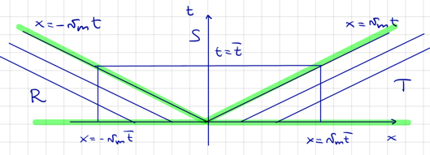

# 4.2 An example from traffic dynamics

table with 2 columns and 3 rows:

|                           |              |
|---------------------------|--------------|
| (Linear) density of autos | $\rho(x,t)$  |
| Average velocity          | $v(x, t)$    |
| Flux of autos             | $q = v \rho$ |

Assumptions:

1. There is only one lane. (No overtaking.)
2. There is no source or sink of cars.
3. The velocity depends on the density of cars $v(\rho)$.

We expect to slow down in large traffic: $v'(\rho) \le 0$.

$$\rho_t + q(\rho)_x = 0 \quad (E)$$

## A model for v(ρ)

We consider the case

$$v(\rho) = v_m \left(1 - \frac{\rho}{\rho_m}\right)$$

where $v_m$ is the maximum velocity and $\rho_m$ is the maximum density. This yields

$$(q \circ \rho)_x = q1(\rho) \rho_x = v_m \left(1 - \frac{2\rho}{\rho_m}\right) \rho_x.$$

Then, the transport equation becomes

$$\rho_t + v_m \left(1 - \frac{2\rho}{\rho_m}\right) \rho_x = 0 \quad (E).$$

This is non-linear in $\rho$ $(\rho \to \rho \rho_x)$, but linear in $\rho_x$
($\rho_x \to \rho \rho_x$). Hence, $(E)$ is quasi-linear. Note that
$q''(\rho) = -2 \frac{v_m}{\rho_m} < 0$, so the flux is concave. We consider the Cauchy
problem

$$
(CP) \quad \left\{\begin{align*}
    \rho_t + v_m \left(1 - \frac{2\rho}{\rho_m}\right) \rho_x &= 0 \\
    \rho(x, 0) &= g(x)
\end{align*}\right.
$$

## Characteristics

Let $x = x(t)$ be the curve such that $\rho(x(t), t) = \rho(x_0, 0) = g(x_0)$ is constant.

??? proof "Claim: $\bm{x(t) = x_0 + tq'(g(x_0))}$"
    We have

    $$\frac{d}{dt} \rho\Big(x(t), t\Big) = 0 
    \iff \rho_x\Big(x(t), t\Big) \frac{dx}{dt} + \rho_t\Big(x(t), t\Big) = 0. \quad (1)$$

    Expanding $(E)$ along the curve, we have

    $$\rho_t\Big(x(t), t\Big) + q'\Big(g(x_0)\Big) \rho_x\Big(x(t), t\Big) = 0$$

    Then, inserting $(1)$, we get

    $$\rho_x\Big(x(t), t\Big) \left(\frac{dx}{dt} - q'\Big(g(x_0)\Big)\right) = 0.$$

    Now, assuming $\rho_x\Big(x(t), t\Big) \neq 0$, we get

    $$\frac{d}{dt}x(t) = q'\Big(g(x_0)\Big)$$

    which yields the claim.

So, the characteristics are straight lines with slope $q'(g(x_0))$. Thus, these slopes
may vary. By the method of characteristics, we get

$$\rho(x, t) = g\Big(x - t q'\big(g(x_0)\big)\Big).$$

Again, we have a progressive wave moving with velocity $q'(g(x_0))$ along the $x$-axis.

???+ remark
    Note that $\rho = q(x - tg'(\rho))$ and that $q'(g(x_0))$ is not the traffic velocity,
    but the velocity of the propagating wave

    $$\frac{dq}{d\rho} = \frac{d}{d\rho} (\rho v) = v + \rho \frac{dv}{d\rho} \le v.$$

???+ remark
    Moreover, in our model, we have

    $$g'(\rho) = v_m \left(1 - \frac{2\rho}{\rho_m}\right) < 0 \quad\text{ for }
    \begin{cases}
        v_m > 0 \\
        \rho > \frac{\rho_m}{2}
    \end{cases}
    $$

    so the propagation velocity may be negative, while the velocity is always positive:

    $$v(\rho) = v_m \left(1 - \frac{\rho}{\rho_m}\right) \ge 0.$$

## Queuing at the traffic light

We have 

- Red light at $x=0$
- Queue at $x<0$
- No cars at $x>0$.

This yields the initial condition

$$g(x) =
\begin{cases}
    \rho_m & x < 0 \\
    0 & x > 0.
\end{cases}
$$

At $t=0$, the light turns green. We have the slopes

$$q'(\rho) = v_m \left(1 - \frac{2\rho}{\rho_m}\right) \implies q'(g(x_0)) =
\begin{cases}
    -v_m & x_0 < 0 \\
    v_m & x_0 > 0.
\end{cases}
$$

and characteristics

$$x =
\begin{cases}
    x_0 - v_m t & x_0 < 0 \\
    x_0 + v_m t & x_0 > 0.
\end{cases}
$$

We get the density

$$\rho(x, t) = 
\begin{cases}
    \rho_m & (x, t) \in R \\
    0 & (x, t) \in T
\end{cases}
$$

where

$$R = \{(x, t) \in \R \times [0, \infty) \mid x < -v_m t\}$$

is the times and positions where no cars have moved yet, and

$$T = \{(x, t) \in \R \times [0, \infty) \mid x > v_m t\}$$

is the times and positions where no cars have yet arrived. So the signal propagates left
with velocity $v_m$. In the region $S$, there is no characteristic because of the
discontinuity in the initial condition. To solve this, we regularize this discontinuity,
follow the characteristics, and send the regularization to zero.

??? proof "Claim: $\bm{\rho(x, t) = \frac{\rho_m}{2} \left(1 - \frac{x}{v_m t}\right)}$ in $\bm S$"
    **Step 1:** Regularize the initial condition:

    Define the regularized initial condition $g_\varepsilon$ as

    $$g_\varepsilon(x) :=
    \begin{cases}
        \rho_m & x \le 0 \\
        \rho_m (1-x/\varepsilon) & 0 < x < \varepsilon \\
        0 & x \ge \varepsilon.
    \end{cases}
    $$

    Then, $g_\varepsilon$ converges pointwise to $g$. The $\varepsilon$-characteristics are

    $$
    x = \begin{cases}
        x_0 - v_m t & x_0 \le 0 \\
        x_0 - v_m t \left(1 - \frac{2x_0}{\varepsilon}\right) & 0 < x_0 < \varepsilon \\
        x_0 + v_m t & x_0 \ge \varepsilon.
    \end{cases}
    $$

    **Step 2:** Solve the regularized problem:

    For $x \in [0, \varepsilon)$, we have

    $$x_0 = \varepsilon \frac{x+v_mt}{2v_mt + \varepsilon}.$$

    Following the characteristics, we get

    $$\rho_\varepsilon(x, t) = g_\varepsilon(x_0) = \rho_m \left(1 - \frac{x+v_mt}{2v_mt + \varepsilon}\right).$$

    For all other $x$, we have the usual characteristics and solution.

    **Step 3:** Send $\varepsilon \to 0$:

    $$\rho(x, t) = \lim_{\varepsilon \to 0} \rho_\varepsilon(x, t) =
    \begin{cases}
        \rho_m & (x, t) \in R \\
        \frac{\rho_m}{2} \left(1 - \frac{x}{v_m t}\right) & (x, t) \in S \\
        0 & (x, t) \in T.
    \end{cases}
    $$

    So in $S$, we have the charachteristics $x = ht$ for $h \in (-v_m, v_m)$.
    
Note that $\frac{1}{2}\rho_m\left(1-\frac{x}{v_m t}\right) = (q')^{-1}(x/t)$ in our model.
This holds in general for any $q$.