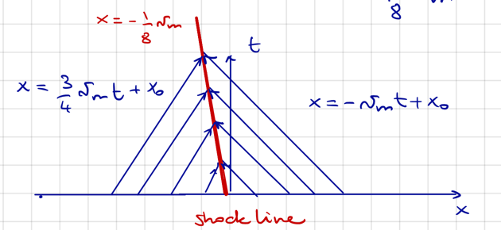

# 4.3 Example of shockwave

???+ example
    Assume the initial data to be
    
    $$g(x) = \begin{cases}
        \frac{1}{8} \rho_m, & x < 0, \\
        \rho_m, & x > 0,
    \end{cases}$$
    
    So for $x>0$, cars are stuck, and $x<0$, cars are moving at a velocity
    $v=v_m \left(1-\frac{\frac{1}{8}\rho}{\rho_m}\right) = \frac{7}{8} v_m$. Then, as we will see,
    there will be a collision. With this initial condition, we have
    
    $$q'(g(x_o)) = \begin{cases}
        \frac{3}{4} v_m , & x_o < 0, \\
        -v_m, & x_o > 0.
    \end{cases}$$
    
    This results in the characteristics
    
    $$x = \begin{cases}
        \frac{3}{4} v_m t + x_o, & x_o < 0, \\
        -v_m t + x_o, & x_o > 0.
    \end{cases}$$

The characteristics in the example intersect, so a solution will have jump discontinuity. In the derivation of
the conservation law, we assumed regularity. Allowing jumps forces us to review the consept of
solutions. Let us start again from

$$\frac{d}{dt} \int_{x_1}^{x_2} \rho(x,t) dx = q(\rho(x_1, t)) - q(\rho(x_2, t)) \quad \forall x_1, x_2$$

and assume that $\rho$ might have a jump singularity along the curve $x = s(t)$ for all
$t\in[t_1, t2]$. We call this the **collision/shock line**. Further, assume that $\rho(x,t)$
is $C^1$ for all $(x, t) : x \neq s(t)$ and $s \in C^1(t_1, t_2)$. Then, we can write

$$\frac{d}{dt}\left\{ \int_{x_1}^{s(t)} \rho(x,t) dx + \int_{s(t)}^{x_2} \rho(x,t) dx \right\} = q(\rho(x_1, t)) - q(\rho(x_2, t))$$

For the first segment $[x_1, s(t)]$, we have

$$\frac{d}{dt} \int_{x_1}^{s(t)} \rho(x,t) dx = \int_{x_1}^{s(t)} \rho_t(x,t) dx +
\lim_{x \to s(t)^-} \rho(x,t) \dot s(t)$$

and similarly for the second segment. Further, we have

$$\lim_{x \to s(t)^\pm} \rho(x,t) = \rho^\pm(s(t), t)$$

and end up with

$$\int_{x_1}^{x_2} \rho_t(x,t) dx + \left[\rho^-(s(t), t) - \rho^+(s(t), t)\right] \dot s(t)
= q(\rho(x_1, t)) - q(\rho(x_2, t))$$

Now, taking the limits $x_1 \to s(t)^-$ and $x_2 \to s(t)^+$, we get the **Rankine-Hugoniot
condition**:

$$\Big(\rho^-(s(t), t) - \rho^+(s(t), t)\Big) \dot s(t) = q\Big(\rho^-(s(t), t)\Big) - q\Big(\rho^+(s(t), t)\Big)$$

Denote these differences as $[\rho]^+_-$ and $[q \circ \rho]^+_-$, respectively. Then, we
can express the Rankine-Hugoniot condition as

$$\dot s(t) = \frac{[q \circ \rho]^+_-}{[\rho]^+_-}$$

As solution satisfying the Rankine-Hugoniot condition is called a **shock wave**.

???+ example
    In the case above, we have $\rho^+ = \rho_m$, $\rho^- = \frac{1}{8}\rho_m$,
    $q \circ \rho^+ = 0$, and $q \circ \rho^- = \frac{7}{64} v_m$. This gives us
    
    $$\dot s(t) = \frac{q\circ \rho^+ - q\circ \rho^-}{\rho^+ - \rho^-} = -\frac{7}{8} v_m$$

    Together with $s(0) = 0$, we get the shock wave $x = s(t) = -\frac{7}{8} v_m t$.

    

    