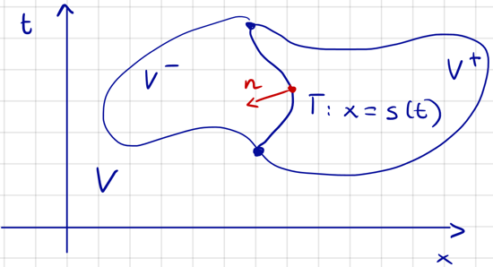

# 4.6 Rankine-Hugoniot (R-H) Condition

Consider an open subset $V \subseteq \R \times (0, \infty)$ and let $\Gamma$ be a
regular curve dividing $V$ into two regions, $V^+, V^-$.

Assume $u$ to be a weak solution of class $C^1$ in $\overline V^+$ and $\overline V^-$ having a
jump discontinuity at $\Gamma$. In $V^\pm$, $u$ is a classical solution of

$$u_t + q(u)_x = 0.$$

Consider a test function $v$ with support in $V$ overlapping $\Gamma$. By the definition of the
weak solution, we have

$$0 = \int_0^\infty \int_\R [u v_t + q(u) v_x] \, dx \, dt =
\int_{V^+} [u v_t + q(u) v_x] +
\int_{V^-} [u v_t + q(u) v_x] \quad (1)$$

Additionally, by stokes theorem, we have

$$
\begin{align*}
    \int_{V^\pm} [u v_t + q(u) v_x]
    &= \int_{V^\pm} [u_t + q(u)_x] v
    \pm \int_\Gamma [u^\pm n_2 + q(u^\pm) n_1] v \\
    &= \pm \int_\Gamma [u^\pm n_2 + q(u^\pm) n_1] v & (2)
\end{align*}
$$

Inserting $(2)$ into $(1)$, we get

$$0 = \int_\Gamma \Big([q(u^+) - q(u^-)]n_1 + [u^+ - u^-]n_2\Big) v$$

so $[q(u^+) - q(u^-)]n_1 + [u^+ - u^-]n_2 = 0$ on $\Gamma \quad(4)$. If $x=s(t)$ with
$s \in C^1[0, T]$ parametrizes $\Gamma$, we get the normal vector

$$n = \frac{1}{\sqrt{1 + s'(t)^2}} (-1, s'(t))$$

and $(4)$ becomes

$$s'(t) = \frac{q(u^+(s(t), t)) - q(u^-(s(t), t))}{u^+(s(t), t) - u^-(s(t), t)}$$

Thus, the weak solutions satisfy R-H, so it is a shock wave. the converse can also be shown.
Similarly for rarefaction waves.
