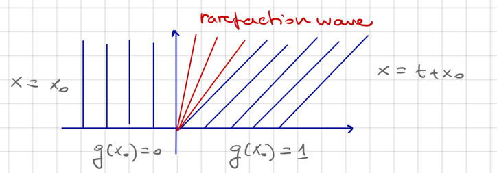
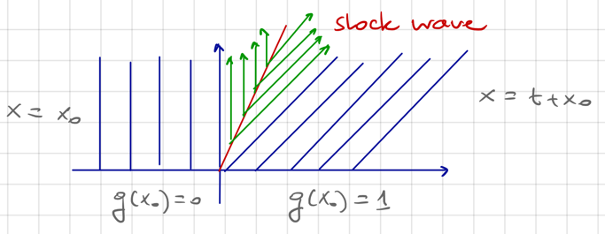

# 4.7 Entropy condition and the Riemann problem

??? example
    Consider a flux of particles, each of constant velocity along the x-axis. Denote by
    $u = u(x, t)$ the velocity of the particle at $(x, t)$. From a Lagrangian point of view,
    we may consider $x = x(t)$ the position of a particle at time $t$. Then, we get the
    velocity $\dot x = u(x(t), t)$. Since we assume constant velocity, we have

    $$0 = \frac{d}{dt} \dot x(t) = u_x u + u_t$$

    which is equivalent to

    $$u_t + \left(\frac{1}{2}u^2\right)_x = 0$$

    This is the **Burgers' equation** and corresponds to a conservation law with quadratic
    nonlinearity $q(u) = \frac{1}{2}u^2$. Now, conisder

    $$
    \left\{\begin{align*}
        u_t + \left(\frac{1}{2}u^2\right)_x &= 0 \\
        u(x, 0) &= g(x)
    \end{align*}\right.
    $$

    with $g = \H$ the Heaviside function. Then, the characteristics are the straight lines

    $$x = q'(g(x_0))t + x_0 = 
    \begin{cases}
        x_0, & x_0 < 0 \\
        x_0 + t, & x_0 > 0
    \end{cases}
    $$

    **Rarefaction wave**

    The solution in the form of a rarefaction wave is

    $$
    u_1(x, t) = \begin{cases}
        0, & x \le 0 \\
        x/t, & 0 < x < t \\
        1, & x \ge t
    \end{cases}
    $$

    which is a weak solution.

    

    **Shock wave**

    We can also construct another solution in the form of a shock wave. Since $u^- = 0$,
    $U^+ = 1$, $q(u^-) = 0$, and $q(u^+) = \frac{1}{2}$, R-H gives

    $$s'(t) = \frac{[q \circ u]^+_-}{[u]^+_-} = \frac{1}{2}$$

    Together with $s(0) = 0$, we get $s(t) = \frac{1}{2}t$.

    

    The function $u_2(x, t) = \H(t/2 - x)$ is another weak solution in the form of a shock
    wave.

The above example shows the possible non-uniqueness of weak solutions to the transport
equation. To find a criterion to select among the possible weak solutions, we now assume

$$g' > 0, \quad q'' \ge q''_\min > 0 \quad (1)$$

In this case, we have shown the existence of a unique classical solution, which by the
implicit function theorem satisfies

$$u_x(x, t) = \frac{g'(x - q(u) t)}{1 + tq''(u) g'(x - q'(u) t)} \overset{(1)}{\le}
\frac{1}{t q''(u)} \le \frac{E}{t}$$

where we set $E := \frac{1}{q''_\min} > 0$. This gives a decay rate for $u_x(x, t)$. By the
Lagrange mean value theorem, we have

$$u(x+z, t) - u(x, t) = u_x(\xi, t)z \le \frac{E}{t} z \quad\quad (EC)$$

This **entropy condition** does not require $u$ to be regular and can be checked also for
weak solutions. If $u$ is a weak soultion of $\href{../5_weaker_def#cp}{(CP)}$ which satisfy
$(EC)$, the function

$$x \mapsto u(x, t) - \frac{E}{t} x \overset{(EC)}{\le} u(o, t)$$

is non-decreasing by $(1)$. Thus, at a discontinuity point $(x, t)$ for $u$, we have

$$u^+(x, t) < u^-(x, t)$$

Assume $q$ to be strictly convex. Then, we have

$$q'(u^+) < \frac{q(u^+) - q(u^-)}{u^+ - u^-} < q'(u^-)$$

Using the R-H condition, we further get the **entropy inequality**

$$q'(u^+)  < \dot s < q'(u^-)$$

???+ example
    We go back to the Burgers' equation

    $$
    \left\{\begin{align*}
        u_t + \left(\frac{1}{2}u^2\right)_x &= 0 \\
        u(x, 0) &= g(x)
    \end{align*}\right.
    $$

    with $g = \H$. Such a shock wave solution is called a non-physical shock as it is not
    an entropy solution.

???+ theorem
    $\begin{align*}
        \text{Let } & q \in C^2(\R) \text{ be convex (or concave)} \\
        & g \in L^\infty(\R) \\
        & \Omega := \R \times (0, \infty)
    \end{align*}$

    Then, $\exists!u$ weak solution of $\href{../5_weaker_def#cp}{(CP)}$ wich satisfies
    $(EC)$.

We apply the theorem to solve the case

$$g(x) =
\begin{cases}
    u^+, & x > 0 \\
    u^-, & x < 0
\end{cases}
$$

which is called the **Riemann problem**.

???+ theorem
    $\begin{align*}
        \text{Let } & q \in C^2(\R) \text{ be strictly convex s.t.} \\
        & q'' \ge h > 0
    \end{align*}$

    ---

    If $u^+ < u^-$, the unique weak solution satisfying $(EC)$ is the shock wave

    $$u(x, t) = \begin{cases}
        u^-, & x < s(t) \\
        u^+, & x > s(t)
    \end{cases}$$

    where $s(t) = \frac{q(u^+) - q(u^-)}{u^+ - u^-}t$.

    ---

    If $u^+ > u^-$, the unique weak solution satisfying $(EC)$ is the rarefaction wave

    $$u(x, t) = \begin{cases}
        u^-, & \frac{x}{t} < q'(u^-) \\
        (q')^{-1}\left(\frac{x}{t}\right), & q'(u^-) < \frac{x}{t} < q'(u^+) \\
        u^+, & \frac{x}{t} > q'(u^+)
    \end{cases}$$
    