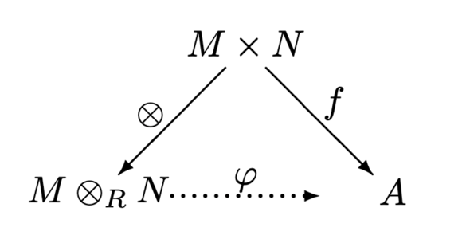
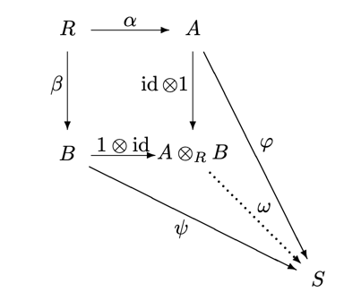

# 6 Tensor product

$R$ may not be commutative.

??? definition "Definition: Right Module"
    A **right module** over a ring $R$ is an abelian group $M$ with a map $M \times R \to M$ such that
    - $(m + n)r = mr + nr$
    - $m(r + s) = mr + ms$
    - $(mr)s = m(rs)$
    - $m1 = m$

??? example "Example: Right-module"
    The row vectors $K^{1\times N}$ is a right $K^{N\times N}$-module.

??? definition "Definition 6.1"
    ## Tensor prouct

    $\begin{align*}
        \text{Let } & M \text{ be a right module} \\
        & N \text{ be a left module} \\
    \end{align*}$

    **Balanced map**
    Define a map $f: M \times N \to P$ to be **balanced** if

    $$
    \begin{align*}
        f(m + m', n) &= f(m, n) + f(m', n) \\
        f(m, n + n') &= f(m, n) + f(m, n') \\
        f(mr, n) &= f(m, rn)
    \end{align*}
    $$

    for all $m, m' \in M$, $n, n' \in N$, $r \in R$.

    **Tensor product**

    The tensor product of $M$ and $N$ is the abelian group $M \otimes_R N$ with a
    balanced map $\otimes: M \times N \to M \otimes_R N$ such that for any balanced map
    $f: M \times N \to P$, there exists a unique group homomorphism $\phi: M \otimes_R N \to P$ such
    that $f = \phi \circ \otimes$.

    

??? proposition "Poposition 6.2"
    Let $M \otimes_R N$ and $M \otimes_R' N$ be tensor products.

    $$
    \begin{align*}
        \implies \exists!\ \phi & \text{ group homomorphism such that } \\
        \phi&(m \otimes n) = m \otimes' n
    \end{align*}
    $$

??? theorem "Theorem 6.3"
    ## Existence of a tensor product

    Let $M$ be a right $R$-module and $N$ be a left $R$-module.

    $\begin{align*}
        \text{Let } & M \text{ be a right } R \text{-module} \\
        & N \text{ be a left } R \text{-module} \\
    \end{align*}$

    Then $M \otimes_R N$ exists and is unique up to isomorphism.

    ??? proof
        $\begin{align*}
            \text{Let } & S \text{ be any set} \\
            & s \in S \\
            & b_s = \delta_{s,t} \in \Z^S \\
        \end{align*}$

        Then, $b_s$ is a basis of

        $$ \operatorname{Free} (S) := (b_s | s \in S) \subseteq \Z^S$$

        Let $G:=\operatorname{Free} (M \times N)$ with basis $b_{m, n}$, and let $H \subseteq G$ be the subgroup generated by

        $$ \begin{align*}
            & b_{m + m', n} - b_{m, n} - b_{m', n} \\
            & b_{m, n + n'} - b_{m, n} - b_{m, n'} \\
            & b_{mr, n} - b_{m, rn}
        \end{align*}$$

        Moreover, set $M \otimes_R N := G/H$ with

        $$
        \begin{align*}
            \otimes: M \times N &\to G/H \\
            (m, n) &\mapsto b_{m, n} + H
        \end{align*}
        $$

        It follows from the generators of $H$ that $\otimes$ is balanced.
 
        ??? proof "Claim: the universal property holds"
            Let $A$ ba an abelian group and $f : M \otimes_R N \to A$ be a balanced map.
            === "Uniqueness"
                For $\phi \circ \otimes = f$ to hold, we need
        
                $$\phi(b_{m, n} + H) = \phi(m \otimes n) = f(m \otimes n)$$
                
                Therefore, $\phi$ is uniquely determined by $f$.

            === "Existence"

                $\begin{align*}
                    \text{Define } \Phi : G &\to A \\
                    b_{m, n} &\mapsto f(m, n)
                \end{align*}$

                $\implies H \subseteq \Ker \Phi$ since $f$ is balanced.

                Then, define

                $$
                \begin{align*}
                    \phi: G/H &\to A \\
                    g + H &\mapsto \Phi(g)
                \end{align*}
                $$

                which is well-defined.

            ...

??? example "Example 6.4"
    $\begin{align*}
        \text{Let } & R = \Z \\
        & M = \Q \\
        & N = \Z/(m)
    \end{align*}$

    Then, $M \otimes_R N = \{0\}$.

    ??? proof
        Let $a \in \Q$ and $b \in \Z/(m)$.

        $$
        \begin{align*}
            a \otimes b &= \frac{a}{m}m \otimes \overline{b} \\
            &= \frac{a}{m} \otimes m\overline{b} \\
            &= \frac{a}{m} \otimes \overline 0 \\
            &= \overline 0
        \end{align*}
        $$

        Therefore, $M \otimes_R N = \{0\}$.

??? proposition "Proposition 6.5"
    ## Distributive law

    $\begin{align*}
        \text{Let } & M \text{ be a right } R \text{-module} \\
        & N_1, N_2 \text{ be left } R \text{-modules}
    \end{align*}$

    $$M \otimes_R (N_1 \oplus N_2) \cong (M \otimes_R N_1) \oplus (M \otimes_R N_2)$$

    ??? proof
        The gist of the prof is as follows:

        The map

        $$
        \begin{align*}
            M \otimes_R (N_1 \oplus N_2) &\to (M \otimes_R N_1) \oplus (M \otimes_R N_2) \\
            (m, n_1 + n_2) &\mapsto (m, n_1) + (m, n_2)
        \end{align*}
        $$

        is balanced. Then, using the universal property, we obtain a homomorphism.

        ...

??? definition "Definition: Bimodules"
    Let $R, S$ be rings. An **$R$-$S$-bimodule** is an abelian group $M$ such that

    - $M$ is a left $R$-module
    - $M$ is a right $S$-module

    such that

    $$(mr)s = m(rs)$$

    **Properties**

    $\begin{align*}
        \text{Let } & M \text{ be an } R-S \text{-bimodule} \\
        & N \text{ be a left } S \text{-module} \\
    \end{align*}$

    By the universal property, we have a unique homomorphism

    $$\phi_a: M \otimes_S N \to M \otimes_S N$$

    sedning every pure tensor $m \otimes n$ to $am \otimes n$ for every $a\in R$.

    Then, for $a, b \in R$, we have

    $$
    \begin{align*}
        \phi_{a+b} &= \phi_a + \phi_b \\
        \phi_{ab} &= \phi_a \circ \phi_b
    \end{align*}
    $$

    Thus, if we define $at:=\phi_a(t)$ for $t\in M \otimes_S N$, we
    we get that $M \otimes_S N$ is a left $R$-module.

    Similarly, we can define a right $R$-module structure on $M \otimes_S N$ if $M$
    is a right $R$-module and $N$ is an $R$-$S$-bimodule.

??? example "Example: Base change"
    Let $A$ be an $R$-algebra. Then, $A$ is an $A$-$R$-bimodule.

    For a left $R$-module $M$, $A \otimes_R M$ becomes a left $A$-module.

??? example
    $\C \otimes V$ is the complexification of a real vector space $V$.

??? example
    $\begin{align*}
        \text{Let } & R \text{ be a commutative ring} \\
        & M, N \text{ be } R \text{-modules}
    \end{align*}$

    Then $M \otimes_R N$ is an $R$-module and $\otimes$ is $R$-bilinear.

??? proposition "Proposition: Rules"
    - $R \otimes_R N \cong N$
    - $M \otimes_R R \cong M$
    - $R^n \otimes_R N \cong {\large\otimes}_{i=1}^n N =: N^{\otimes n}$
    - $R^n \otimes_R R^m \cong R^{nm}$
    - $A \otimes_R R^n \cong A^n \cong R^n \otimes_R A$ (base change)

??? proposition "Proposition 6.6"
    ## Distributive law

    $\begin{align*}
        \text{Let } & R, S \text{ be rings} \\
        & L \text{ be a right } R \text{-module} \\
        &M \text{ be an } R\text{-}S \text{-bimodule} \\
        & N \text{ be a left } S \text{-module}
    \end{align*}$

    Then, we have

    $$(L \otimes_R M) \otimes_S N \cong L \otimes_R (M \otimes_S N)$$

    is an isomorpphism of additive groups.

    ??? proof
        Ommitted.

From now on, $R$ will be a commutative ring and $\otimes_R=\otimes$.

??? proposiiton "Proposition 6.6"
    ## Associative law

    Let $M, N$ be $R$-modules.

    $$ \implies M \otimes N \cong N \otimes M$$

    ??? proof
        **Sketch:**

        Use the bilinear map

        $$
        \begin{align*}
            M \times N &\to N \otimes M \\
            (m, n) &\mapsto n \otimes m
        \end{align*}
        $$

        and the universal property.

???+ theorem "Theorem 6.8"
    Let $A, B$ be commutative $R$-algebras with the homomorphisms

    $$
    \begin{align*}
        \alpha: R &\to A \\
        \beta: R &\to B
    \end{align*}
    $$

    === "a)"
        $A \otimes B$ can be made into a commutative ring with the multiplication

        $$(a \otimes b) \cdot (a' \otimes b') := aa' \otimes bb'$$

    === "b)"
        The maps

        $$
        \begin{align*}
            \operatorname{id}_A \otimes 1 : A & \to A \otimes B \\
            a &\mapsto a \otimes 1 \\
            1 \otimes \operatorname{id}_B : B & \to B \otimes A \\
            b &\mapsto 1 \otimes b
        \end{align*}
        $$

        are ring homomorphisms.

        $$\implies A \otimes B \text{ is an } R \text{-algebra}$$

    === "c)"
        **Universal property**

        $\begin{align*}
            \text{Let } & S \text{ be a commutative ring} \\
            & \phi : A \to S \\
            & \psi : B \to S \text{ be ring homomorphisms s.t.} \\
        \end{align*}$

        $$\phi \circ \alpha = \psi \circ \beta$$

        $\implies \exists!\ \omega: A \otimes B \to S$ homomorphism s.t.

        $$
        \begin{align*}
            \omega \circ (\operatorname{id}_A \otimes 1) &= \phi \\
            \omega \circ (1 \otimes \operatorname{id}_B) &= \psi
        \end{align*}
        $$

    

    ???+ proof "Sketch of proof"
        === "a)"
            From the balanced maps
        
            $$
            \begin{align*}
                A \times A \to A \\
                (a, a') &\mapsto aa' \\
                B \times B \to B \\
                (b, b') &\mapsto bb'
            \end{align*}
            $$

            we obtain from the universal property the homomorphisms

            $$
            \begin{align*}
                \mu_A : A \otimes A &\to A \\
                \mu_B : B \otimes B &\to B
            \end{align*}
            $$

            Moreover, from the balanced map

            $$
            \begin{align*}
                (A \otimes A) \times (B \otimes B) &\to A \otimes B \\
                (s, t) &\mapsto \mu_A(s) \otimes \mu_B(t)
            \end{align*}
            $$

            we obtain once more from the universal property the homomorphism

            $$\mu_A \otimes \mu_B : (A \otimes A) \otimes (B \otimes B) \to A \otimes B$$

            Finally, composing these, we obtain

            $$
            \begin{align*}
                (A \otimes A) \otimes (B \otimes B) \overset{\otimes}{\to} (A \otimes B) \otimes (A \otimes B)
                \overunderset{\sim}{\text{P.6.6+P.6.7}}{\to} (A \otimes A) \otimes (B \otimes B)
                \overset{\mu_A \otimes \mu_B}{\to} A \otimes B
            \end{align*}
            $$

            This gives the multiplication on $A \otimes B$. Now, it remains to check the ring axioms.

        === "b)"
            This is somehow clear.

        === "c)"
            === "Uniqueness"
                $$
                \begin{align*}
                    \omega(a \otimes b) &= \omega((a \otimes 1) \cdot (1 \otimes b)) \\
                    &= \omega(a \otimes 1) \cdot \omega(1 \otimes b) \\
                    &= \phi(a) \cdot \psi(b)
                \end{align*}
                $$

            === "Existence"
                The map

                $$
                \begin{align*}
                    A \times B &\to S \\
                    (a, b) &\mapsto \phi(a) \cdot \psi(b)
                \end{align*}
                $$

                is balanced, Thus, by the universal property, we obtain a homomorphism

                $$A \otimes B \to S$$