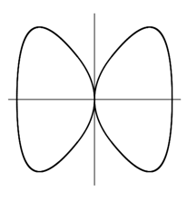

# 11 Rings of dimension 1
## 11.1 Regular Rings and Normal Rings

For a regular local ring $(R, \m)$ of dimension $1$, we know there exists $\pi \in R$ called a
**uniformizing parameter** such that $\m = (\pi).$ Hence, for a nonzero element $a\in R$, we
can write

$$a = u \pi^n$$

for some $u \in R^\times$ and $n \in \N$ uniquely determined by $\pi$. Hence, $R$ is a UFD with
only one prime element. Moreover, for $0 \neq a \in K:=\Quot(R)$, we similarly have the same equality for some
$u \in R^\times$ and $n \in \Z$ uniquely determined by $\pi$. Then, we obtain a map

$$
\begin{align*}
    \nu : K & \to \Z \cup \{\infty\} \\
    a & \mapsto
    \begin{cases}
        n, & a \neq 0 \\
        \infty, & a = 0
    \end{cases}
\end{align*}
$$

This map satisfies

$$
\begin{align*}
    (1) && \nu(a+b) &\ge \min\{\nu(a), \nu(b)\} \\
    (2) && \nu(ab) &= \nu(a) + \nu(b) \\
    (3) && \nu(a) = \infty & \iff a = 0
\end{align*}
$$

and is thus called a (**discrete**) **valuation** on $K$. Additionally, we can obtain
$R = \{a \in K \mid \nu(a) \ge 0\}$ and can be called **discrete valuation ring** (DVR).

??? theorem "Theorem 11.1"
    
    Let $(R, \m)$ be a Noetherian, local ring of dimension $1$.

    $$R \text{ is regular } \iff R \text{ is normal}$$

    ??? proof
        === "$\implies$"
            Follows from [C.10.6](../regular_local_rings/#c106).

        === "$\impliedby$"
            Required to proove: $\m$ is principal.

            From [C.7.9](../../dimensions/principal_ideal_thm/#c79), we get a system of parameters $a\in R$ s.t.

            $$\m = \sqrt{(a)}$$

            For $b\in R\setminus(a)$ we define the **colon ideal**

            $$(a):(b) := \{x\in R \mid xb \in (a)\} \ideal R$$

            As $R$ is Noetherian, we can choose $b$ such that $(a):(b)$ is maximal among all colon ideals.
            
            ??? proof "\Claim: $(a):(b)$ is a prime ideal"
                $\begin{align*}
                    & b \notin (a) \\
                    & \implies (a):(b) \neq R
                \end{align*}$

                Let $x, y \in R\setminus(a):(b)$.

                $\begin{align*}
                    \implies& xb \notin (a) \land (a):(b) \subseteq (a):(xb) \\
                    \overset{\text{max}}{\implies}& (a):(xb) = (a):(b) \\
                    \implies& y \notin (a):(xb) \\
                    \implies& yxb \notin (a) \\
                    \implies& xy \notin (a):(b) \\
                    \implies& (a):(b) \text{ is prime}
                \end{align*}$

            We have that $\m$ is minimal over $(a)$ and thus $\m = (a):(b)$.

            Consider the $R$-module $I:=\frac{b}{a}\m \subseteq K$.
            As $\m = (a):(b)$, we have that $I \subseteq R$, so it is an ideal of $R$.

            ??? proof "\Claim: $I = R$"
                Assume the converse.

                $\begin{align*}
                    \implies& I \subseteq \m \\
                    \implies& \frac{b}{a}\m \subseteq \m \\
                    \implies& \m \text{ is an } R\left[\frac{b}{a}\right]\text{-module}
                \end{align*}$

                $\m$ is finitely generated as an $R$-module.

                $\begin{align*}
                    \implieshref{../../dimensions/integral_extensions/l83}{L.8.3}
                    & \frac{b}{a} \text{ is integral over } R \\
                    \overset{\text{hyp}}{\implies}& \frac{b}{a} \in R \\
                    \implies& b \in (a) & \contradiction
                \end{align*}$

            $\begin{align*}
                \implies& R = \frac{b}{a} \m \\
                \implies& \m = \frac{a}{b} R \\
                \implies & \frac{a}{b} \in R \\
                \implies & \m = \left(\frac{a}{b}\right)
            \end{align*}$

??? remark
    === "(1)"
        Let $S$ be a normal Noetherian ring.

        $$\implieshref{#t111}{T.11.1} S_P \text{ is regular for all } P \in \Spec S \text{ with } \ht(P) \le 1$$

    === "(2)"
        For a normal affine variety $X$ over an algebraically closed field, $X_{\text{sing}} \subseteq X$ has codimension $\ge 2$.

        Moreover, a normal affine curve $X$ is nonsingular.

        If also irreducible we have an equivalence.

        So normalization is the same as desingularization.

??? example "Example 11.2"
    Let $X=\V_{\C^2}(x^4 + y^4 - x^2)$.

    

    By normalizing $A:=\C[X]$, we desingularize $X$. From the Jacobian criterion
    [T.10.8](../regular_local_rings/#t108), we get that $X_{\text{sing}} = \{(0, 0)\}$.
    Then, by [T.11.1](#t111), $A_x$ is normal for all $x \neq (0, 0)$.

    $\begin{align*}
        \implieshref{#t111}{T.11.1}& A_x \text{ is normal } \forall\ x \neq (0, 0) \\
        \implies& \tilde A \subseteq A_x, \quad \forall\ x \neq (0, 0) \\
        \implies& f/g \in \tilde A \text{ satisfies } g(x, y) \neq 0 \quad \forall\ (x, y) \neq (0, 0)
    \end{align*}$

    
## 11.2 Dedekind Domains

??? definition "Definition 11.3"
    $\begin{align*}
        \text{Let } & R \text{ be an integral domain} \\
        & K := \Quot(R)
    \end{align*}$

    ### Fractional ideal

    A **fractional ideal** of $R$ is a nonzero $R$-submodule $I \subseteq K$ s.t.

    $$\exists\ 0 \neq c \in R : \{0\} \neq cI \subseteq R$$

    For $I, J \subseteq K$ fractional ideals, we define

    $$I\cdot J := \left\{\sum_{i=1}^n a_i b_i \mid n \in \N, a_i \in I, b_i \in J\right\}$$

    wich is itself a fractional ideal.
    
    ### Invertible fractional ideal

    A fractional ideal $I$ is called **invertible** if

    $$\exists\ J \subseteq K \text{ f.i. } : I\cdot J = R$$

    We denote $\Cfi(R)$ the group of all invertible fractional ideals. It is abelian.

For a fractional ideal. $I \subseteq K$, we define

$$I^{-1} := \{a \in K \mid aI \subseteq R\}$$

which is itself a fractional ideal. If $I$ is invertible, we get

$$J \subseteq I^{-1} = I^{-1} R = I^{-1} IJ \subseteq R J = J$$

so if the inverse exists, it is $I^{-1}$. Furthermore, for $a\in K^\times$, we have
$(a)_R \cdot (a^{-1})_R = R$, and we obtain a map

$$
\begin{align*}
    \psi: K^\times &\to \Cfi(R) \\
    a &\mapsto (a)_R
\end{align*}
$$

We call $\Cl(R):=\Cfi(R)/\Im \psi$ the **ideal class group** of $R$. This can be nontrivial, as shown in the following example.

??? example "Example 11.4"
    $\begin{align*}
        \text{Let } & R = \Z[\sqrt{-5}] \subseteq \C \\
        & I = (2, 1+\sqrt{-5})_R \\
        & J = (1, \frac{1-\sqrt{-5}}{2})_R
    \end{align*}$

    $$\implies I\cdot J = (2, 1+\sqrt{-5}, 3, 1-\sqrt{-5})_R = R$$

    Hence, $I$ is invertible, but not a principal ideal. This makes $\Cl(R)$ nontrivial.

??? definition "Definition 11.5"
    ### Dedekind Domain

    A Noetherian normal domain of dimension at most $1$ is called a **Dedekind domain**.

??? example "Example 11.6"
    Examples of Dedekind domains:

    - $\Z$ and $\Z[\sqrt{-5}]$
    - Coordinate rings of irreducible, nonsingular curves

??? theorem "Theorem 11.7"
    
    $\begin{align*}
        \text{Let } & R \text{ be a Dedekind domain} \\
        & K := \Quot(R)
    \end{align*}$

    **(a)**

    Every fractional ideal $I \subseteq K$ is invertible.

    ---

    **(b)**

    Every ideal is a finite product of prime ideals. The empty product is defined as $R$.
    The factorizaton is unique up to order.

    ??? proof
        Let $\{0\} \neq P \in \Spec R$. Then, $P$ is maximal and $P^{-1} P \ideal R$ is an ideal.

        $\begin{align*}
            \implieshref{#l118}{L.11.8}& P \subsetneq P^{-1} P \quad (*) \\
            \implies P^{-1} P = R \\
            \implies P \text{ is invertible}
        \end{align*}$

        === "(b)"
            === "Existence"
                Assume the converse, and let $I$ be tha maximal of all ideals that are not a product of prime ideals.
                
                $\begin{align*}
                    & \implies \{0\} \subsetneq I \subsetneq R \\
                    & \implies \exists\ P \in \Spec R : I \subseteq P \\
                    & \implies P^{-1} I \subseteq P^{-1} P = R
                \end{align*}$
    
                $I$ is maximal and $I \subsetneq P^{-1} I$ by [L.11.8](#l118)
    
                $\begin{align*}
                    & \implies \exists P_i \in \Spec R : P^{-1} I = \prod_{i=1}^{r} P_i \\
                    & \implies I = R I = P P^{-1} I = P \prod_{i=1}^{r} P_i \quad \contradiction
                \end{align*}$

            === "Uniqueness"
                Assume there are two factorizations

                $$I = \prod_{i=1}^{r} P_i = \prod_{j=1}^{s} Q_j$$

                Then, uniqueness holds for $r=0$. Assume $r > 0$.

                $\begin{align*}
                    \implies & \prod_{i=1}^{s} Q_i \subseteq P_1 \\
                    \implieshref{../../dimensions/principal_ideal_thm}{T.7.3} &
                    \exists\ j : Q_j \subseteq P_1 \\
                    \implies & Q_j = P_1 \quad \text{as Q is maximal}
                \end{align*}$

                Then, the uniqueness follows by induction.

        === "(a)"
            Let $I \subseteq K$ be a fractional ideal.

            $\begin{align*}
                \implies & \exists\ 0 \neq a \in R : J:=aI \subseteq R \\
                \overset{(b)}{\implies} & J = \prod_{i=1}^{r} P_i \\
                \overset{(*)}{\implies} & \prod_{i=1}^{r} P_i^{-1} \cdot (a) \cdot I = R \\
                \implies & I \text{ is invertible}
            \end{align*}$

??? lemma "Lemma 11.8"
    
    $\begin{align*}
        \text{Let } & R \text{ be a Dedekind domain} \\
        & I \ideal R \\
        & P \in \Spec R
    \end{align*}$

    $$\implies I \subsetneq P^{-1} I$$

    ??? proof
        We have that $1 \in P^{-1}$, so $I \subseteq P^{-1} I$. Morover, $\dim(R) \le 1$.

        $\begin{align*}
            \implies & \dim(R_P) = 1 \\
            \implieshref{#t111}{T.11.1}& R_P \text{ is regular} \\
            \implies & \exists\ \pi : P_P = (\pi)_{R_P}
        \end{align*}$

        Moreover, as $R$ is Noetherian, $P=(a_1, \dots, a_n)_R$ and $\pi^{-1} a_i \in \pi^{-1} P_P = R_P$.

        $\begin{align*}
            & \implies \exists\ u \in R\setminus P : u \pi^{-1} a_i \in R \quad \forall\ i \\
            & \implies\gamma:= u \pi^{-1} \in P^{-1}
        \end{align*}$

        $P$ induces a valuation $\nu$ on $K$. Choose $a \in I$ minimizing $\nu$.

        $\begin{align*}
            & \nu(\gamma) = -1 \\
            & \implies \nu(\gamma a) = \nu(a) - 1 \\
            & \implies \gamma a \in P^{-1} I \setminus I
        \end{align*}$

??? remark
    $$R \text{ is a Dedekind domain} \iff \text{Every f.i. is invertible} \iff \text{Every ideal is a finite product of prime ideals}$$

??? theorem "Theorem 11.10"
    ### Factorial Dedekind Domains

    Let $R$ be a Dedekind domain.

    $$R \text{ is factorial } \iff R \text{ is a principal ideal domain}$$

    ???+ proof
        === "$\implies$"
            By [L.4.14](../../dimensions/krull_dim_trans_deg/#l414), we get that all prime ideals are principal.
            Then, it easily follows from [T.11.7(b)](#t117) that all ideals are principal.

        === "$\impliedby$"
            Holds in general.

## 11.3 Elliptic curves

Let $K$ be an algebraically closed field of characteristic not equal to $2$ or $3$, and
$E \subseteq K^2$ be a curve given by

$$y^2 = x^3 + ax + b$$

with $a, b \in K$ such that there are no singular points or cusps on $E$. In other words,
$4a^3 + 27b^2 \neq 0$. Then, by the Jacobian criterion [T.10.8](../regular_local_rings/#t108),
$E$ is nonsingular. Then, $R:=K[E]$ is a Dedekind domain and $\{0\} \neq I \ideal R$ is a
product of maximal ideals in $R$ corresponding to the points on $E$. Moreover, if the ideal is
principal, the product of maximal ideals is mapped to the identity in $\Cl(R)$.

???+ lemma "Lemma 11.11"
    
    $\begin{align*}
        \text{Let } & X \subseteq K^2 \text{ be a nonsingular affine curve s.t. } \I(X) = (g)
        \text{ for some } g \in K[x, y]\setminus (y) \\
        & \xi_1, \dots, \xi_r \in K \text{ be pairwise distinct zeros of } g(x, 0) \\
        & e_1, \dots, e_r \text{ be their multiplicities} \\
        & \m_i := (x-\xi_i, y) /(g) \in \Spec{K[X]}
    \end{align*}$

    $$\implies (\overline y) = \prod_{i=1}^{r} \m_i^{e_i}$$
    