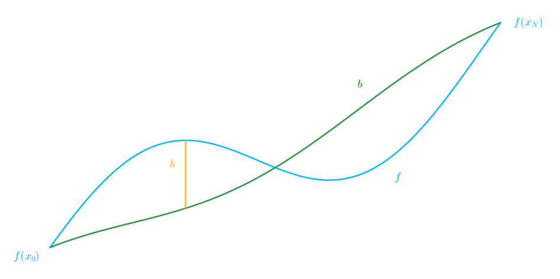

# 2.4 The fractal Operator

Let $I := [x_0, x_N]$ and $f \in C(I)$. Define the space of continuous functions with the 
same endpoints as $f$ by

$$C_f(I) := \{g \in C(I) \mid g(x_0) = f(x_0) \land g(x_N) = f(x_N)\}$$

Note that $(C_f(I), d_{\infty})$ is a complete metric space.

$\begin{align*}
    \text{Let } & \Delta := \{x_0, x_1, \ldots, x_N\} \text{ be a partition of } I \\
    & u_i : I \to I \text{ be contractive homeomorphisms s.t. } u_i(x_0) = x_{i-1} \land u_i(x_N) = x_i \\
    & \alpha \in \R^N \\
    & b \in C_f(I) \text{ be a base function}
\end{align*}$

More generally, $b = L f$, where $L : C_f(I) \to C_f(I)$ is linear and bounded. Define an RB operator

$$
\begin{align*}
    T_\Delta^\alpha : C_f(I) & \to C_f(I) \\
    g & \mapsto f + \alpha_i \cdot (g - b) \circ u_i^{-1}
\end{align*}
$$

on each interval $u_i(I)$. One can show that

- $T_\Delta^\alpha g(x_i^-) = T_\Delta^\alpha g(x_i^+)$
- $T_\Delta^\alpha g(x_0) = f(x_0)$
- $T_\Delta^\alpha g(x_N) = f(x_N)$.

If $\alpha_\infty:=\|\alpha\|_\infty < 1$, then $T_\Delta^\alpha$ is a contraction on $(C_f(I), d_\infty)$.
Thus, there exists a unique fixed point $f_\Delta^\alpha \in C_f(I)$. The family of fractal
functions $\{f_\Delta^\alpha\}_{\Delta, \alpha}$ are parametrized by $\Delta$ and $\alpha$.
For $\alpha=0$, we have $f_\Delta^0 = f$.

???+ proposition
    $\begin{align*}
        \text{Let } & f \in C_f(I) \\
        & f_\Delta^\alpha \text{ be the unique fixed point}
    \end{align*}$

    $$\implies \|f_\Delta^\alpha - f\|_\infty \leq \frac{\alpha_\infty}{1 - \alpha_\infty} \cdot \|f\|_\infty$$

The fractal operator

$$
\begin{align*}
    \F_\Delta^\alpha : C_f(I) & \to C_f(I) \\
    f & \mapsto f_\Delta^\alpha
\end{align*}
$$

is linear and bounded.