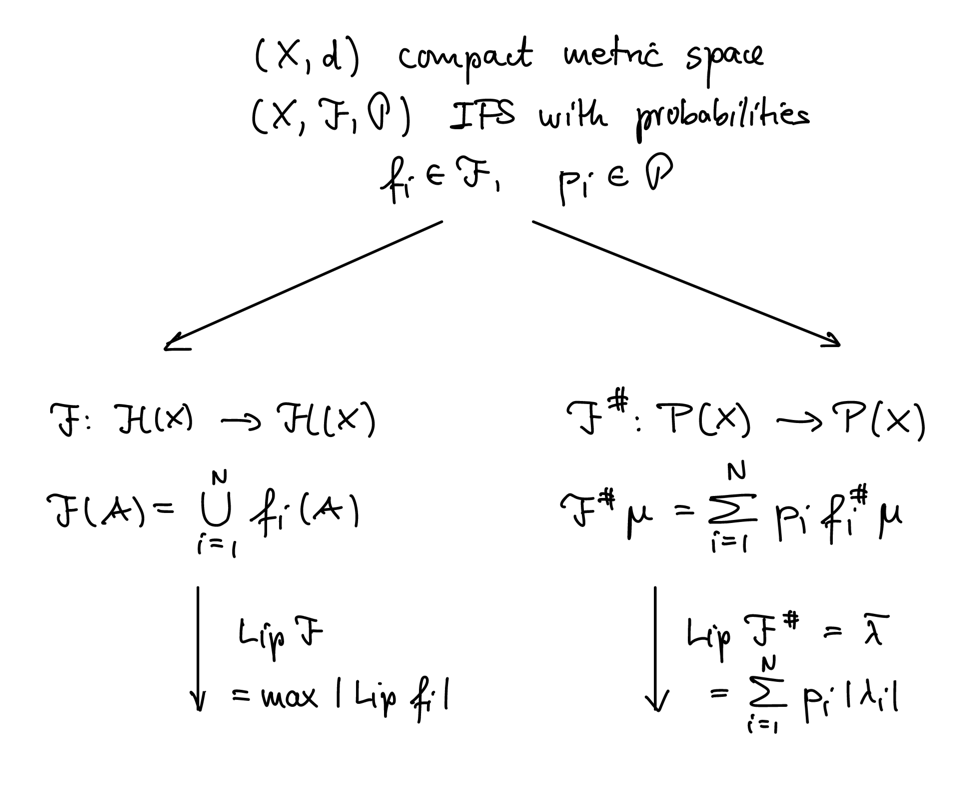
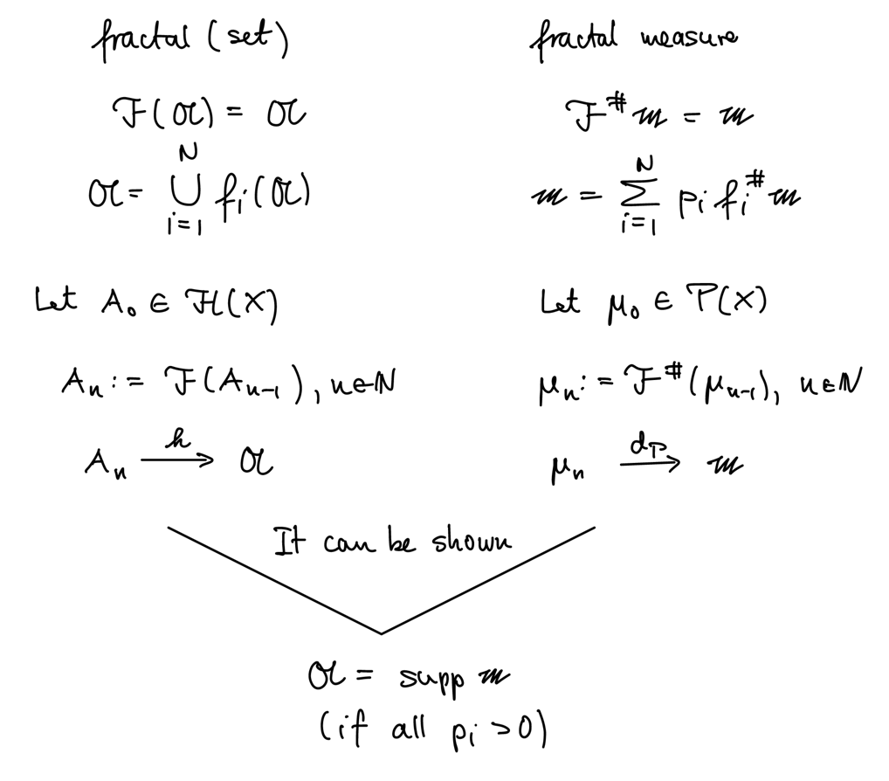

# 5 IFS with Probabilities

$\begin{align*}
    \text{Let } & (X, d) \text{ be a complete metric space} \\
    & B(X) \text{ be it's Borel } \sigma\text{-algebra} \\
    & (X, B(X)) \text{ be a measurable space} \\
    & (X, B(X), \mu) \text{ be a (Borel) measure space.}
\end{align*}$

???+ definition
    The **support of a measure** is given by

    $$\operatorname{supp} \mu = \{x \in X \mid \mu(O_x) > 0 \quad \forall\ O_x \in \mathcal{N}_x\}$$

    where $\mathcal{N}_x$ is the set of all open neighborhoods of $x$.

It is known that for a continuous function $f: X \to X$ on a Borel measure space,
there exists a unique measure $\nu$ given by

$$\nu(A) = \mu(f^{-1}(A))$$

???+ definition
    ## Invariant Borel measure
    
    Given the context as above, and with $f : X \to X$ continuous, we say that the Borel
    measure $\mu$ is **invariant under $f$** if

    $$f^\#\mu := \mu \circ f^{-1} = \mu$$

    on $B(X)$.

???+ definition
    ## IFS with Probabilities

    An IFS with probabilities is an IFS $(X, \F)$ together with a set of probabilities
    $\mathcal{P} = \{p_1, \dots, p_N\}$, where each $p_i$ is assigned to $f_i \in \F$,

    $$(X, \F, \mathcal{P}) = \Big(X, (f_1, p_1), \dots, (f_N, p_N)\Big)$$

???+ theorem
    $\begin{align*}
        \text{Let } & (X, d) \text{ be a compact metric space} \\
        & P(X) \text{ be the space of all Borel probability measures}
    \end{align*}$

    Define $d_P: P(X) \times P(X) \to \R$ by

    $$d_P(\mu, \nu) = \sup \left\{\int_X f \d(\mu-\nu) \mid \Lip f \le 1\right\}$$

    Then, $d_P$ is a metric on $P(X)$ and $(P(X), d_P)$ is a compact metric space (weak* topology).

???+ lemma
    $\begin{align*}
        \text{Let } & (X, d) \text{ be a compact metric space} \\
        & g : X \to X \text{ be contractive, } |\Lip g| < 1 \\
    \end{align*}$

    Define $g^\# : P(X) \to P(X)$ by

    $$g^\# \mu = \mu \circ g^{-1}$$

    Then, $g^\#$ is a contraction on $(P(X), d_P)$ with $\lambda = \Lip g$.

    ??? proof
        As $\Lip f \le 1$, we have for all $x, y \in X$,

        $$
        \begin{align*}
            |f \circ g (x) . f \circ g (y)| &\le d(g(x), g(y)) \\
            &\le \lambda d(x, y)
        \end{align*}\quad (*)
        $$

        Let $\mu, \nu \in P(X)$

        $$
        \begin{align*}
            \implies d_P(g^\# \mu, g^\# \nu) 
            &= \sup \left\{\int_X f \d(g^\# \mu - g^\# \nu) \mid \Lip f \le 1\right\} \\
            &= \sup \left\{\int_X f \circ g \d(\mu - \nu) \mid \Lip f \le 1\right\} \\
            &= \sup \left\{\int_X f \circ g \d(\mu - \nu) \mid \Lip f \le 1\right\} \\
            &= |\lambda| \sup \left\{\int_X |\lambda|^{-1} f \circ g \d(\mu - \nu) \mid \Lip f \le 1\right\} \\
            &\overset{(*)}{\le} |\lambda| \sup \left\{\int_X h\d(\mu - \nu) \mid \Lip h \le 1\right\} \\
            &= |\lambda| d_P(\mu, \nu)
        \end{align*}
        $$

???+ example
    $\begin{align*}
        \text{Let } & X = [0, 1] \\
        & g(x) = \frac{1}{2} x + \frac{1}{3}
    \end{align*}$

    Then, $g^\#$ is contractive and the unique fixed point of $g^\#$ is the dirichlet measure
    $\delta_\frac{2}{3}$ centered at $\frac{2}{3}$.

???+ theorem
    $\begin{align*}
        \text{Let } & (X, d) \text{ be a compact metric space} \\
        & (X, \F, \mathcal{P}) \text{ be an IFS with probabilities}
    \end{align*}$

    Define $\F^\# : P(X) \to P(X)$ by

    $$\F^\# \mu = \sum_{i=1}^N p_i f_i^\# \mu$$

    Then, $\F^\#$ is a contraction on $(P(X), d_P)$ with
    $\overline{\lambda} = \sum_{i=1}^{N} p_i |\lambda_i|$.

    ???+ proof
        $$
        \begin{align*}
            d_P(\F^\# \mu, \F^\# \nu)
            &= \sup \left\{\int_X g \d(\F^\# \mu - \F^\# \nu) \mid \Lip g \le 1\right\} \\
            &= \sup \left\{\sum_{i=1}^{N} p_i \int_X g \d(f_i^\# \mu - f_i^\# \nu) \mid \Lip g \le 1\right\} \\
            &\le \sum_{i=1}^{N} p_i d_P(f_i^\# \mu, f_i^\# \nu) \\
            &\le \sum_{i=1}^{N} p_i |\lambda_i| d_P(\mu, \nu) \\
        \end{align*}
        $$

???+ definition
    ## Fractal measure / ℱ#-invariant measure

    Let $\m \in P(X)$ be a fixed point of $\F^\#$:

    $$\m = \F^\# \m = \sum_{i=1}^{N} p_i f_i^\# \m$$

    $\m$ is also called a **P-balanced measure** of $(X, \F, \mathcal{P})$.

It can be shown that $\A = \operatorname{supp} \m$:

## Chaos Game

$\begin{align*}
    \text{Let } & (X, d) \text{ be a compact metric space} \\
    & (X, \F, \mathcal{P}) \text{ be an IFS with probabilities} \\
    & \m \text{ be a P-balanced measure} \\
    & x_0 \in X \\
    & x_k = f_i(x_{k-1}) \text{ with } f_i \in \F \text{ chosen with probability } p_i
\end{align*}$

Then, for almost all(1) random sequences $\{x_k\}$ and $A \in B(X)$ with
$\m(\partial A) = 0$, we have

$$\m(A) = \lim_{k \to \infty} \frac{|A \cap \{x_n\}_{n=1}^{k}|}{k+1}$$

???+ remark
    (1) With respect to the measure on the code spce $(\Sigma_N, d_F, \nu)$(2). 
    (2) Consider the cylinder set
    $Z(\sigma_1, \dots, \sigma_k):=\{\omega \in \Sigma_N \mid \omega(k) = \sigma(k)\}$ and define
    the measeure $\nu(Z(\sigma_1, \dots, \sigma_k)) = \prod_{j=1}^{k} p_{\sigma_j}$

???+ remark
    Define

    $$
    \begin{align*}
        s_i : \Sigma_N &\to \Sigma_N \\
        \sigma &\mapsto i \sigma
    \end{align*}
    $$

    - $(\Sigma_N, \{s_i\}, \{p_i\})$ is an IFS with probabilities
    - If $\mathfrak p$ is a P-balanced measure of the above IFS, then there exists a relation
    between $\mathfrak p$ and $\m$.

## Hausdoorff Dimension of a Measure

???+ definition
    $\begin{align*}
        \text{Let } & \mu \text{ be a Borel (probability) measure} \\
        & A := \operatorname{supp} \mu \subseteq \R^n \text{ be a bounded set}
    \end{align*}$

    The **Hausdorff dimension of $\mu$** is given by

    $$\dim_\H \mu := \inf \{\dim_\H E \mid E \supseteq A, \mu(E) = 1\}$$

???+ theorem
    ### Collage Theorem for Measures

    $\begin{align*}
        \text{Let } & (X, d) \text{ be a compact metric space} \\
        & (X, \F, \mathcal{P}) \text{ be an IFS with probabilities} \\
        & S := \max |\Lip f_i| \\
        & \m \text{ be the P-balanced measure of } (X, \F, \mathcal{P})
    \end{align*}$

    $$\implies d_P(\mu, \m) \le \frac{d_P(\mu, \F^\# \mu)}{1 - S}$$