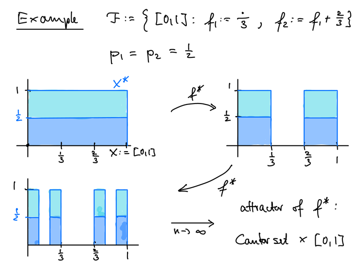

# 3 Dynamical Systems

???+ definition
    $\begin{align*}
        \text{Let } & (X, d) \text{ be a metric space.} \\
        & f : X \to X \text{ be a mapping}
    \end{align*}$

    - The pair $(X, f)$ is called a **dynamical system**.
    - The **orbit** of a point $x_o \in X$ is the set

    $$\mathcal{O}(x_o) = \{f^n(x_o) : n \in \N_0\}$$

???+ example
    === "(a)"
        **The Logistic Map**

        $\begin{align*}
            \text{Let } & X:=\R \\
            & c \in \R^+ \\
            & f_c : X \to X \text{ be given by}
        \end{align*}$

        $$x \mapsto c x (1 - x)$$

        Then, $(X, f_c)$ is a one-parameter dynamical system.

    === "(b)"
        $X:=C[0, 1]$

        $$
        \begin{align*}
            T : X &\to X \\
            f & \mapsto \frac{1}{2} f\left(\frac{\cdot}{2}\right) + \frac{1}{2} f\left(\frac{\cdot + 1}{2}\right)
        \end{align*}
        $$

    === "(c)"
        $\begin{align*}
            \text{Let } & \tilde X \text{ be a compact metric space} \\
            & X := \H(\tilde X)
        \end{align*}$

        $$
        \begin{align*}
            \F : X &\to X \\
            A &\mapsto \bigcup_{i=1}^N f_i(A)
        \end{align*}
        $$

        where $(\tilde X, f_1, \ldots, f_N)$ is a (contractive) IFS.

???+ definition
    A closed subset $A \subset X$ is called an attractor of the dynamical system $(X, f)$ if

    1. A is invariant under $f$: $f(A) = A$
    2. $\exists\ U \subset X$ open such that $A \subseteq A$ and

    $$d(f^n(x), A) \xrightarrow[n \to \infty]{} 0 \quad \forall x \in U$$

    $U$ is called a **basis of attraction**.

???+ example
    Let $X := \C \cup \{\infty\}$ be the Riemann sphere and $f : X \to X$ be given by
    $f(x) = z^2$.

    Then, the set $A := \{0, \infty\}$ is the attractor. The set
    $U := \{z \in \C : |z| \neq 1\}$ is the basis of attraction.

Suppose $\F = (X; f_1, \dots, f_N)$ is a (contractive) IFS and set $X^*:=X \times [0, 1]$.
Let $p_1, \dots, p_N$ be a set of non-zero probabilities and define

$$
\begin{align*}
    f^* : X^* &\to X^* \\
    (x, t) &\mapsto
    \begin{cases}
        \left(f_i(x), \frac{t-s_{i-1}}{p_i}\right), & (x, t) \in X \times [s_{i-1}, s_i] \\
        \left(f_N(x), \frac{t-s_{N-1}}{p_N}\right), & (x, t) \in X \times [s_{N-1}, 1]
    \end{cases}
\end{align*}
$$

$\begin{align*}\text{with } s_i &:= \sum_{j=1}^i p_j\end{align*}$.

???+ example
    

