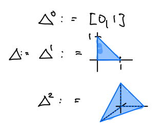
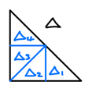
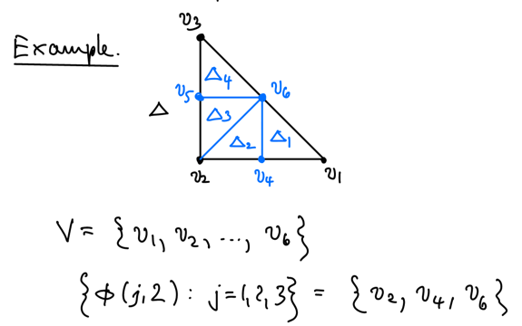
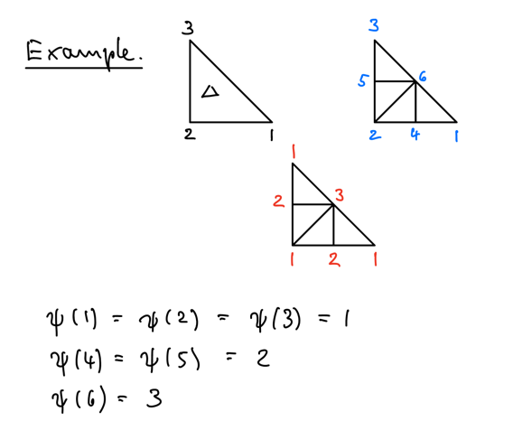

# 4 Fractal Surfaces in ℝ2

???+ definition
    ## Regular n-simplex in ℝn+1

    $$\Delta^n = \left\{x \in \R^{n+1} \mid \sum_{i=1}^{n+1} x_i \le 1, x_i \ge 0 \right\}$$

???+ example
    

Consider $C(\Delta):= C(\Delta, \R)$ and a finite partition of sub simplicies $\Delta_i$ of $\Delta$ s.t.

$\begin{align*}
    & (1) \quad \Delta_i \cap \Delta_j \neq \emptyset \text{ along at most one edge} \\
    & (2) \quad \Delta_i \text{ is similar to } \Delta \\
    & (3) \quad \Delta_i \text{ is congruent to } \Delta_j
\end{align*}$

???+ example
    

Then, by definition, there exists $N$ similitudes $u_i: \Delta \to \Delta_i$. Suppose that
$\{q_i : \R^2 \to \R^2\}_{i=1}^N$ is a family of affine maps and let $\{\lambda_i\in\R\}_{i=1}^N$
be a family of real numbers. Define an RB operator $T : C(\Delta) \to \R^\Delta$ by

$$(*) \quad Tf := q_i \circ u_i^{-1} + \lambda_i f \circ u_i^{-1}$$

on each $\Delta_i$. The $q_i$ are usually determined by interpolation conditions.

$\begin{align*}
    \text{Let } & V \text{ be the set of distinct vertices of the partition of } \Delta \\
    & n := |V| \\
    & \phi : \{1, \ldots, 3\} \times \{1, \ldots, N\} \to \{1, \ldots, n\} \text{ be the labelling map}
\end{align*}$

where $\{1, 2, 3\}$ is the set of vertices of $\Delta$. Then, $\{v_{\phi(j,i)}\}_{j=1}^3$
is the set of vertices of $\Delta_i$.

???+ example
    

We can determin the $q_i$ uniquely by the interpolation set
$Z:=\{(v_\nu, z_\nu) \in \Delta \times \R\}$ s.t.

$$q_i(v_j) + \lambda_i z_j = z_{\phi(j,i)}$$

Then, we get

$$
\begin{align*}
    (Tf)(v_{\phi(j,i)}) &= q_i \circ u_i^{-1}(v_{\phi(j,i)}) + \lambda_i f \circ u_i^{-1}(v_{\phi(j,i)}) \\
    &= q_i(v_j) + \lambda_i f(v_j) \\
    &= q_i(v_j) + \lambda_i z_j \\
    &= z_{\phi(j,i)}
\end{align*}
$$

## Continuity on Δ

We need continuity on the edges of each subsimplices:

$$q_i \circ u_i^{-1} (x, y) + \lambda_i f\circ u_i^{-1} (x, y) 
= q_j \circ u_j^{-1} (x, y) + \lambda_j f\circ u_j^{-1} (x, y) \quad\quad (G)$$

for all $(x, y) \in \Delta_i \cap \Delta_j =: e_{ij}$.

### Case 1: Coplanar Boundary Conditions, different λi

Define the set of continuous functions with zero boundary

$$C_0(\Delta) := \{f \in C(\Delta) : f|_{\partial \Delta} = 0\}$$

and the interpolation points

$$Z_0(\Delta) := \{(v_\nu, z_\nu) \in Z \mid z_\nu = 0 \text{ if } v_\nu \in \partial \Delta\}$$

???+ definition
    $$\operatorname{Aff}(\R^2): \text{ the set of affine maps on } \R^2$$

???+ theorem
    $\begin{align*}
        \text{Let } & q_i \in \operatorname{Aff}(\R^2) \cap C_0(\Delta) \\
        & \max_{1 \le i \le N} |\lambda_i| < 1
    \end{align*}$

    $$\implies T \text{ is a contraction on } C_0(\Delta)$$

???+ definition
    The graph of the unique fixed point $f^*$ of $T$ is called an
    **affine fractal (interpolation) surface of class $C_0$**.

### Case 2: General Boundary Conditions, equal λi

Let $\pi := \{\Delta_1, \ldots, \Delta_N\}$ be a partition of $\Delta$ and $F_\pi=(V, E)$ be the
graph. Assume it has chromatic number $3$. Then, there exists a mapping
$\psi : \{1, \ldots, n\} \to \{1, 2, 3\}$ s.t. the vertices of $\Delta_i$ have unique labels.
Thus, $\phi : \{1, \ldots, 3\} \times \{1, \ldots, N\} \to \{1, \ldots, n\}$ has to be chosen s.t.

$$\phi(\psi(j), i) = j, \quad \forall\ v_j \in \Delta_i$$

???+ example
    

Define

$\begin{align*}
    (1) &&& u_i : \Delta \to \Delta_i \text{ s.t. } u_i(v_{\phi(j)}) = v_j \\
    (2) &&& q_i \in \operatorname{Aff}(\R^2) \text{ s.t. } q_i(v_{\phi(j)}) + \lambda z_{\phi(j)} = z_j \\
    (3) &&& \mathfrak{H}(\Delta) := \{f \in C(\Delta) \mid f(v_\nu) = z_\nu\}
\end{align*}$

???+ definition
    Partitions $\pi$ of $\Delta$ for which $G_\pi$ has chromatic number $3$ are called **admissible**.

???+ theorem
    $\begin{align*}
        \text{Let } & \pi \text{ be an admissible partition of } \Delta \\
        & u_i, q_i \text{ be as above} \\
        & \lambda_i = \lambda \text{ s.t. } |\lambda| < 1
    \end{align*}$
    
    $$
    \implies\begin{cases}
        T : \mathfrak{H}(\Delta) \to \mathfrak{H}(\Delta) \text{ is well defined} \\
        Tf \text{ interpolates } Z
    \end{cases}
    $$

    ??? proof
        $\begin{align*}
            \text{Let } & i, i' \in \N_N \text{ s.t. } u_i(\Delta) \text{ adjecent to } u_{i'}(\Delta) \\
            & e_{ii'} \text{ be the common edge}
        \end{align*}$

        Then, by $(1)$, we have

        $$
        \begin{align*}
            u_i^{-1}(v_j) &= u_{i'}^{-1}(v_j) = v_{\phi(j)} \\
            u_i^{-1}(v_{j'}) &= u_{i'}^{-1}(v_{j'}) = v_{\phi(j')}
        \end{align*}
        $$

        In addition, we have

        $$
        \begin{align*}
            u_i \text{ affine } &\implies u_i^{-1} \text{ affine } \\
            & \implies u_i^{-1}(x, y) = u_{i'}^{-1}(x, y) \text{ on } e_{ii'}
        \end{align*}
        $$

        Equality of $\lambda_i$ shows that $\href{#G}{(G)}$ is satisfied.
        Contractivity follows as usual.

???+ definition
    The graph of the unique fixed point $f^*$ of $T$ is called an
    **affine fractal (interpolation) surface of class $\mathfrak{H}$**.