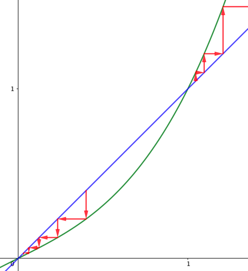
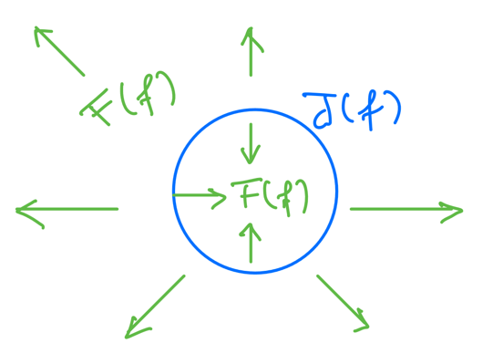

# 7 Julia and Fatou Sets

Let $(X, d)$ be a metric space and $f : X \to X$ be an endomorphism.

???+ definition
    The point $p\in X$ is called periodic if $\exists\ n$ s.t.

    $$f^n(p) = p$$

    The smallest such $n$ is called the period of $p$.

    If $n=1$, $p$ is a fixed point.

Let $X$ be a differentiable manifold and $f : X \to X$ be a diffeomorphism.

???+ definition
    Let $p\in X$ be a periodic point of $f$ with period $n$.

    $p$ is called

    - **hyperbolic** if $|(f^n)'(p)| \neq 1$
    - **attracting (attractive)** if $|(f^n)'(p)| < 1$
    - **repelling** if $|(f^n)'(p)| > 1$

Suppose $X=\R$.

???+ proposition
    Let $p$ be an attractor of $f$.

    Then, there exists a neighborhood $U \subseteq X$ of $p$ s.t

    $$x\in U \implies \lim_{n\to\infty} f^n(x) = p$$

    ??? proof
        $f$ is a diffeomorphism

        $\begin{align*}
            \implies& f \in C^1 \\
            \implies& \exists\ \varepsilon > 0 : |f'(x)| \le A < 1 \quad \forall\ x\in (p-\varepsilon, p+\varepsilon) \\
            \overset{\text{M.V.T.}}{\implies}& |f(x) - p| = |f(x)-f(o)| \le A|x-p| < \varepsilon \\
            \implies& f(x) \in (p-\varepsilon, p+\varepsilon) \\
            \implies& |f^n(x) - p| \le A^n|x-p| \\
            \implies& f^n(x) \to p
        \end{align*}$

???+ example
    Consider the function

    $$
    \begin{align*}
        f(x) &= \frac{1}{2}x(x^2+1) \\
        f'(x) &= \frac{3}{2}x^2+\frac{1}{2}
    \end{align*}
    $$

    It has fixed points in \{-1, 0, 1\}.

    - $|f'(0)| = \frac{1}{2} < 1$, so $p=0$ is attracting.
    - $|f'(\pm 1)| = 2 > 1$, so $p=\pm 1$ are repelling.

    

???+ definition
    ## Julia set

    Let $f := \frac{p}{q} : \C \to \C$ be a rational function.

    The **Julia set** $J(f)$ for $f$ os the closure of the set of repelling periodic points
    of $f$.

???+ definition
    ## Fatou set

    $$F(f) := \C \setminus J(f)$$

???+ proposition
    $$
    \begin{align*}
        f(J(f)) &= J(f) = f^{-1}(J(f)) \\
        f(F(f)) &= F(f) = f^{-1}(F(f))
    \end{align*}
    $$

???+ example
    $\begin{align*}
        \text{Let } & X := \C \\
        & f(z) = z^2 \\
        & f^n(z) = z^{2^n}
    \end{align*}$

    Periodic points:

    $$
    \begin{align*}
        z &= f^n(z) = z^{2^n} \\
        z&(z^{2^n-1}-1) = 0 \\
    \end{align*}
    $$

    - $p=0$ is the only attractor
    - The $2^n-1$ roots of unity are repelling

    This yields

    $$F(f) = \{z\in \C : |z| \neq 1\} \quad J(f) = \{z\in \C : |z| = 1\}$$

    

???+ definition
    ## Filled-in Julia set

    $$K(f) := \{z\in \C : f^n(z) \not\to \infty\}$$

???+ remark
    $$J(f) = \partial K(f)$$

???+ theorem
    The Julia set $J(f_c)$ of the the (class of) funcitons $f_c(z):=z^2+c$ is
    compact for all $c\in\C$.

???+ theorem
    $$z \in J(f_c) \iff -z \in J(f_c)$$

    ???+ proof
        $$f_c(z) = z^2+c = (-z)^2+c = f_c(-z)$$

        This yields

        $$f_c^n(z) = f_c^{n-1}(f_c(z)) = f_c^{n-1}(f_c(-z)) = f_c^n(-z)$$

???+ theorem
    If $|c| < \frac{1}{4}$, then $J(f_c)$ is a simple closed curve.

???+ definition
    ## Mandelbrot set

    $$
    \begin{align*}
        M &= \{c \in \C : J(f_c) \text{ is connected}\} \\
        &= \{c \in \C : f_c^n(0) \text{ is bounded}\}
    \end{align*}
    $$

See [markmath](https://www.marksmath.org/classes/Fall2016FractalLAC/demos/
SelfSimilarSets/self-similarity_and_Julia_sets.html) for relation between Julia sets
and IFSs.