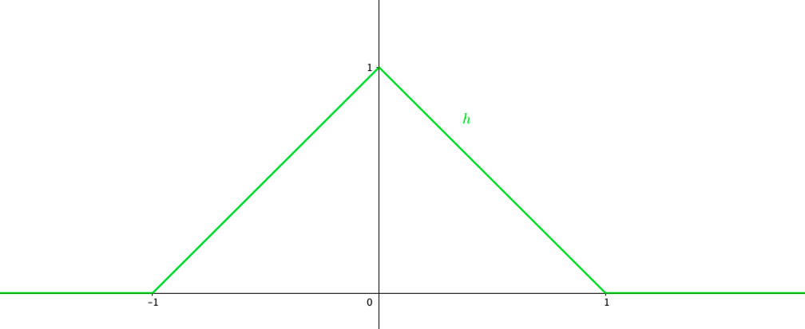
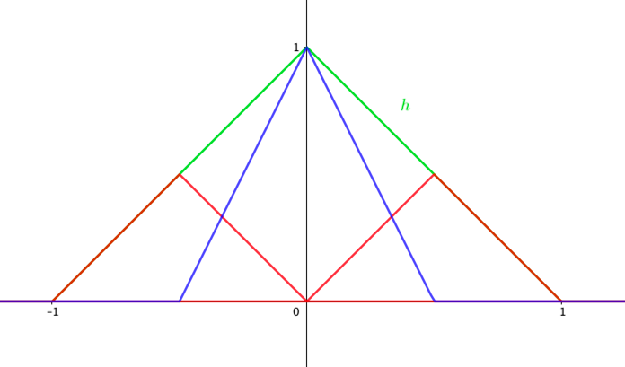
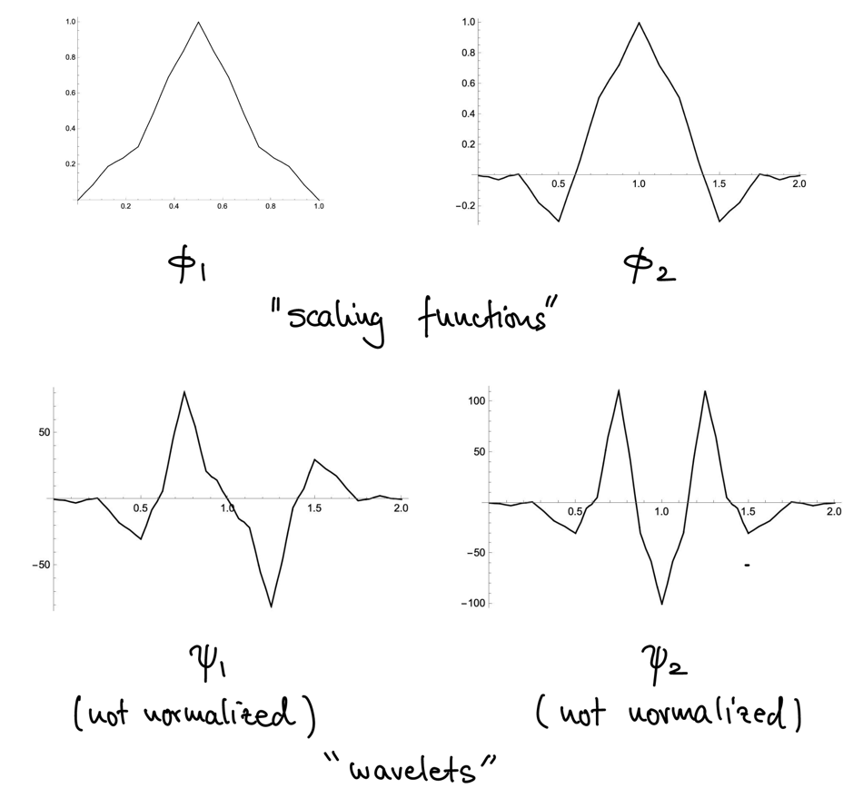

# 6 Refinable Shift-Invariant Spaces and Fractal Functions

???+ definition
    ## Finitely generated shift-invariant space (FSI) of L2(ℝ)

    A subset $S \subseteq L^2(\R)$ given by a finite familiy of functions
    $\Phi \subseteq L^2(\R)$

    $$S = S(\Phi) = \clos_{L^2} \Span \{ \phi(\cdot - k) \mid \phi \in \Phi, k \in \Z \}$$

    is called a **finitely generated shift-invariant space**. If $| \Phi | = 1$, it
    is called a **principal shift-invariant space**.

???+ definition
    ## Refinable shift-invariant space

    A finitely generated shift-invariant space $S(\Phi)$ is called **refinable** if

    $$f \in S \implies f(\cdot / 2) \in S$$

???+ example
    Hat function:

    $h(x) = (1- |x|)_+$

    

    $S:=\clos_{L^2} \Span \{ h(\cdot - k) \mid k \in \Z \}$

    

    $$
    \begin{align*}
        h\left(\frac{x}{2}\right) &= \frac{1}{2} h(x+1) + h(x) + \frac{1}{2} h(x-1) \\
        h(x)&= \frac{1}{2} h(2x+1) + h(2x) + \frac{1}{2} h(2x-1)
    \end{align*}
    $$

If $S$ is a refinable FSI space with $r:= | \Phi |$, then there exists $r\times r$
matrices $M_k$ s.t.

$$\Phi(x) = \sum_{k\in \Z} M_k \Phi(2x-k)$$

## Orthogonal translates

As in the example with the hat function, the translates need not be orthogonal:

$$\int_{-1}^1 h(x) h(x\pm 1) \, \d x = \frac{1}{6}$$

**Idea**: Let $w\in L^2(\R)$ with $\operatorname{supp} w = [0, 1]$ and consider the space
$S(h, w)$. Try to find a $u \in L^2(\R)$ s.t.

1. $\operatorname{supp} u = [-1, 1]$
2. $u \in \Span\{j, w, w(\cdot + 1)\}$
3. $u \perp u(\cdot + 1), w$
4. $S(u, w) = S(h, w)$

Define the function

$$
\begin{align*}
    u :=& (\I - P_{S(w)}) h \\
    =& h - \frac{\inner{h}{w}}{\|w\|^2} w - \frac{\inner{h}{w(\cdot + 1)}}{\|w\|^2} w(\cdot + 1)
\end{align*}
$$

By $(3)$, we need

$$0 = \inner{u}{u(\cdot -1)} = \inner{h}{h(\cdot -1)} - \frac{\inner{h}{w}\inner{w}{h(\cdot -1)}}{\|w\|^2}$$

so $w$ has to satisfy

$$\inner{h}{h(\cdot -1)} = \frac{\inner{h}{w}\inner{w}{h(\cdot -1)}}{\|w\|^2} \quad\quad (I)$$

In addition, by $(4)$, imposing that $V_0:=S(h, w) = S(u, w)$, is refinable, we need

$$w\left(\frac{\cdot}{2}\right) = h(\cdot-1) + s_0 w + s_1 w(\cdot-1) \in V_0 \quad \quad (*)$$

For $|s_0|, |s_1| < 1$, $(*)$ is a fixed point equation for an affine fractal function.
Choose $s:=s_0 = s_1$.

???+ theorem
    Let $f, \tilde f$ be affine fractal functions with fixed point equations

    $$
    \begin{align*}
        f(u_i(x)) &= c_i x + d_i + s_i f(x) \\
        \tilde f(u_i(x)) &= \tilde c_i x + \tilde d_i + \tilde s_i \tilde f(x)
    \end{align*}
    $$

    on $[0, 1]$ and with $u_i(x) = a_i x + b_i$.

    Then, their inner product can be given by

    $$
    \begin{align*}
        \int_0^1 f(x) \tilde f(x) \, \d x =
        \frac{1}{1-\sum_{i=1}^{N} a_is_i\tilde s_i}
        \sum_{i=1}^{N} a_i\Big(&s_i \tilde c_i f_1 + s_i \tilde d_i f_0 + \tilde s_i c_i \tilde f_1
        + \tilde s_i d_i \tilde f_0 \\
        &+ \frac{1}{3}(c_i + \tilde c_i)\frac{1}{2} (c_i \tilde d_i + d_i \tilde c_i) + d_i \tilde d_i\Big)
    \end{align*}
    $$

    where

    $$
    \begin{align*}
        f_0 &:= \frac{\sum_{i=1}^{N} a_i \left(\frac{1}{2} c_i + d_i\right)}{1-\sum_{i=1}^{N} a_is_i} \\
        f_1 &:= \frac{\sum_{i=1}^{N} a_i \left(b_i s_i f_0 + \frac{1}{3} a_i c_i + \frac{1}{2}
        (b_ic_i+a_id_i)+b_id_i\right)}{1-\sum_{i=1}^{N} a_i^2s_i}
    \end{align*}
    $$

So the above theorem yields

$$
\begin{align*}
    \inner{w}{1} &= \frac{1}{2(1-s)} \\
    \inner{w}{w} &= \frac{2+ s}{6(1-s)^2(1+s)} \\
    \inner{h}{w} &= \inner{h(\cdot -1)}{w} = \frac{1}{4(1-s)} \\
    \inner{h}{h(\cdot -1)} &= \frac{1}{6}
\end{align*}
$$

So this implies $s=-\frac{1}{5}$

## Multiresolution analysis (MRA)

Let $\{V_k\}_{k\in\Z}$ be a collection of closed subspaces of $L^2(\R)$ s.t.

$\begin{align*}
    & (i) && V_k \subseteq V_{k+1} \\
    & (ii) && \bigcup_{k\in\Z} V_k = \{0\} \\
    & (iii) && \clos_L^2 \bigcup_{k\in\Z} V_k = L^2(\R) \\
    & (iv) && f\in V_k \iff f(\cdot - 2^{-k}) \in V_0 \\
    & (v) && \mathcal{B}_\Phi := \{\phi^\alpha(\cdot - \ell) \mid \alpha \in \{1, \dots, A\}, \ell \in \Z\}
    \text{ is a Riesz basis of } V_0 
\end{align*}$

???+ definition
    ### Riesz basis

    $\mathcal{B}_\Phi$ is a **Riesz basis** if there exists $R_1, R_2 > 0$ for all
    $\{c_\ell^\alpha\} \subset \ell^2(\Z)$

    $$R_1 \sum_{\alpha=1}^{A} \sum_{\ell \in \Z} |c_\ell^\alpha|^2 \leq
    \left\| \sum_{\alpha=1}^{A} \sum_{\ell \in \Z} c_\ell^\alpha \phi^\alpha(\cdot - \ell) \right\|_{L^2}^2
    \leq R_2 \sum_{\alpha=1}^{A} \sum_{\ell \in \Z} |c_\ell^\alpha|^2$$

???+ definition
    ### Wavelet Sapces

    For $k\in \Z$:

    $$
    \begin{align*}
        W_k :=& V_{k+1} \ominus V_k \\
        V_{k+1} =& V_k \oplus W_k
    \end{align*}
    $$

    Let $\phi^1, \dots, \phi^B \in L^2$ s.t.
    
    $$\clos_{L^2} \Span \{\psi^\beta(\cdot - \ell) \mid \beta \in \{1, \dots, B\}, \ell \in \Z\} = W_0$$
    
    is a Riesz basis of $W_0$.
    
    Then, $\{\psi^\beta\}_{\beta=1}^{B}$ are called **wavelets**.

    