# 2 Constructions

## Subspaces and induced topology

??? theorem "Theorem 2.6"
    ### Continuity from covers 

    $\begin{align*}
        \text{Let } & f : X \to Y \text{ be a map between topological spaces} \\
        & (A_i)_{i \in I} \text{ be an open cover of } X
    \end{align*}$

    $$f \text{ is continuous} \iff f|_{A_i} \text{ is continuous for all } i \in I$$

    ??? proof
        === "$\implies$"
            Inclusions $j_i : A_i \to X$ are continuous, so $f|_{A_i} = f \circ j_i$ is continuous.

        === "$\impliedby$"
            Let $U \in \O_Y$.

            $\begin{align*}
                &\implies f_i^{-1}(U) \in \O_X \quad \forall\ i \in I \\
                &\implies f^{-1}(U) = \bigcup_{i \in I} f_i^{-1}(U) \in \O_X
            \end{align*}$

??? definition "Definition 2.9"
    ### Induced topology

    Let $(X, \O)$ be a topological space and $f : Y \to X$ a set map. Then,

    $$\O_f := \{ f^{-1}(U) \subseteq Y \mid U \in \O \}$$

    is the topology on $Y$ induced by $f$.

??? theorem "Theorem 2.10"
    ### Universal property of of the induced topology 

    $\begin{align*}
       \text{Let } & (X, \O) \text{ be a topological space} \\
       & f : Y \to X \text{ be a set map}
    \end{align*}$

    $$
    \begin{align*}
        (1) & \quad \O_f \text{ is the coarsest topology on } Y \text{ such that } f \text{ is continuous} \\ \\
        (2) & \quad \text{For any topological space } Z, \text{ and any map } g : Z \to Y, \\
        & \quad g \text{ is continuous } \iff f \circ g : Z \to X \text{ is continuous} \\ \\
        (3) & \quad \O_f \text{ is the unique topology on } Y { satisfying } (2)
    \end{align*}
    $$

    ??? proof
        === "$(1)$"
            ??? proof "Claim: $\O_f$ is a topology on $Y$."
                1. $f^{-1}(\emptyset) = \emptyset \in \O_f$
                2. $f^{-1}(X) = Y \in \O_f$
                3. $\O$ is closed under arbitrary unions and pairwise intersections. Thus,
                so is $\O_f$.

            The preimage $f^{-1}(U)$ needs to be open for all $U \in \O$ for $f$ to be
            continuous. Thus, it is the coarsest topology on $Y$ such that $f$ is
            continuous.

        === "$(2)$"
            $$
            \begin{align*}
                g \text{ is continuous for } \O_f
                & \iff g^{-1}(V) \in \O_Z \quad \forall\ V \in \O_f \\
                & \iff g^{-1}(f^{-1}(U)) \in \O_Z \quad \forall\ U \in \O \\
                & \iff f \circ g \text{ is continuous}
            \end{align*}
            $$

        === "$(3)$"
            Let $\mathcal{R, S}$ be topologies on $Y$ satisfying $(2)$.

            $\begin{align*}
                \implies& \id_Y : (Y, \mathcal R) \to (Y, \mathcal R) \text{ is continuous} \\
                \overset{(2)}{\implies}& f \circ \id_Y : (Y, \mathcal R) \to (X, \O) \text{ is continuous} \\
            \end{align*}$

            Consider $g = \id_Y : (Y, \mathcal R) \to (Y, \mathcal S)$.

            $\begin{align*}
                \implies& f \circ g : (Y, \mathcal R) \to (X, \O) \text{ is continuous} \\
                \overset{(2)}{\implies}& g \text{ is continuous} \\
                \implies& \mathcal S \subseteq \mathcal R
            \end{align*}$

            By symmetry, $\mathcal R \subseteq \mathcal S$. Thus, $\mathcal R = \mathcal S$.

## Embeddings

??? definition "Definition 2.11"
    ### Embedding

    A continuous map $f : X \to Y$ is called an **embedding** if $f$ is injective and $X$
    has the topology induced by $f$.

??? remark "Remark 2.12"
    **Equivalent definitions of embeddings:**

    - $f$ is a homeomorphism onto the subspace $\Im f \subseteq Y$.
    - $f$ is a continuous, injective and open/closed map onto $\Im f$.

??? example "Example 2.13"
    The logarithmic spiral

    $$
    \begin{align*}
        \R &\to \R^2 \\
        t &\mapsto e^{bt} (\sin t, \cos t)
    \end{align*}
    $$

    is an embedding.

    ---

    The inverse stereographic projection

    $$
    \begin{align*}
        \R^d &\to S^d \subseteq \R^{d+1} \\
        x &\mapsto \frac{1}{1 + \|x\|^2} (2x_1, \dots, 2x_d, \|x\|^2 - 1)
    \end{align*}
    $$
    
    is an embedding.

??? example "Example 2.14"
    Consider $S^1 \subseteq \R^2$ with the subset topology. The canonical continuous,
    bijective map $\phi : [0, 1) \to S^1$ is not a homeomorphism:

    $[0, a) = (-1, a) \cap [0, 1)$ is open in $[0, 1)$, but $\phi([0, a))$ is not open in
    $S^1$.

    ---

    For $c \in \R\setminus\Q$, the map

    $$
    \begin{align*}
        f : \Z &\to [0, 1) \\
        t &\mapsto ct - \lfloor ct \rfloor
    \end{align*}
    $$

    is injective and its image is dense, but not an embedding with respect to the
    discrete topology on $\Z$.

??? definition "Definition 2.15"
    ### Knot

    An embedding $f : S^1 \to \R^3$ is called a **knot**.

    - Two knots are **equivalent** if there is a self-homeomorphism of $\R^3$ that maps one
    to the other.
    - A knot is called **trivial** if it is equivalent to the canonical embedding
    $S^1 \to \R^3$ (the unknot).

??? remark "Remark 2.17"
    Two smooth knots are equivalent iff the complements of their images in $\R^3$ are
    homeomorphic (Gordon-Luecke, 1989).

## Products and initial topology

??? definition "Definition 2.18"
    ### Initial topology 

    Consider a family of topological spaces $(X_i)_{i \in I}$, a set $Y$ and maps
    $f_i : Y \to X_i$. The collection

    $$\mathcal S = \left\{f_i^{-1}(U_i) \subseteq Y \mid i \in I, U_i \in \O_{X_i}\right\}$$

    is a subbasis for the **initial topology** on $Y$.

??? theorem "Theorem 2.19"
    ### Universal property of the initial topology 

    Let $(X_i, f_i)_{i \in I}$ be as in [D.2.18](#d218), and $\O$ the initial topology on $Y$.

    $$
    \begin{align*}
        (1) & \quad \O \text{ is the coarsest topology on } Y \text{ such that all }
        f_i \text{ are continuous} \\ \\
        (2) & \quad \text{For any topological space } Z, \text{ and any map } g : Z \to Y, \\
        & \quad g \text{ is continuous for } \O
        \iff f_i \circ g : Z \to X \text{ is continuous for all} i \in I \\ \\
        (3) & \quad \O \text{ is the unique topology on } Y \text{ satisfying } (2)
    \end{align*}
    $$

    ??? proof
        Analogous to that of [T.2.10](#t210).

??? definition "Definition 2.20"
    ### Product topology

    Consider a family of topological spaces $(X_i)_{i \in I}$ and the cartesian product

    $$X := \prod_{i \in I} X_i$$

    with projection maps $pr_i : X \to X_i$.

    - For a subset $U_i \subseteq X_i$, the **cylinder** over $U_i$ is

    $$\pr_i^{-1}(U_i) \cong U_i \times \prod_{i \neq j \in I} X_j \subseteq X$$

    - The cylinders over open sets $U_i \in \O_{X_i}$ form a subbasis for the product
    topology:

    $$\mathcal S = \left\{\pr_i^{-1}(U_i) \subseteq X \mid i \in I, U_i \in \O_{X_i}\right\}$$

??? remark "Remark 2.21"
    The corresponding basis is given by the cylinder sets

    $$\B = \left\{\bigcap_{k\in K} \pr_k^{-1}(U_k) \mid K \subseteq I \text{ finite}, U_k \in \O_{X_k}\right\}$$

??? remark "Remark 2.22"
    - Allowing arbitrary products of open sets yieds the box topology, which in general
    has less desirable properties.
    - The two topologies (which?) clearly coincide for finite index sets $I$.

??? example "Example 2.23"
    The product topology on $\R^n$ is the one induced by the euclidean metric.

    ---

    $S^1 \times [0, 1]$ is homeomorphic to the the annulus
    $A = \{x \in \R^2 \mid 1 \leq \|x\| \leq 2\}$.

    ---

    Consider the map $f : X \to Y$, and its graph
    $\Gamma(f) = \{(x, f(x)) \mid x \in X\} \subseteq X \times Y$. $f$ is continuous
    if $x \mapsto (x, f(x))$ is an embedding $X \to \Gamma(f)$.

    ---

    The map

    $$
    \begin{align*}
        c : \{0, 1\}^\N &\to \R \\
        (a_n)_{n \in \N} &\mapsto \sum_{n=0}^\infty \frac{2a_n}{3^n}
    \end{align*}
    $$

    is an embedding of binary sequences into $\R$ (disccrete topology on $\{0, 1\}$
    and the product topology on $\{0, 1\}^\N$). The image is the Cantor set.

??? proposition "Proposition 2.24"
    ### Component projections of a product are open 

    For a product

    $$X = \prod_{i \in I} X_i$$

    of topological spaces, the projections $\pr_i : X \to X_i$ are open maps.

    ??? proof
        Every open set can be written as a union of their basis sets, so it is sufficient
        to show that it is open for cylinder sets:

        Let $U_K \in \B$ be a cylinder set with

        $$U_K = \bigcap_{k \in K} \pr_k^{-1}(U_k), \quad K \subseteq I \text{ finite and } U_k \in \O_{X_k}$$

        Then, we easily have

        $$\pr_i(U_K) = \begin{cases}
            U_i, & i \in K \\
            X_i, & i \notin K
        \end{cases}$$

        which is open in $X_i$.

??? remark "Remark 2.25"
    Product topologies satisfy the following property of products:

    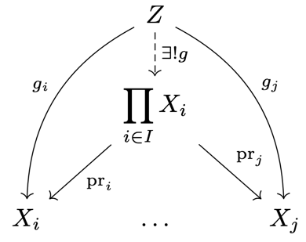

    $\begin{align*}
        \text{Let } & Z \text{ be a topological space} \\
        & (g_i : Z \to X_i)_{i \in I} \text{ a family of continuous maps}
    \end{align*}$

    $$
    \begin{align*}
        \implies \exists! & g : Z \to \prod_{i\in I} X_i \text{ continuous s.t.} \\
        &g_i = \pr_i \circ g \quad \forall\ i \in I
    \end{align*}
    $$

## Pullbacks

??? definition "Definition 2.26"
    ### Pullback

    Consider two maps $f : X \to B$ and $g : Y \to B$. The **pullback** of $f$ and $g$ is

    $$X \times_B Y := \{(x, y) \in X \times Y \mid f(x) = g(y)\} \subseteq X \times Y.$$

    The diagram

    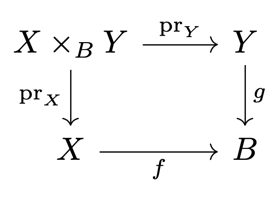

    is called a **pullback square**.

??? remark "Remark 2.27"
    Pullback combine products and subspaces:

    - The pullback is also called the *fiber product*, as

    $$X \times_B Y = \bigcup_{b \in B} f^{-1}(b) \times g^{-1}(b)$$

    - For the one-point space $B = \{*\}$, the pullback is the product $X \times Y$.

??? theorem "Theorem 2.28"
    ### Universal property of the pullback 

    Consider a commutative square of continuous maps:

    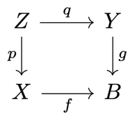

    Then, there exists a unique map $m : Z \to X \times_B Y$ such that the following diagram
    commutes:

    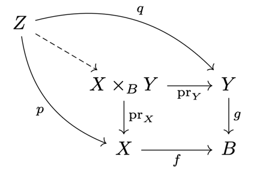

    ??? proof
        === "Existence"
            Define $m : Z \to X \times_B Y$ by

            $$z \mapsto (p(z), q(z))$$

            It is well defined, as $f \circ p(z) = g \circ q(z)$.

        === "Uniqueness"
            ?

        === "Continuity"
            Both $p$ and $q$ are continuous.

            $\begin{align*}
                \implieshref{#t219}{T.2.19}& (p, q) = i \circ m : Z \to X \times Y \text{ is continuous} \\
                \implieshref{#t210}{T.2.10}& m \text{ is continuous}
            \end{align*}$

??? corollary "Corollary 2.29"
    ### Pullbacks of sections 

    Consider the section $s : B \to Y$ such that $g \circ s = \id_B$ and the diagram

    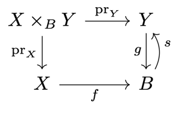

    Then, a section to $\pr_X : X \times_B Y \to X$ is given by

    $$\begin{align*}
        \s : X &\to X \times_B Y \\
        x &\mapsto (x, s \circ f(x))
    \end{align*}$$

    as in the diagram

    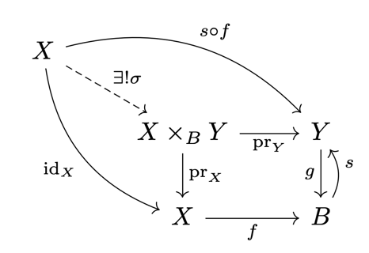

## Quotient spaces

??? definition "Definition 2.30"
    ### Quotient topology

    $\begin{align*}
        \text{Let } & X \text{ be a topological space} \\
        & \sim \text{ be equivalence relation on } X \\
        & p : X \to X/_\sim \text{ be the canonical projection}
    \end{align*}$

    The topology

    $$\O = \{U \subseteq X/_\sim \mid p^{-1}(U) \text{ is open}\}$$

    is called the **quotient topology**. The space $X/_\sim$ is called the **quotient space**.

??? remark "Remark 2.31"
    The quotient topology is the finest topology on $X/_\sim$ such that $p$ is continuous.

??? example "Example 2.32"
    Consider the space $X = [0, 1]$ and the equivalence relation $0 \sim 1$. Then, the
    quotient space $X/_\sim$ is homeomorphic to $S^1$.

    ---

    $X = [0, 1]^2$, $(0, a) \sim (1, 1-a)$. Then, $X/_\sim$ is homeomorphic to the
    Möbius strip.

    ---

    $X = [0, 1]^2$, $(0, a) \sim (1, a)$ and $(b, 0) \sim (b, 1)$. Then, $X/_\sim$ is
    homeomorphic to a torus $T^2 \cong S^1 \times S^1$.

    ---

    $X = \R^2$, $x \sim y \iff x - y \in \Z^2$. Then, $X/_\sim$ is homeomorphic to the
    torus $T^2$.

    ---
    

    $X = \R^{n+1} \setminus \{0\}$, $0 \neq \lambda \in \R$, $x \sim y \iff x = \lambda y$.
    Then, $X/_\sim$ is homeomorphic to the projective space $\R P^n$.

    ---

    $X = D^n = \{x \in \R^n \mid \|x\| \leq 1\}$, $x \sim -x \iff \|x\| = 1$. Then,
    $X/_\sim$ is homeomorphic to the projective space $\R P^n$.

??? definition "Definition 2.33"
    ### Quotient map

    A map $f : X \to Y$ is called a **quotient map** if

    $$U \in \O_Y \iff f^{-1}(U) \in \O_X$$

    We have $Y \cong X/_{\sim f}$, with the relation $a \sim_f b \iff f(a) = f(b)$.

??? proposition "Proposition 2.34"
    ### Open/closed surjections are quotient maps 

    Any open or closed continuous surjection is a quotient map.

    ??? proof
        $\begin{align*}
            \text{Let } & f : X \to Y \text{ be an open, continuous, surjective map} \\
            & V \subseteq Y \text{ be a set s.t. } f^{-1}(V) \in \O_X
        \end{align*}$

        $\begin{align*}
            & \implies f(f^{-1}(V)) = V \in \O_Y \\
            & \implies f \text{ is a quotient map}
        \end{align*}$

        Analogously for closed maps.

??? remark "Remark 2.35"
    Some quotient maps are neither open nor closed. The projection of

    $$\Big(\R \times \{0\}\Big) \cup \Big([0, \infty) \times \R\Big)$$

    onto the first coordinate is such a map.

## Final topologies and topological sums

??? definition "Definition 2.36"
    ### Final topology

    The **final topology** for a family of maps $(f_i : X_i \to Y)_{i \in I}$ is

    $$\O = \{U \subseteq Y \mid f_i^{-1}(U) \in \O_{X_i} \quad \forall\ i \in I\}$$

??? remark "Remark 2.37"
    - The initial topology is specified by a subbasis.
    - In contrast, the final topology has a simple explicit form.

??? theorem "Theorem 2.38"
    ### Universal property of the final topology 

    $\begin{align*}
        \text{Let } & (X_i)_{i \in I} \text{ be a family of topological spaces} \\
        & Y \text{ be a set} \\
        & f_i : X_i \to Y \text{ be set maps}
    \end{align*}$

    $$
    \begin{align*}
        (1) & \quad \text{The final topology is the finest topology on } Y \text{ such that the }
        f_i \text{ are continuous for all } i \in I \\ \\
        (2) & \quad \text{For any topological space } Z, \text{ and any map } g : Y \to Z, \\
        & \quad g \text{ is continuous } \iff g \circ f_i \text{ is continuous } \forall\ i \in I \\ \\
        (3) & \quad \text{The final topology is the unique topology on } Y \text{ satisfying } (2)
    \end{align*}
    $$

    ??? proof
        Analogous to that of [T.2.10](#t210).

??? definition "Definition 2.39"
    ### Topological sum

    $\begin{align*}
        \text{Let } & (X_i)_{i \in I} \text{ be a family of topological spaces} \\
        & Y = \coprod_{i \in I} X_i = \bigcup_{i \in I} \Big(X_i \times \{i\}\Big)
        \text{ be their disjoint union}
    \end{align*}$

    The final topology for the inclusions $\operatorname{in}_i : X_i \to Y$ is

    $$\O = \{U \subseteq Y \mid U \cap X_i \text{ open } \forall\ i \in I\}$$

    and the resulting space is called the **sum** or **coproduct** of the $(X_i)_{i \in I}$.

    We write $A+B$ for the sum of twp spaces $A$ and $B$.

## Pushouts

??? definition "Definition 2.40"
    ### Pushout

    For two maps $f : A \to X$ and $g : A \to Y$, the **pushout** of $f$ is the quotient
    space

    $$X +_A Y = (X + Y)/_\sim$$

    for the equivalence relation $\sim$ generated by $f(a) \sim g(a)$ for all $a \in A$.

    The diagram

    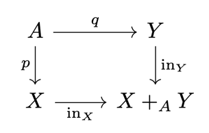

    is called a **pushout square**.

??? theorem "Theorem 2.41"
    ### Universal property of the pushout 

    Consider a commutative square of continuous maps

    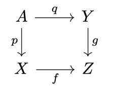

    Then, there exists a unique map $m : X +_A Y \to Z$ such that the following diagram
    commutes:

    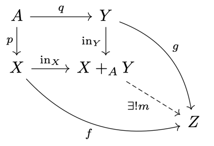

    ??? proof
        Similar to that of [T.2.28](#t228).

??? exmaple "Example 2.42"
    $A  = \emptyset \implies X +_\emptyset Y = X + Y$ (trivial equivalence relation).

    ---

    $A \subseteq X$ and $Y = \{*\}$. Then, $X +_A Y = X/A$.

    ---

    $A \subseteq X$ and $g : A \to Y$ continuous. Then, $Y \cup_g X = X +_A Y$ is called
    the **adjunction space**.

    - The relation identifies $A \subseteq X$ with the image $\Im g \subseteq Y$ (attaching
    $X$ to $Y$ along $g$).
    - For $X = D^n$, $A = S^{n-1}$, this is called attaching an $n$-cell.

## CW complexes

??? example "Example 2.43"
    Attaching a $1$-cell to a point gives a circle $S^1$

    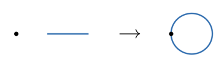

    ---

    More generally, attaching an n-cell to a point gives an $n$-sphere $S^n$.

    ---

    Attaching two $1$-cells to a point gives a bouquet of two circles.

    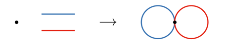

    ---

    Attaching a $2$-cell to a bouquet of two circles gives a torus $T^2$.

    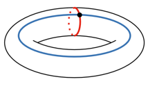

    ---

    Attaching a $2$-cell to a circle along a map $S^1 \to S^1$ that winds around the circle
    twice gives a projective plane.

??? definition "Definition 2.44"
    ### CW complex

    Let $K^0$ be a discrete space. For $n \in \N$, let $K^n$ be obtained by attaching a
    sum of $n$-cells to $K^{n-1}$.

    - The maps $S^n \to K^{n-1}$ defining the cell-attachment are called
    **attaching maps**.
    - The resulting pushout maps $D^n \to K^n$ are called **characteristic maps**.

    ---

    More generally, the space

    $$K = \bigcup_{n \in \N} K^n$$

    with the final topology for the inclusions $(K^n \hookrightarrow K)_{n \in \N}$ is called a
    **CW complex**.

    - For each $n$, the complex $K^n$ is called the $\bm n$**-skeleton** of $K$.
    - The open cells of $K$ are the homeomorphic images of the open $n$-balls under the
    characteristic maps.

??? remark "Remark 2.45"
    The name "CW" stands for "closure-finite" and "weak" topology.

    - The closure of any cell intersects only finitely many cells
    - Weak topology is an alternative name for the final topology of the inclusions.