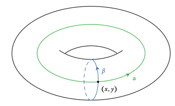
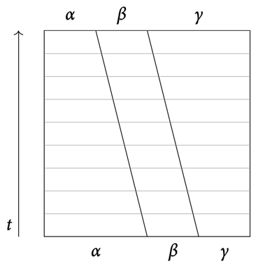

# 9 The fundamental group

## Path homotopies

??? definition "Definition 9.1"
    ### Path homotopy

    A **path** in $X$ from $p$ to $q$ is a continuous map $\gamma : [0, 1] \to X$ with 
    **endpoints** $\gamma(0) = p, \gamma(1) = q$.

    ---

    For $x\in X$, the **constant path** is $e_x : s \mapsto x$.

    ---

    A **loop** is a path $\gamma : \gamma(0) = \gamma(1)$. $\gamma(0)$ is called the
    **base point**.

    ---

    A **pth homotopy** is a homomomorphism of paths relative to $A = \{0,1\} \subset [0, 1]$

??? remark "Remark 9.2"
    There is a homotopy of paths

    $$H : [0, 1]\times [0, 1] \to X$$

    of paths $\gamma_0, \gamma_1 : p \leadsto q$. Writing $\gamma_t := H(-,t) : [0,1] \to X$,
    we require that

    $$
    \begin{cases}
        \gamma_t(0) = H(0, t) = p \\
        \gamma_t(1) = H(1, t) = q
    \end{cases}
    $$

    for all $t\in [0, 1]$.

??? example "Example 9.3"
    Using the loop

    $$
    \begin{align*}
        [0, 1] & \to S^1 \\
        s & \mapsto e^{2\pi i s}
    \end{align*}
    $$

    we can identify arbitrary loops with maps $S^1 \to X$.

    Consider for example the map $S^1 \to S^1, z \mapsto z^k$:

    - it is a loop for all $k\in \Z$.
    - it is a path, but not a loop for all $k\in\R\setminus\Z$.

    ---

    Let $T = S^1 \times S^1$ be  a torus and $(x,y) \in T$. Consider tha maps

    $$t \mapsto (t,y) \quad t \mapsto (x,t)$$

    These are loops $S^1 \to T$ in the torus that are not path-homotopic.

    

## Concatenation of paths

??? definition "Definition 9.4"
    ### Concatenation of paths

    The concatenation of the paths $\alpha : x \leadsto y, \beta : y \leadsto z$ is

    $$(\alpha * \beta)(s) := \begin{cases}
        \alpha(2s), & s\in [0, 1/2] \\
        \beta(2s - 1), & s\in [1/2, 1]
    \end{cases}$$

    This is continuous by the pasting lemma.

??? remark "Remark 9.5"
    Let $\alpha \simeq \alpha' : x \leadsto y, \beta \simeq \beta' : y \leadsto z$ be
    path homotopies. Then, we have

    $$\alpha * \beta \simeq \alpha' * \beta' : x \leadsto z$$

    So concatenation is well-defined on equivalence classes of paths:

    $$[\alpha] * [\beta] := [\alpha * \beta]$$

??? theorem "Theorem 9.6"
    ### Algebraic properties of path concatenation 

    $\begin{align*}
        \text{Let } & \alpha : x \leadsto y \\
        & \beta, \gamma \text{ be paths in } X
    \end{align*}$

    **1. Associativity**:

    The concatenation $[\alpha] * ([\beta] * [\gamma])$ is well-defined $\iff$
    $([\alpha] * [\beta]) * [\gamma]$ is well-defined.

    In that case, they are equal:

    $$[\alpha] * ([\beta] * [\gamma]) = ([\alpha] * [\beta]) * [\gamma]$$

    ---

    **2. Left and right identity**:

    For $z\in X$ let $e_z : [0,1] \to X$ be the constant path at $z$. Then

    $$[e_x] * [\alpha] = [\alpha] = [\alpha] * [e_y]$$

    ---

    **3. Inverse**:

    Define the path

    $$
    \begin{align*}
        \tilde \alpha : \alpha(1) &\leadsto \alpha(0) \\
        s &\mapsto \alpha(1-s)
    \end{align*}
    $$

    Then, we have

    $$
    \begin{align*}
        [\alpha] * [\tilde \alpha] &= [e_x] \\
        [\tilde \alpha] * [\alpha] &= [e_y]
    \end{align*}
    $$

    ??? proof
        === "$(1)$"
            A homotopy from $\alpha * (\beta * \gamma)$ to $(\alpha * \beta) * \gamma$ can
            be sketched as follews:

            

        === "$(2)$"
            Fro the right identity, a homotopy from $\alpha * e_y$ to $\alpha$ can be
            sketched as follows:

            

            For the left identity, mirror the picture.

        === "$(3)$"
            A homotopy from $e_x$ to $\alpha * \tilde \alpha$ can be sketched as follows:

            

            For the left inverse, exchange the roles of $\alpha$ and $\tilde \alpha$.

## The fundamental group

??? definition "Definition 9.7"
    ### Fundamental group

    Let $x \in X$. The **fundamental group** $\pi_1(X, x)$ of $X$ based at $x$ is the
    group of path-homotopy classes of loops based at $x$:

    $$\pi_1(X,x) = \{\gamma : x \leadsto x\} / \sim$$

    with group operation $*$ given by concatenation of paths.

??? example "Example 9.8"
    Define the map

    $$
    \begin{align*}
        \gamma_k : S^1 &\to S^1 \\
        z &\mapsto z^k
    \end{align*}
    $$

    Then, we have $\gamma_k * \gamma_1 = \gamma_{k+1}$, so this gives a group homomorphism

    $$
    \begin{align*}
        \Phi : \Z &\to \pi_1(S^1, 1) \\
        k &\mapsto \gamma_k
    \end{align*}
    $$

    We will later show that this is an isomorphism.

    ---

    In $\R^n$, every looå is nullhomotopic, so $\pi_1(\R^n, x)$ is trivial for any choice
    of base point $x$.

    ---

    Similarly, $\pi_1(S^k,x)$ is trivial for $k\geq 2$. This is not trivial, as there are
    space-filling loops in $S^k$.

    ---

    Recall the two essential loops $\alpha, \beta$ in the torus from [E.9.3](#e93).

    - Both give non-trivial elements in the fundamental group.
    - $\alpha * \beta \simeq \beta * \alpha$
    - This is unusial. The fundamental group is in general not commutative.

## The fundamental groupoid

??? definition "Definition 9.9"
    ### Fundamental groupoid

    Let $X$ be a topological space. Its **fundamental groupoid** $\Pi(X)$ is the
    groupoid defined by

    - objects: points of $X$
    - morphisms: homotopy classes of paths
    - composition: concatenation of equivalence classes of paths

??? remark "Remark 9.10"
    $\Pi(X)$ is a groupoid. It follows from [T.9.6](#t96):

    - Compositions of morphisms are well-defined [R.9.5](#r95). 
    - Composition of morphisms is associative.
    - For every object $x$, we have by an identity morphism $e_x$.
    - Every morphism has an inverse.

??? remark "Remark 9.11"
    The isomorphism classes of objects in $\Pi(X)$ are exactly $\pi_0(X)$:

    $$x \text{ is isomorphic to } y \text{ in } \Pi(X) \iff \exists\, \gamma : x \leadsto y$$

    The automorphisms of a point $x \in X$, viewed as an object in $\Pi(X)$,
    (isomorphisms from $x$ to itself) are 

    $$\Hom_{\Pi(X)}(x, x) = \pi_1(X, x)$$

    Isomorphic objects in any category have isomorphic groups of automorphisms.

??? lemma "Lemma 9.12"
    ### Change of base point 

    Let $\alpha : x \leadsto y$ be a path in $X$. The map

    $$
    \begin{align*}
        \psi_\alpha : \pi_1(X, x) &\to \pi_1(X, y) \\
        [\gamma] &\mapsto [\alpha]^{-1} * [\gamma] * [\alpha]
    \end{align*}
    $$

    is a group isomorphism. The assignement $\alpha \mapsto \psi_\alpha$ defines a functor
    $\Pi(X) \to \bm{\operatorname{Grp}}$.

    ??? proof
        === "Homomorphism"
            $$
            \begin{align*}
                \psi_\alpha([\gamma] * [\gamma'])
                &= [\alpha]^{-1} * [\gamma] * [\gamma'] * [\alpha] \\
                &= [\alpha]^{-1} * [\gamma] * [\alpha] * [\alpha]^{-1} * [\gamma'] * [\alpha] \\
                &= \psi_\alpha([\gamma]) * \psi_\alpha([\gamma'])
            \end{align*}
            $$

        === "Bijectivity"
            Let $\hat\alpha : s \mapsto \alpha(1-s)$ be the reverse path of $\alpha$. Then,
            $\psi_{\hat\alpha}$ is the inverse of $\psi_\alpha$.

        === "Functoriality"
            $$
            \begin{align*}
                \psi_{\alpha * \beta}([\gamma])
                &= [\alpha * \beta]^{-1} * [\gamma] * [\alpha * \beta] \\
                &= [\beta]^{-1} * [\alpha]^{-1} * [\gamma] * [\alpha] * [\beta] \\
                &= \psi_\beta \circ \psi_\alpha([\gamma])
            \end{align*}
            $$

??? remark "Remark 9.13"
    The particular isomorphism $\psi_\alpha$ depends on the chosen path $\alpha$.

??? corollary "Corollary 9.14"
    ### Base point independence 

    Let $X$ be a path-connected topological space. Then, the fundamental group $\pi_1(X, x)$
    is independent of the choice of base pooint $x$ up to a non-unique isomorphism.

??? remark "Remark 9.15"
    For all $x\in X$, the fundamental group $\pi_1(X, x)$ is a full subcategory of the
    fundamental groupoid $\Pi(X)$.

    ---

    The embedding of $\pi_1(X, x)$ into $\Pi(X)$ thus defines a fully faithful functor.
    $(\Hom_{\pi_1(X, x)}(x,x) \xrightarrow{\sim} \Hom_{\Pi(X)}(x,x))$

    ---

    If $X$ is path-connected, this functor is also essentially surjective. Hence it is
    an equivalence of categories.

    ---

    Therefore, the fundamental groups and the fundamental groupoid are equivalelce
    invariants of the path-connected spaces.

    ---

    The fundamental groupoid encodes more explicit information:

    - For arbitrary spaces, it contains all fundamental groups of path-components.
    - For different different base points of a component, it contains the explicit
      isomorphisms induced by paths between the base points.

??? proposition "Proposition 9.16"
    ### Functoriality of the fundamental groupoid 

    $\begin{align*}
        \text{Let } & f : X \to Y \text{ be a continuous map} \\
        & \alpha : x \leadsto y \text{ be a path in } X
    \end{align*}$

    Then, $f \circ \alpha : f(x) \leadsto f(y)$ is a path in $Y$.

    ---

    This assignment is compatible with concatenation, meaning that

    $$
    \begin{align*}
        \Pi(f) : \Pi(X) &\to \Pi(Y) \\
        x &\mapsto f(x) \\
        [\alpha] &\mapsto f_*[\alpha] := [f \circ \alpha]
    \end{align*}
    $$

    is a morphism of groupoids (a functor).

    ---

    With this assignment, the fundamental groupoid becomes is a functor

    $$\Pi : \bm{\operatorname{Top}} \to \bm{\operatorname{Grpd}}$$

    ??? proof
        $\begin{align*}
            \text{Let } & x, y, z \in X \\
            & \alpha : x \leadsto y \\
            & \beta : y \leadsto z
        \end{align*}$

        $$
        \begin{align*}
            \implies f_*(\alpha * \beta) &= [f \circ (\alpha * \beta)] \\
            &= [(f \circ \alpha) * (f \circ \beta)] \\
            &= f_*[\alpha] * f_*[\beta]
        \end{align*}
        $$

        Additionally, we have $f_*(e_x) = [f \circ e_x] = [e_{f(x)}]$.

??? corollary "Corollary 9.17"
    In particular, we get a group homomorphism

    $$
    \begin{align*}
        f_* : \pi_1(X, x) &\to \pi_1(Y, f(x)) \\
        [\alpha] &\mapsto [f \circ \alpha]
    \end{align*}
    $$

    If $f$ is a homeomorphism, then $f_*$ is an isomorphism of the fundamental groups.

## Homotopy invariance

??? proposition "Proposition 9.18"
    ### Induced homomorphism of homotopic maps 

    Let $H$ be a homotopy between maps $f, g : X \to Y$. Further, let $x\in X$, and
    define the path $\alpha_x : t \mapsto H(x,t) \in Y$. Then, we have

    $$g_* = \psi_{\alpha_x} \circ f_* : \pi_1(X, x) \to \pi_1(Y, g(x))$$

    and for every $[\gamma] \in \pi_1(X, x)$, we have

    $$[g\circ \gamma] = \psi_{\alpha_x}([f \circ \gamma])
    = [\alpha_x]^{-1} * [f \circ \gamma] * [\alpha_x] \in \pi_1(Y, g(x))$$

    If $H$ is a homotopy relative to $\{x\}$, then $f,g$ induce the same homomorphism
    of fundamental groups.

    ??? proof
        ?

??? corollary "Corollary 9.19"
    If $f : X \to Y$ is a homotopy equivalence, then $f_*$ is a group isomorphism. Furthermore,
    $\pi_1(X, x)$ is a homotopy invariant of pointed spaces.

    ---

    Contractible spaces have trivial fundamental groups.

??? example "Example 9.20"
    $\R^n$ ha trivial fundamental groups for any base point. Any star-shaped region
    has a trivial fundamental group.

    ---

    For $n \ge 2, x \in S^n$, we have
    $\pi_1(\R^{n+1}\setminus\{0\}, x) \cong \pi_1(S^n, x)$, which is trivial.

??? proposition "Proposition 9.21"
    ### Homotopic maps and groupoids 

    Let $H$ be a homotopy between $f, g : X \to Y$.

    Then, $H$ induces a natural isomorphism of the functors

    $$\Pi(f), \Pi(g) : \Pi(X) \to \Pi(Y)$$

    ??? proof
        Let $a_x : t \mapsto H(x,t) \in Y$ for any $x\in X$. Then, $([a_x])_{x\in X}$
        defines a natural transformation $\Pi(f) \Rightarrow \Pi(g)\quad(i)$.

        The morphism $[\gamma] : x \to x'$ in $\Pi(X)$ is a path-homotopy class, represented
        by $\gamma : x \leadsto x'$.
    
        The morphisms $\Pi(f)([\gamma]), \Pi(g)([\gamma])$ are represented by
        $f \circ \gamma, g \circ \gamma$.
    
        So, by $(i)$, the following diagram commutes:
    
        
    
        In other words,
        $f\circ \gamma * \alpha_{x'} \simeq \alpha_x * g \circ \gamma \rel \{x,x'\}$.
        The morphisms of a groupoid are isomorphisms, so we have a natural isomorphism.

        

??? corollary "Corollary 9.22"
    $f : X \to Y$ is a homotopy equivalence $\implies \Pi(f) : \Pi(X) \to \Pi(Y)$ is an
    equivalence of categories.

    In particular, contractible spaces have have trivial fundamental groupoids.

??? definition "Definition 9.23"
    ### Simply connected

    A topological space $X$ is **simply connected** if it is path-connected and has
    trivial fundamental groups:

    1. $\pi_0(X)$ is trivial
    2. $\pi_1(X, x)$ is trivial for all $x\in X$.

    Equivalently, the fundamental groupoid is equivalent to the trivial groupoid.

