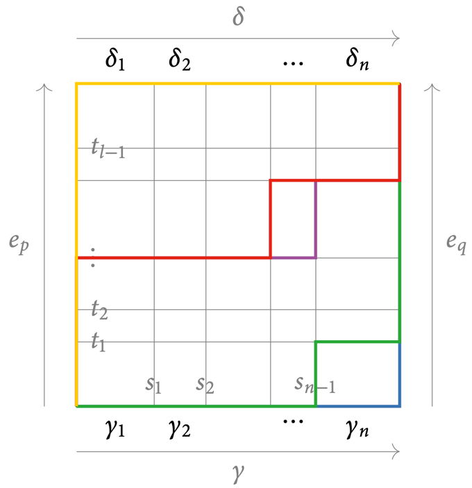
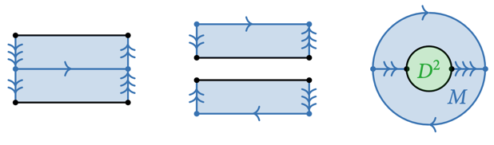
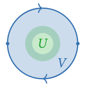

# 10 The Seifert-Van Kampen Theorem

## The fundamental groupoid of a union

??? theorem "Theorem 10.1"
    ### Seifert-Van Kampen theorem, groupoid version 
    
    Let $X$ be a topological space, and $\{U,V\}$ be an open cover. The commutative diagram
    
    

        \begin{tikzcd}
            \Pi(U\cap V) \arrow[r] \arrow[d] & \Pi(U) \arrow[d] \\
            \Pi(V) \arrow[r]                 & \Pi(X)
        \end{tikzcd}
    

    
    induced by the inclusions of $U\cap V$ into $U$ and $V$ and into $X$ is a pushout diagram.

    ??? proof
        For a groupoid $G$, we need a unique morphism $f : \Pi(X) \to G$ making the diagram
        commute:

        

            \begin{tikzcd}
                \Pi(U\cap V) \arrow[r] \arrow[d]                & \Pi(U) \arrow[d] \arrow[ddr, bend left, "f_U"] & \\
                \Pi(V) \arrow[r] \arrow[drr, bend right, "f_V"] & \Pi(X) \arrow[dr, dashed, "f"]                 & \\
                                                                &                                                & G
            \end{tikzcd}
        

        1. Define the functor $f$ at the level of objects
        2. Define the functor $f$ at the level of morphisms (homotopy classes of paths in $X$)
        3. Show that every path oin $X$ is a concatenation of paths in $U$ or $V$
        4. Show that $f$ is well-defined, independent of the choice of path.

        === "$(1)$"
            For the two triangles to commute, we must have

            $$f(x) = \begin{cases}
                f_U(x), & x \in U \\
                f_V(x), & x \in V
            \end{cases}$$

            If $x \in U\cap V$, then by the commutativity of the outer square, we have that
            $f_U(x) = f_V(x)$, so it is well-defined.

        === "$(2)$"
            Consider the morphism $[\gamma]$ represented by the path
            $\gamma : [0, 1] \to X, p \leadsto q$.

            If $\gamma$ is a path entirely in $U$, define $f([\gamma]) = f_U([\gamma])$.
            Similarly for $V$.

            Now, if $\gamma = \gamma_1 * \dots * \gamma_n$ is a concatenation of paths in $U$ or
            $V$, define $f([\gamma]) = f([\gamma_n]) \circ \cdots \circ f([\gamma_1])$ to
            ensure functoriality of $f$.

        === "$(3)$"
            Let $\gamma$ be a path in $X$. Then, $\gamma^{-1}(U), \gamma^{-1}(V)$ are open
            in $[0, 1]$. Thus, they are unions of open intervals. Since $[0, 1]$ is compact,
            we can find a finite subcover. Now, choose

            $$0 = s_0 < s_1 < \cdots < s_n = 1$$

            in the pairwise intersections of this finite open cover. Then we have that
            $\gamma|_{[s_{i-1}, s_i]}$ is entirely in $U$ or $V$. Now, reparametrize 
            $\gamma|_{[s_{i-1}, s_i]}$ to get the path $\gamma_i$. Then, we have

            $$\gamma = \gamma_1 * \cdots * \gamma_n$$

            which is a concatenation of paths lying entirely in $U$ or $V$.

        === "$(4)$"
            Assume $[\gamma] = [\delta]$. Observe that

            - if $\gamma_i \sim \gamma_i'$ is path-homotopic in $U$ of $V$, then
            $f([\gamma_i]) = f([\gamma_i'])$.
            - if both $\gamma_i, \gamma_{i+1}$ map entorely into $U$ or $V$, then
            by functoriality of $f_V, f_U$, we have that
            $f([\gamma_i*\gamma_{i+1}]) = f([\gamma_{i+1}]) \circ f([\gamma_i])$.

            Let $H : [0, 1]^2 \to X$ be a path homotopy from $\gamma$ to $\delta$.

            

            By compactness of $[0, 1]^2$, we can find

            $$
            \begin{align*}
                & 0 = s_0 < s_1 < \cdots < s_n = 1, \\
                & 0 = t_0 < t_1 < \cdots < t_l = 1
            \end{align*}
            $$

            such that $H|_{[s_{i-1}, s_i]\times [t_{j-1}, t_j]}$ lies entirely in $U$ or $V$.
            This yields a decomposition of paths

            $$
            \begin{align*}
                & \gamma = \gamma_1 * \cdots * \gamma_n, \\
                & \delta = \delta_1 * \cdots * \delta_l
            \end{align*}
            $$

            So by yinduction, we get

            $$f([\gamma]) = f([\gamma_n]) \circ \cdots \circ f([\gamma_1])
            = f([\delta_l]) \circ \cdots \circ f([\delta_1]) = f([\delta]).$$

??? remark "Remark 10.2"
    Recall the universal property of apushout: If $G$ is another groupoid together with morphisms 
    making the outer diagram commute:

    

        \begin{tikzcd}
            \Pi(U\cap V) \arrow[r] \arrow[d]         & \Pi(U) \arrow[d] \arrow[ddr, bend left] & \\
            \Pi(V) \arrow[r] \arrow[drr, bend right] & \Pi(X) \arrow[dr, dashed]               & \\
                                                     &                                         & G
        \end{tikzcd}
    

    Then, there is a unique morphism $\Pi(X)\to G$ making the diagram commute.

??? remark "Remark 10.3"
    Note that $X = U \cup V$ is the pushout of the inclusions $U\cap V \hookrightarrow U, V$:

    

        \begin{tikzcd}
            U\cap V \arrow[r, hook] \arrow[d, hook] & U \arrow[d] \\
            V \arrow[r]                             & X
        \end{tikzcd}
    

    So the Seifert-Van Kampen theorem says that $\Pi(-)$ sends pushouts of open inclusions to
    pushouts of groupoids.

??? remark "Remark 10.4"

    We do not have a simple explicit construction for a pushout of groupoids. Thus, the
    theorem is easy to state but not easy to compute.

    There is a version for the fundamental group, which is more restrictive but very explicit.

??? theorem "Theorem 10.5"
    ### Seifert-Van Kampen theorem, group version 

    Let $X$ be a topological space, and $\{U,V\}$ be an open cover. Assume that $U\cap V$ is
    path-connected.
    
    Now, let $x \in U\cap V$. Then, the commutative diagram

    

        \begin{tikzcd}
            {\pi_1(U\cap V, x)} \arrow[r] \arrow[d] & {\pi_1(U, x)} \arrow[d] \\
            {\pi_1(V, x)} \arrow[r]                 & {\pi_1(X, x)}
        \end{tikzcd}
    

    induced by the inclusion of $U\cap V$ into $U$ and $V$ and into $X$ is a pushout diagram.

    ??? proof
        Let $x, X'$ be as in [L.10.20](#l1020). Further, let $U' := U\cap X', V' := V\cap X'$.
        
        ??? proof "Claim: $x$ meets every path-component of $U', V', U'\cap V'$"
            $U \cap V$ is path-connected, so $U' \cap V' = U \cap V \cap X' = U \cap V$.
            
            By [L.10.20](#l1020), $U', V'$ are path-connected, so $x$ meets every
            path-components of $U', V', U'\cap V'$.

        Now, let $A = \{x\}$. By [T.10.19](#t1019), we have a pushout diagram of groupoids

        

            \begin{tikzcd}
                {\pi_1(U\cap V, x) \simeq \Pi(U'\cap V', A)} \arrow[r] \arrow[d] & {\Pi(U', A) \simeq \pi_1(U, x)} \arrow[d] \\
                {\pi_1(V, x) \simeq \Pi(V, A)} \arrow[r]                         & {\Pi(X', A) \simeq \pi_1(X, x)}
            \end{tikzcd}
        

        In particular, $\pi_1(X, x)$ is the pushout of groups.

## Pushout of groups

??? definition "Definition 10.6"
    ### Free product

    The **free product** of two groups $G_1, G_2$, as a set, is

    $$G_1 * G_2 = \{(g_1, \dots, g_n) \mid n \ge 0, g_i \in G_1 \sqcup G_2\}/\sim$$

    where $\sim$ is the equivalence relation generated by

    1. If $g_i, g_{i+1}$ are both in $G_1$ or both in $G_2$, then
    $(g_1, \dots, g_n) \sim (g_1, \dots, g_{i-1}, g_i g_{i+1}, g_{i+2}, \dots, g_n)$.
    2. If $g_i = e$ the identity, then
    $(g_1, \dots, g_n) \sim (g_1, \dots, g_{i-1}, g_{i+1}, \dots, g_n)$.

    The group structure is induced by concatenation:

    $$(g_1, \dots, g_n) \cdot (g_{n+1}, \dots, g_{k}) = (g_1, \dots, g_k)$$

??? remark "Remark 10.7"
    Check that this operation is well-defined on $G_1 * G_2$, e.i. that it descends to
    to equivalent classes $[(g_1, \dots, g_n)]$, and makes it into a group.

??? example "Example 10.8"
    1. $\{e\} * \{e\} \cong \{e\}$.
    2. $\{e\} * G \cong G$.
    3. $\Z * \Z$ is huge. It kontains $(k_1, l_1, k_2, l_2, \dots, k_n, l_n)$, where
    $k_i$ is in the first copy of $\Z$ and $l_i$ in the second copy.
    4. $\Z a * \Z b/\langle aba^{-1}b^{-1}\rangle$ is much smaller, and is isomorphic to
    $\Z a \oplus \Z b$.

    
??? example "Example 10.9"
    We show that the following diagram is a pushout:

    

        \begin{tikzcd}
            \{e\} \arrow[r, "j_1"] \arrow[d, "j_2"]      & G_1 \arrow[d] \arrow[ddr, bend left, "f_1"] & \\
            G_2 \arrow[r] \arrow[drr, bend right, "f_2"] & G_1 * G_2 \arrow[dr, dashed, "\exists!f"]   & \\
                                                         &                                             & H
        \end{tikzcd}
    

    Since the diagram should commute, $f$ must satisfy

    $$
    f([g]) = \begin{cases}
        f_1(g), & g \in G_1 \\
        f_2(g), & g \in G_2
    \end{cases}
    $$

    Further, $f$ is a group homomorphism:

    $$f([g_1, \dots, g_n]) = f([g_1]) \cdots f([g_n]).$$

    This determines the group homomorphism $f : G_1 * G_2 \to H$ uniquely.

??? example "Example 10.10"
    We show that the following diagram is a pushout:

    

        \begin{tikzcd}
            G_0 \arrow[r, "j_1"] \arrow[d, "j_2"] & G_1 \arrow[d] \\
            G_2 \arrow[r]                         & G_1 * G_2/ N(I)
        \end{tikzcd}
    

    where $I = \{j_1(g)j_2(g)^{-1} \mid g \in G_0\}$ and $N(I)$ is the normal subgroup
    generated by $I$.

    Consider the diagram

    

        \begin{tikzcd}
            G_0 \arrow[r, "j_1"] \arrow[d, "j_2"]        & G_1 \arrow[d] \arrow[ddr, bend left, "f_1"]            & \\
            G_2 \arrow[r] \arrow[drr, bend right, "f_2"] & G_1 * G_2/N(I) \arrow[dr, dashed, "\exists!\tilde f"]   & \\
                                                         &                                                        & H
        \end{tikzcd}
    

    Check that the group homomorphism $f$ in [E.10.9](#e109) descends to the quotient
    $G_1 * G_2/N(I)$.

??? remark "Remark 10.11"

    This pushout property also holds in the category of groupoids: Recall that groups form
    a full subcategory of groupoids. Thus, consider the above as a diagram of groupoids,
    with $H$ any groupoid.

## Examples using the Seifert-Van Kampen Theorem

??? example "Example 10.12"
    Consider a wedge of two circles

    

        \begin{tikzpicture}
            \draw (0,0) circle (1);
            \draw (2,0) circle (1);
            \fill (1,0) circle (0.1);
            \node at (1.3,0) {$p$};
        \end{tikzpicture}
    

    Apply the Seifert-Van Kampen theorem to the open cover $U$ = left circle + half of the right
    circle, $V$ = right circle + half of the left circle.

    - $U$ deform retracts onto the left circle
    - $V$ deform retracts onto the right circle

    $$\pi_1(U, p) \cong \pi_1(V, p) \cong \pi_1(S^1, p) \cong \Z$$

    The intersection $U\cap V$ deformation retracts onto $p$, so it is contractible.

    $$\pi_1(U\cap V, p) \cong \pi_1(\{p\}, p) \cong \{e\}$$

    Thus, it is path-connected. By the Seifert-Van Kampen, the fundamental group of the wedge
    is the pushout

    

        {\begin{tikzcd}
            \{e\} \cong {\pi_1(U\cap V, p)} \arrow[r] \arrow[d] & {\pi_1(U, p)} \cong \mathbb{Z} \arrow[d] \\
            \mathbb{Z} \cong {\pi_1(V, p)} \arrow[r]            & {\pi_1(X, p)} = \mathbb{Z} * \mathbb{Z}
        \end{tikzcd}}
    

??? example "Example 10.13"
    We will compute the fundamental group of the projective space $\R\mathbb{P}^2$.

    $\R\mathbb{P}^2$ can be obtained by attaching a disk $D^2$ to the boundary of a Möbius strip
    $M$, $\R\mathbb{P}^2 = M +_{S^1} D^2$.

    

    We use the open neighborhoods $U \supseteq D^2, V \supseteq M$ chosen such that

    $$U \cong \operatorname{int} D^2, \quad V \cong \operatorname{int} M,
    \quad U\cap V \cong S^1 \times (0,1)$$

    

    Note that $U \cap V \cong S^1 \times (0,1)$ is path-connected, so it does not matter
    which $x \in U\cap V$ we choose for the fundamental groups.

    - $V, U \cap V$ deformation retract to $S^1$
    - $U$ is contractible

    Thus, we end up the diagram

    

        \begin{tikzcd}
            \mathbb{Z} \cong {\pi_1(U\cap V, x)} \arrow[r] \arrow[d, "\iota_*"] & {\pi_1(U, x)} \cong \{e\} \arrow[d] \\
            \mathbb{Z} \cong {\pi_1(V, x)} \arrow[r]                          & {\pi_1(X, x)}
        \end{tikzcd}
    

    The map $\iota_*$ is induced by the inclusion of the cylinder $U\cap V$ into the
    Möbius strip $V$. Under the deformations onto $S^1$, the central circle of the cylinder
    maps around the central cirlce of the Möbius strip twice.

    Thus, we can conclude that $\pi_1(\R\mathbb{P}^2) \cong \Z/2\Z$.
    

    ??? example "Example 10.14"
        1. The funcamental group of the circle is $\pi_1(S^1, x) \cong \Z$.
        2. The fundamental group of the $n$-sphare for $n \ge 2$ is
        $\pi_1(S^n, x) \cong \{e\}$.

## The relative fundamental groupoid

??? definition "Definition 10.15"
    ## Relative fundamental groupoid

    For a subset $A \subseteq X$, the **relative fundamental groupoid** is the full
    subcategory

    $$\Pi(X, A) \subseteq \Pi(X)$$

    on the objects of $A$:

    - $\Ob\Big(\Pi(X, A)\Big) = A$
    - $\Hom_{\Pi(X, A)}(a, a') = \Hom_{\Pi(X)}(a, a') \quad a, a' \in \Pi(X, A)$

??? example "Example 10.16"
    1. $A = \{x\} \implies \Pi(X, A) = \Pi(X, x)$.
    2. $A = X \implies \Pi(X, A) = \Pi(X)$.
    3. For $X = [0, 1], A = \{0, 1\}$, we have that $X$ is contractible. So $\Pi(X, A)$ is
    the groupoid

    

        \begin{tikzcd}
            -1 \arrow["\operatorname{id}_{-1}", loop, distance=2em, in=145, out=215] \arrow[r, "f", bend left] & 1 \arrow["\operatorname{id}_1", loop, distance=2em, in=325, out=35] \arrow[l, "f^{-1}", bend left]
        \end{tikzcd}
    

??? proposition "Proposition 10.17"
    ### Equivalence of absolute and relative fundamental groupoids
    Let $A \subseteq X$ be a subset.

    $$A \text{ meets every path-component of } X \implies \Pi(X, A) \xrightarrow{i} \Pi(X)
    \text{ is an equivalence of categories}$$

    ??? proof
        **Step 1**: construct a retraction $r : \Pi(X) \to \Pi(X, A)$ to $i$.

        Let $x \in X$.

        - $x \in A$: set $r(x) = x$ and $f_x = e_x$ the constant path.
        - $x \notin A$: Choose an element $r(x) \in A$ from the path-component of $x$, and
        choose a path $f_x : x \leadsto r(x)$.
        - if $[g] : x \to y$ is a morphism in $\Pi(X)$ represented by $g : x \leadsto y$,
        set $r([g]) = [f_x^{-1} * g* f_y]$.

        **Step 2**: natural isomorphism $\id_{\Pi(X)} \to i\circ r$.
    
        So $r$ is a retraction of $i$. Further, the family of morphisms $([f_x])_{x \in X}$ in
        $\Pi(X)$ assemble a natural isomorphism $\id_{\Pi(X)} \to i\circ r$:
    
        

            \begin{tikzcd}
                x \arrow[r, "{[f_x]}"] \arrow[d, "{[g]}"] & r(x) \arrow[d, "{r([g]) = [f_x^{-1} * g * f_y]}"] \\
                y \arrow[r, "{[f_y]}"]                    & r(y)
            \end{tikzcd}
        

??? example "Example 10.18"
    1. $\Pi([0, 1]) \xleftarrow{\simeq} \Pi([0, 1], \{0, 1\}) \xleftarrow{\simeq} \pi_1([0, 1])$
    2. $\Pi(S^1) \xleftarrow{\simeq} \Pi(S^1, \{-1, 1\}) \xleftarrow{\simeq} \pi_1(S^1)$

## The relative Seifert-Van Kampen theorem

??? theorem "Theorem 10.19"
    ### Seifert-Van Kampen theorem, relative version 
    Let $\{U, V\}$ be an open cover of $X$

    $\begin{align*}
        \text{Let } & \{U, V\} \text{ be an open cover of } X \\
        & A \subseteq X \text{ be a subset meeting every path-component of } U, V, U\cap V.
    \end{align*}$

    The commutative diagram

    

        \begin{tikzcd}
            \Pi(U\cap V, A) \arrow[r] \arrow[d] & \Pi(U, A) \arrow[d] \\
            \Pi(V, A) \arrow[r]                 & \Pi(X, A)
        \end{tikzcd}
    

    induced by the inclusions is a pushout diagram.

    ??? proof
        First, set $r_{U\cap V} = r : \Pi(U \cap V) \to \Pi(U\cap V, A)$ from the proof of
        [P.10.17](#p1017).

        Then, extend to $r_U : \Pi(U) \to \Pi(U, A)$ using the same construction on objects
        and morphisms. Similarly for $r_V$.

        Next, set $r_X|_U = r_U, r_X|_V = r_V$ on objects and morphisms.

        ??? proof "Claim: $r_X$ is well-defined"
            Both $r_U, r_V$ extend from $r_{U\cap V}$, so they agree on objects and morphisms
            in $U\cap V$.

        Thus, by [L.8.27](../8_homotopies#l827), we get a double pushout diagram:

        

            \begin{tikzcd}
                {\Pi(U\cap V, A)} \arrow[rrr] \arrow[ddd] &                                                            &                                    & {\Pi(U, A)} \arrow[ddd] \\
                                                          & \Pi(U\cap V) \arrow[lu, "r_{U\cap V}"] \arrow[r] \arrow[d] & \Pi(U) \arrow[ru, "r_U"] \arrow[d] &                         \\
                                                          & \Pi(V) \arrow[ld, "r_V"] \arrow[r]                         & \Pi(X) \arrow[rd, "r", dotted]     &                         \\
                {\Pi(V, A)} \arrow[rrr]                   &                                                            &                                    & {\Pi(X, A)}            
            \end{tikzcd}
        

??? lemma "Lemma 10.20"
    ### Intersections of path-components 
    $\begin{align*}
        \text{Let } & \{U, V\} \text{ be an open cover of } X \text{ s.t.} \\
        & U \cap V \text{ is path-connected.} \\
        & x \in U\cap V \\
        & X' \text{ be the path-component of } x \text{ in } X
    \end{align*}$

    $$\implies U \cap X', V \cap X' \text{ are path-connected}$$

??? example "Example 10.21"
    Recall that $\pi(S^1) \xleftarrow{\simeq} \pi(S^1, \{-1, 1\}) \xleftarrow{\simeq} \Pi(S^1)$.

    $\begin{align*}
        \text{Let } & U = S^1 \setminus \{i\} \\
        & V = S^1 \setminus \{-i\} \\
        & A = \{-1, 1\}
    \end{align*}$

    Then, we have that $\Pi(U, A)$ is the groupoid

    

        \begin{tikzcd}
            -1 & 1 \arrow[l, bend left, "\alpha_1"]
        \end{tikzcd}
    

    and $\Pi(V, A)$ is the groupoid

    

        \begin{tikzcd}
            -1 \arrow[r, bend left, "{\alpha_{-1}}"] & 1
        \end{tikzcd}
    

    while $\Pi(U\cap V, A)$ is the discrete groupoid (with only identity morphisms).

    So by [T.10.19](#t1019), $\Pi(S^1, A)$ is the pushout

    

        \begin{tikzcd}
            -1 \arrow[r, bend left, "\alpha_2"] 1 \arrow[l, bend left, "\alpha_1"]
        \end{tikzcd}
    

    where $\alpha_2 \circ \alpha_1 \neq \id_1$. This automorphism
    $\beta = \alpha_2 \circ \alpha_1$ generate the automorphisms of $1$ freely:

    $$\pi_1(S^1, 1) = \Hom_{\Pi(S^1, A)}(1, 1) = \{\beta^k \mid k \in \Z\} \cong \Z$$

    Recall that $[\beta^k]$ is the homotopy class of the loop
    $\gamma_k : S^1 \to S^1, z \mapsto z^k$ from [E.9.8](../9_fundamental_group#e98). 
