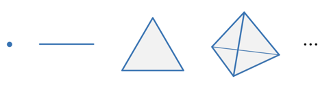
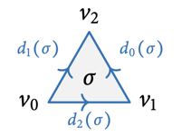
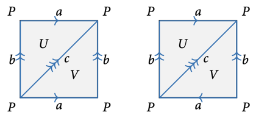
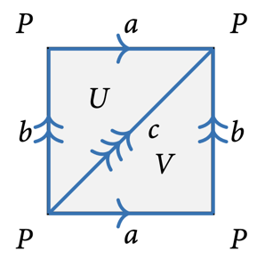

# 11 Homology

    $\newcommand{\Csing}{C^\text{sing}}$

## Singular simplices

???+ definition "Definition 11.1"
    ### Standard *n*-simplex

    For $n\in\N$, the **standard $\bm n$-simplex** is the subspace

    $$\Delta^n = \left\{(t_0,\dots, t_n)\in\R^n \mid t_i \ge 0, \sum_{i=0}^n t_i = 1\right\}
    \subseteq \R^{n+1}.$$

    For $0 \le i \le n$, the **$\bm i$-th vertex** $v_i$ of $\Delta^n$ is the standard basis
    vector $e_{i+1} \in \R^{n+1}$.

    

???+ remark "Remark 11.2"
    The standard $n$-simplex is the convex hull of its vertices, standard basis vectors.

???+ definition "Definition 11.3"
    ### Singular *n*-simplex

    A **singular $\bm n$-simplex** in $X$ is a continuous map $\sigma:\Delta^n\to X$.

    Let $\delta^i : \Delta^{n-1} \hookrightarrow \Delta^n$ be the embedding that maps
    the vertices $(v_0, \dots, v_{n-1})$ of $\Delta^{n-1}$ affinely to the vertices
    $(w_0, \dots, w_{i-1}, w_{i+1}, \dots, w_n)$ of $\Delta^n$.

    The **$\bm i$-th face** $d_i(\sigma)$ of a singular $n$-simplex $\sigma$ is the
    restriction of $\sigma$ via the embedding $\delta^i$

    $$d_i(\sigma) = \sigma \circ \delta^i : \Delta^{n-1} \to X.$$

    
    

???+ remark "Remark 11.4"
    - *Singular* indicates that $\sigma$ does not need to be an embedding.
    - A singular $0$-simplex is essentially a point.
    - A singular $1$-simplex is essentially a path $\gamma$ (after identifying
    $\Delta^1 \cong [0,1]$).
        - Its $0$-th face is the endpoint $\gamma(0)$.
        - Its $1$-st face is the endpoint $\gamma(1)$.

## Singular chains

???+ definition "Definition 11.5"
    ### Free abelian group

    For a set $S$, the **free abelian group** on $S$ is

    $$\Z S = \bigoplus_{s\in S} \Z =
    \left\{ \sum_{s\in S} n_s s \mid n_s\in\Z,
    n_s = 0 \text{ for all but finitely many } s \right\}.$$

    If $|S| = r < \infty$, we say that $\Z S$ has rank $r$.

???+ remark "Remark 11.6"
    This group is free in the following sense:

    - Every homomorphism of abelian groups $\Z S \to A$ is uniquely determined by map of
    sets $S \to A$ using the canonical inclusion $S \hookrightarrow \Z S$.
    - This can be expressed by an adjunction $F \dashv U$ of a free functor
    $F : \mathbf{Set} \to \mathbf{Ab}$ and a forgetful functor
    $U : \mathbf{Ab} \to \mathbf{Set}$ similarly to vector spaces.

???+ definition "Definition 11.7"
    ### Singular chain

    The group of **singular $\bm n$-chains** $\Csing_n(X)$ of $X$ is the free abelian group
    generatoed by the singular $n$-simplices in $X$:

    $$\Csing_n(X) = \Z\{\sigma : \Delta^n \to X\}.$$

    The **$\bm n$-th boundary map** $\partial_n : \Csing_n(X) \to \Csing_{n-1}(X)$ is the
    homomorphism defined uniquelly by

    $$\partial_n(\sigma) = \sum_{i=0}^n (-1)^i d_i(\sigma).$$

    A chain with zero boundary $\s \in \ker \partial_n$ is called a **singular cycle**.

    A chain $\s \in \Im \partial_{n+1}$ is called a **singular boundary**.

    

???+ lemma "Lemma 11.8"
    ### Every boundary is a cycle 

    $$\partial^2 = 0$$

    ???+ proof
        Observe that

        $$d_jd_i(\s) = d_{i-1}d_j(\s) \quad \text{for } j < i.$$

        Then we have

        $$
        \begin{align*}
            \partial^2(\s)
            &=\partial \left(\sum_{i=0}^n (-1)^i d_i(\s)\right) \\
            &=\sum_{i=0}^n \partial d_i(\s) \\
            &= \sum_{i=0}^n \sum_{j=0}^n (-1)^j d_jd_i(\s) \\
            &= \sum_{i=0}^n (-1)^i \sum_{j=0}^{i-1} (-1)^j d_{i-1}d_j(\s)
            + \sum_{i=0}^n (-1)^i \sum_{j=i}^{n-1} (-1)^j d_jd_i(\s) \\
            &= \sum_{0 \le j < i \le n} (-1)^{i+j} d_{i-1}d_j(\s)
            + \sum_{0 \le i < k \le n} (-1)^{i+k-1} d_{k-1}d_i(\s) \\
            &= 0.
        \end{align*}
        $$

## Chain complexes

???+ definition "Definition 11.9"
    ### Chain complex

    A **chain complex of abelian groups** is a pair $(C_\bullet, \partial)$ where
    
    - $C_\bullet$ is a **graded abelian group**, i.e. a family $(C_n)_{n\in\Z}$ of abelian
    groups
    - $\partial$ is a differential: For every $n\in\Z$, we have a homomorphism

    $$\partial = \partial_n : C_n \to C_{n-1} \text{ s.t. }
    \partial^2 = \partial_n \circ \partial_{n+1} = 0.$$

    We say that $C_n$ is in **degree** $n$.

???+ example "Example 11.10"
    **1.**

    Denote by $\Z[k]$ the chain complex

    $$\dots \to 0 \to 0 \to \Z \to 0 \to 0 \to \dots.$$

    where the only non-trivial abelian group is in degree k.

    ---

    **2.**

    Consider the chain complex

    $$\dots \to 0 \to 0 \to \Z \xrightarrow{\partial} \Z \to 0 \to 0 \to \dots.$$

    where th only non-trivial entries are in degrees 0 and 1. Then, the differential
    $\partial$ can be any homomorphism $\Z \to \Z$, so it is multiplication by some integer
    $d \in \Z$.

    ---

    **3.**

    Consider the chain complex

    $$\dots \to 0 \to \Z t \xrightarrow{\partial_2} \Z a \oplus \Z b \oplus \Z c
    \xrightarrow{\partial_1} \Z x \oplus \Z y \oplus \Z z \to 0 \to \dots.$$

    where the differentials are given by

    $$
    \begin{align*}
        \partial_2(t) &= a + b - c \\
        \partial_1(a) &= y - x & \partial_1(b) &= z - y & \partial_1(c) &= z - x.
    \end{align*}
    $$

    Then, we have

    $$\partial_1 \circ \partial_2(t) = \partial_1(a + b - c) = (y-x) + (z-y) - (z-x) = 0.$$

## Homology

???+ definition "Definition 11.11"
    ### Homology group

    Let $C = (C_\bullet, \partial)$ be a chain complex.

    The **$\bm n$-cycles** and **$\bm n$-boundaries** are respactively the subgroups

    $$
    \begin{align*}
        Z_n(C) &= \ker (\partial_n : C_n \to C_{n-1}), \\
        B_n(C) &= \Im (\partial_{n+1} : C_{n+1} \to C_n).
    \end{align*}
    $$

    As $\partial^2 = 0$, we have $B_n(C) \subseteq Z_n(C)$.

    The **$\bm n$-th homology group** of $C$ is the quotient group

    $$H_n(C) = Z_n(C) / B_n(C).$$

???+ example "Example 11.12"
    Recall the chain complexes in [E.11.10](#e1110).

    **1.**

    Only $\partial_k$ has non-trivial kernel, and all maps are $0$. Thus,

    - all chains are cycles,
    - all boundaries are zero

    $$
    H_n(\Z[k]) =
    \begin{cases}
        \Z, &\quad n = k, \\
        0, &\quad n \ne k.
    \end{cases}
    $$

    ---

    **2.**

    Consider the chain complex with $\partial_1$ being multiplication by $d\neq 0$:

    $$\dots \to 0 \to 0 \to \Z \xrightarrow{\partial_1} \Z
    \xrightarrow{\partial_0} 0 \to \dots.$$

    Then, we have

    - $\partial_0$ has the only non-trivial kernel: $\ker \partial_0 = \Z$,
    - $\partial_1$ has the only non-trivial image: $\Im \partial_1 = d\Z$.

    $$
    H_n =
    \begin{cases}
        \Z/d\Z, &\quad n = 0, \\
        0, &\quad n \ne 0.
    \end{cases}
    $$

    ---

    **3.**

    We have that $x - y = (y - x) - (x-y)$, so $\Im \partial_1 = (y-x) \Z \oplus (z-x) \Z$.

    Then, we have

    $$H_0 = \Z x \oplus \Z y \oplus \Z z / \Im \partial_1
    \cong \Z x \oplus \Z (y-x) \oplus \Z (z-x) / \Im \partial_1
    \cong \Z.$$

    Additionally, we have $\ker \partial_1 = (a + b - c) \Z = \Im \partial_2$ and
    $\ker \partial_2 = 0$, so we get

    $$H_1 = 0 = H_2.$$
    

## Functoriality of singular homology

???+ definition "Definition 11.13"
    ### Chain map

    If $C = (C_\bullet, \partial_C)$ and $D = (D_\bullet, \partial_D)$ are chain complexes,
    as sequence of maps (homomorphisms)

    $$f_n : C_n \to D_n$$

    is called a **chain map** of a **map of chain complexes** if for all $n$, we have

    $$\partial f_n = f_{n-1} \partial.$$

???+ lemma "Lemma 11.14"
    ### Chain maps descends to homology 

    $\begin{align*}
        \text{Let } & C = (C_\bullet, \partial_C), (D_\bullet, \partial_D)
        \text{ be chain complexes,} \\
        & f_\bullet : C_\bullet \to D_\bullet \text{ be a chain map.} 
    \end{align*}$

    $$
    \begin{align*}
        \implies & f_\bullet \text{ induces a map} \\
        & f_\bullet : H_\bullet(C) \to H_\bullet(D).
    \end{align*}
    $$

    ???+ proof
        We claim that $f_\bullet$ restricts to cycles and boundaries:

        Let $z$ be an $n$-cycle in $C$.

        $\begin{align*}
            & \iff \partial z = 0 \\
            & \implies \partial (f_n z) = f_{n-1} \partial z = 0 \\
            & \implies f_n z \text{ is an } n\text{-cycle in } D.
        \end{align*}$

        Now, let $z = \partial w$ be an $n$-boundary in $C$.

        $\begin{align*}
            & \implies f_n z = \partial f_{n+1} w \\
            & \implies f_n z \text{ is an } n\text{-boundary in } D.
        \end{align*}$

        So $f_\bullet$ descends to the quotients, the homologies.

???+ definition "Definition 11.15"
    ### Induced morphisms of singular chains

    Let $f : X \to Y$ be a continuous map.

    - Any $n$-simplex $\sigma : \Delta^n \to X$ determines an $n$-simplex $f_*\s = f\circ\s$
    in $Y$.
    - This extends to a unique homomorphism of abelian groups

    $$f_* : (f_*)_n : \Csing_n(X) \to \Csing_n(Y).$$

???+ proposition "Proposition 11.16"
    ### Functoriality of singular homology

    1. $f_*$ is a chain map.
    2. Therefore, it induces maps on the homology groups

    $$
    \begin{align*}
        f_* : H_n(X) &\to H_n(Y) \\
        [z] &\mapsto [f_*z].
    \end{align*}
    $$

    ???+ proof
        === "$(1)$"
            Let $\displaystyle z = \sum_j n_j \s_j \in \Csing_n(X)$.

            Then, we have

            $$\partial(f_*z) = \sum_j n_j \partial(f \circ \s_j)
            = \sum_j n_j \sum_i (-1)^i d_i(f \circ \s_j) \tag{*}.$$

            Notice that

            $$d_i(f \circ \s_j) = f \circ \s_j \circ \delta^i
            = f_*(\s_j \circ \delta^i) = f_*d_i(\s_j) \tag{**}.$$

            Substituting $(**)$ into $(*)$, we get

            $$
            \begin{align*}
                \partial(f_*z)
                &= \sum_j n_j \sum_i (-1)^i f_*d_i(\s_j) \\
                &= f_*\left(\sum_j n_j \sum_i (-1)^i d_i(\s_j)\right) \\
                &= f_*\left(\sum_i (-1)^i d_i(z)\right) \\
                &= f_*\partial z.
            \end{align*}
            $$

        === "$(2)$"
            By [Lemma 11.14](#l1114), $f_*$ induces maps on the homology groups.

## Δ-complexes

???+ definition "Definition 11.17"
    ### Δ-complex structure 

    A **$\bm\Delta$-complex structure** on a space $X$ is a collection of simplices of $X$

    $$\Delta_X = \{\sigma_\alpha : \Delta^{k_\alpha} \to X\}_\alpha$$

    such that

    $$
    \begin{align*}
        (1) & \quad \s_\alpha|_{\Delta^{k_\alpha}} \text{ is injective,} \\ \\
        (2) & \quad \forall\, x \in X, \exists! \alpha :
        x \in \Im \left(\s_\alpha|_{\Delta^{k_\alpha}}\right) \\ \\
        (3) & \quad \forall\, \alpha, 0 \le i \le k_\alpha\ \exists! \beta :
        d_i(\s_\alpha) = \s_\beta \\ \\
        (4) & \quad \forall\, A \subseteq X
        (A \text{ is open } \iff
        \s_\alpha^{-1}(A) \text{ is open in } \Delta^{k_\alpha} \text{ for all } \alpha).
    \end{align*}
    $$

???+ example "Example 11.18"
    Consider the following $\Delta$-complex structure on the torus and the Klein bottle:

    

    Both have

    - two $2$-simplices,
    - three $1$-simplices,
    - one $0$-simplex,

    however, the face maps are different:

    - The torus has $d_0(V) = b$,
    - while the Klein bottle has $d_0(V) = c$.

    So knowing the simplices alone is not enough to understand $X$; the face maps encode
    important information.

???+ remark "Remark 11.19"
    The conditions for a $\Delta$-complex on $X$ ensure that we can recover $X$ from the
    simplices if we know what the faces of the simplices are.

    We can organize this data into a **semi-simplicial set**, which is a combinatorial
    way to encode the $\Delta$-complex. Thus, $X$ is recovered via geometric realization.

    Not all spaces arise this way: any $\Delta$-complex is a CW-complex.

???+ definition "Definition 11.20"
    Let $(X, \Delta_X)$ be a $\Delta$-complex, and let

    $$C_n^\Delta(X, \Delta_X) \subset \Csing_n(X)$$

    be the subgroup spanned by $n$-simplices which lies in $\Delta_X$.

???+ remark "Remark 11.21"
    The properties $(1)$ and $(2)$ of the $\Delta$-complex structure ([D.11.17](#d1117))
    ensure that the differential $\partial_n$ of $\Csing_n(X)$ restricts to
    $C_n^\Delta(X, \Delta_X)$.

    Thus, we have a chain complex

    $$C_\bullet^\Delta(X, \Delta_X) = (C_n^\Delta(X, \Delta_X), \partial).$$

???+ definition "Definition 11.22"
    ### Simplicial chain complex

    The **simplicial chain complex** of a $\Delta$-complex $(X, \Delta_X)$ is

    $$(C_n^\Delta(X, \Delta_X), \partial_n).$$

    The **simplicial homology** of $(X, \Delta_X)$ is

    $$H_n^\Delta(X, \Delta_X) = H(C_n^\Delta(X, \Delta_X)).$$

???+ example "Example 11.23"
    Recall the $\Delta$-complex structure on a torus:

    

    **We compute its homology**:

    The chain groups are generated by

    - the triangles: $\Z U \oplus \Z V$,
    - edges: $\Z a \oplus \Z b \oplus \Z c$,
    - vertex: $\Z P$.

    The boundary of an edge is the tip minus end of the edge:

    $$\partial_1: \Z a \oplus \Z b \oplus \Z c \to \Z P, \quad a, b, c \mapsto P - P = 0.$$

    For a triangle, we take a signed linear combination of the boundary edges:

    $$
    \begin{align*}
        \partial_2: \Z U \oplus \Z V &\to \Z a \oplus \Z b \oplus \Z c, \\
        U &\mapsto a - c + b \\
        V &\mapsto b - c + a.
    \end{align*}
    $$

    We add zero maps to obtain a chain complex:

    $$0 \xrightarrow{\partial_3} \Z U \oplus \Z V \xrightarrow{\partial_2}
    \Z a \oplus \Z b \oplus \Z c \xrightarrow{\partial_1} \Z P
    \xrightarrow{\partial_0} 0.$$

    Then, we get the homology groups

    $$
    \begin{align*}
        H_0 = \ker \partial_0/\Im \partial_1 & \cong \Z[P] \cong \Z, \\
        H_1 = \ker \partial_1/\Im \partial_2
        & \cong \Z a \oplus \Z b \oplus \Z c / \Z(a+b-c) \\
        & \cong \Z[a] \oplus \Z[b] \\
        & \cong \Z^2, \\
        H_2 = \ker \partial_2/\Im \partial_3 & \cong \Z[U-V] \cong \Z.
    \end{align*}
    $$

    **What this tells us about the torus:**

    In $H_0$, we identify all vertices that are connected by an ende. The rank of this
    abelian group is the number of path components.

    In the torus, the generators $[a]$ and $[b]$ are represented by the loops $\alpha$ and
    $\beta$ in [E.9.3](../fundamental_group$e93). They generate the fundamental group. For
    path-connected spaces, $H_1$ is the abelianization of the fundamental group (the
    quotient by commutators $x\cdot y - y\cdot x$).

    The rank of $H_2$ is $1$, reflecting that the torus is an orientable surface. The Klein
    bottle is not orientable and $H_2$ has rank $2$.

???+ remark "Remark 11.24"
    **Advantages of simplicial homology**:

    - By construction, if $\Delta_X$ contains only $k$-simplices for $k\le n$, then
    $H_k^\Delta(X, \Delta_X) = 0$ for $k > n$. We do not have such a simple criterion for
    simplicial homology.
    - The chain complexes are much smaller than the singular chain complexes. This often
    makes simplicial homology computationally directly. However, it is more difficult to
    prove properties like homotopy invariance directly.

???+ remark "Remark 11.25"
    Choose two $\Delta$-structures on a space and compute simplicial homology for both of
    them. Notice that you get isomorphic homology groups.

???+ theorem "Theorem 11.26"
    The map induced by the inclusion of simplices

    $$C_\bullet^\Delta(X, \Delta_X) \to \Csing_\bullet(X)$$

    induces an isomorphism on homology. In particular,

    $$H_\bullet(X) = H_\bullet^\Delta(X, \Delta_X)$$

    is independent of the choice of $\Delta$-complex structure.