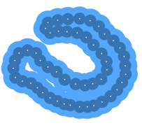

# 12 Properties of homology

    $\newcommand{\Csing}{C^\text{sing}}$

## Singular homology for simple examples

??? example "Example 12.2"
    Let $X = \emptyset$. Then, there are no maps from any $n$-simplex to $X$, so
    $\Csing_n(X) = 0$ for all $n$. Then, we can conclude that

    $$H_\bullet(X) = 0.$$

??? example "Example 12.3"
    Let $X = \{*\}$ be a singleton.

    $$\implies H_n(*) = \begin{cases}
        \mathbb{Z} & n = 0 \\
        0 & n \neq 0
    \end{cases}$$

    ??? proof
        $\begin{align*}
            & \forall\, n \ge 0\ \exists! \s_n : \Delta_n \to \{*\} \\
            & \implies \Csing_n(*) = \Z \s_n \cong \Z \\
        \end{align*}$

        Additionallly,

        $$\partial \s_n = \sum_{i=0}^n (-1)^i d_i(\s_n) = \sum_{i=0}^n (-1)^i \s_{n-1} = \begin{cases}
            0, & n \text{ odd} \\
            \s_{n-1}, & n = \text{ even}
        \end{cases}$$

        So the singular chain complex $\Csing_\bullet(*)$ is

        $$\dots \to \Z \xrightarrow{\id} \Z \xrightarrow{0} \Z \xrightarrow{\id} \Z
        \xrightarrow{0} \Z \xrightarrow{0} \Z \to 0 \to 0 \to \dots$$

## Additivity

??? definition "Definition 12.4"
    ### Direct product, direct sum

    Let $\{G_i\}_{i \in I}$ be a family of abelian groups.

    The **direct product**

    $$\prod_{i \in I} G_i$$

    is the cartesian product, with componentwise addition.

    ---

    The (**external**) **direct sum**

    $$\bigoplus_{i \in I} G_i$$

    is the subgrouo of $\displaystyle\prod_{i \in I} G_i$ consisting of elements tuples
    with finitely many nonzero components.

??? remark "Remark 12.5"
    In the category of abelian groups,

    - the direct product is a product, and
    - the direct sum is a coproduct.

    If $I$ is finite, the inclusion
    $\displaystyle\bigoplus_{i \in I} G_i \hookrightarrow \prod_{i \in I} G_i$
    is an isomorphism.

??? theorem "Theorem 12.6"
    ### Additivity of homology 

    Let $(X_i)_{i \in I}$ be the path-components of $X$. Then, the map

    $$\bigoplus_{i \in I} H_\bullet(X_i) \to H_\bullet(X)$$

    induced by the inclusions $X_i \hookrightarrow X$ is an isomorphism.

    ??? proof
        Images of any singular simplex is path-connected. Thus, $\Csing_n(X)$ splits
        as a direct sum of the subgroups $\Csing_n(X_i)$, i.e.,

        $$\bigoplus_{i \in I} \Csing_n(X_i) \to \Csing_n(X)$$

        induced by the inclusions $X_i \hookrightarrow X$ is an isomorphism.

        Boundary maps preserve this direct sum decomposition, restricting to
        $\Csing_n(X_i) \to \Csing_{n-1}(X_i)$. Therefore, the direct sim decomposition
        restricts to cycles $\ker \partial_n$ and boundaries $\Im \partial_{n+1}$.

        Thus, the homology groups also inherit the decomposition.

## Zeroth homology counts path-components

??? proposition "Proposition 12.7"
    ### H₀ of a path-connected space 

    Let $X \neq \emptyset$ be a path-connected space.

    $$\implies H_0(X) \cong \Z$$

    ??? proof
        We have that $\partial_0 = 0$, so $C_0(X) = \ker \partial_0$ and
        $H_0(X) = C_0(X) / \Im \partial_1$.

        Now, define

        $$
        \begin{align*}
            \epsilon : C_0(X) & \to \Z \\
            \sum_i n_i \s_i & \mapsto \sum_i n_i
        \end{align*}
        $$

        As $X\neq\emptyset$, $\epsilon$ is surjective.

        ??? proof "Claim: $\ker\epsilon \supseteq \Im \partial_1$"
            Let $\s \in \Csing_1(X)$.

            $$\implies \epsilon \circ \partial_1(\s) = \epsilon(d_0(\s) - d_1(\s)) = 1-1 = 0$$

        ??? proof "Claim: $\ker\epsilon \subseteq \Im \partial_1$"
            Assume $0 = \epsilon(\sum_i n_i \s_i) = \sum_i n_i$.

            Identify the singular $0$-simplices $\s_i$ with their image points
            $p_i = \s_i(v_0)$. Then, choose a base point $x \in X$ and paths
            $\tau_i : x \leadsto p_i$.

            $\begin{align*}
                & \implies \tau_i \text{ are singular } 1-\text{simplices, with }
                \partial \tau_i = \sigma_i - \sigma_x
            \end{align*}$

            $\begin{align*}
                \implies \partial \left(\sum_i n_i \tau_i\right)
                &= \left(\sum_i n_i \s_i\right) - \left(\sum_i n_i \s_x\right) \\
                &= \sum_i n_i \s_i
            \end{align*}$

            $\displaystyle \implies \sum_i n_i \s_i \in \Im \partial_1$

        So $\ker\epsilon = \Im \partial_1$, and

        $$H_0(X) = \ker\partial_0 / \Im\partial_1 = \Csing_0(X) / \ker\epsilon
        \cong \Im \epsilon = \Z$$

??? corollary "Corollary 12.8"
    

    $$H_0(X) = \bigoplus_{c \in \pi_0(X)} \Z$$

    ??? proof
        [P.12.7](#p127) + [T.12.6](#t126)

## Homotopy invariance

??? theorem "Theorem 12.9"
    ### Homotopy invariance of homology 

    Let $f, g : X \to Y$ be homotopic maps. Then, the maps

    $$H_\bullet(f), H_\bullet(g) : H_\bullet(X) \to H_\bullet(Y)$$

    are equal. In particular, if $f$ is a homotopy equivalence, then $H_\bullet(f)$ is an
    isomorphism.

    ??? proof "Sketch of proof"
        Let $F : X \times [0,1] \to Y$ be a homotopy between $f$ and $g$. Equip
        $\Delta^n \times [0,1]$ with a $\Delta$-complex structure. Composing the
        $(n+1)$-simplices of this $\Delta$-complex with $F$, we can construct a *prism
        operator* $P : C_n(X) \to C_{n+1}(Y)$ satisfying

        $$\partial \circ P = g_n - f_n - P \circ \partial$$

        Now, given a cycle $\alpha \in C_(X)$, we have

        $$g_n(\alpha) - f_n(\alpha) = \partial P(\alpha) + P(\partial \alpha) = \partial P(\alpha)$$

        and we can conclude that $[g_n(\alpha)] = [f_n(\alpha)]$.

## Exact sequences

??? definition "Definition 12.10"
    ### Exactness

    Let $A \xrightarrow{f} B \xrightarrow{g} C$ be two homomorphisms of abelian groups.

    They are **exact** at $B$ if $\Im f = \ker g$.

    A chain complex $(C_\bullet, \partial)$ is an **exact sequence** if it is exact at every
    $C_n$. That is, $H_n = 0$ for all $n$.

??? theorem "Theorem 12.11"
    ### Short exact sequence

    A **short exact sequence** of abelian groups is an exact sequence of the form

    $$0 \to A \xrightarrow{f} B \xrightarrow{g} C \to 0$$

    We see that

    - $\Im f = \ker g$,
    - $f$ is injective, and
    - $g$ is surjective.

??? remark "Remark 12.12"
    Exactness makes sense whenever we have kernels and images.

??? remark "Remark 12.13"
    A short exact sequence of chain complexes is an exact sequence

    $$0 \to A_\bullet \xrightarrow{f} B_\bullet \xrightarrow{g} C_\bullet \to 0$$

    where $A_\bullet, B_\bullet, C_\bullet$ are chain complexes and $f, g$ are chain maps.
    The following commutative diagram has exact rows:

    

        \begin{tikzcd}
            & \vdots \arrow[d]                                     & \vdots \arrow[d]                                     & \vdots \arrow[d]                          &   \\
            0 \arrow[r] & A_{n+1} \arrow[d, "\partial_A"] \arrow[r, "f_{n+1}"] & B_{n+1} \arrow[d, "\partial_B"] \arrow[r, "g_{n+1}"] & C_{n+1} \arrow[d, "\partial_C"] \arrow[r] & 0 \\
            0 \arrow[r] & A_n \arrow[d, "\partial_A"] \arrow[r, "f_n"]         & B_n \arrow[r, "g_n"] \arrow[d, "\partial_B"]         & C_n \arrow[d, "\partial_C"] \arrow[r]     & 0 \\
            0 \arrow[r] & A_{n-1} \arrow[d, "\partial_A"] \arrow[r, "f_{n-1}"] & B_{n-1} \arrow[r, "g_{n-1}"] \arrow[d, "\partial_B"] & C_{n-1} \arrow[r] \arrow[d, "\partial_C"] & 0 \\
                        & \vdots                                               & \vdots                                               & \vdots                                    &  
        \end{tikzcd}
    

## The long exact homology sequence

??? lemma "Lemma 12.14"
    ### Zig-zag lemma 

    A short exact sequence of chain complexes

    $$0 \to C \xrightarrow{\phi} D \xrightarrow{\psi} E \to 0$$

    induces a long sequence in homology

    

        \begin{tikzcd}
                                 & \ldots \arrow[r]      & {H_{n+1}(E)} \arrow[lld, "\partial_\*"] \\
            H_n(C) \arrow[r]     & H_n(D) \arrow[r]     & H_n(E) \arrow[lld, "\partial_\*"]     \\
            {H_{n-1}(C)} \arrow[r] & H(D) \arrow[r] & \ldots                               
        \end{tikzcd}
    

    where $\partial_*$ is induced by the boundary map in $D$.

??? definition "Definition 12.15"
    ### Connecting homomorphism

    The **connecting homomorphism** $\partial_n$ in the homology long exact sequence is defined as
    follows:

    Let $h \in H_p(E)$ and choose a cycle $e_p \in E_p : [e_p] = h$ and a preimage
    $d_p \in D_p : \psi(d_p) = e_p$.

    Note that $\psi(\partial d_p) = 0$, so $\partial d_p \in \ker \psi = \Im \phi$. As $\phi$ is
    injective, we have that $\exists!c_{p-1} \in C_{p-1} : \phi(c_{p-1}) = \partial d_p$.

    Additionally, $\phi(\partial c_{p-1}) = 0$, so $\partial c_{p-1} = 0$.

    

        \begin{tikzcd}
            C_p \arrow[r, "\phi"] \arrow[d, "\partial"]       & D_p \arrow[r, "\psi"] \arrow[d, "\partial"]       & E_p \arrow[d, "\partial"]       &   & d_p \arrow[r, "\psi", maps to] \arrow[d, "\partial", maps to] & e_p \arrow[d, "\partial", maps to] \\
            {C_{p-1}} \arrow[r, "\phi"] \arrow[d, "\partial"] & {D_{p-1}} \arrow[r, "\psi"] \arrow[d, "\partial"] & {E_{p-1}} \arrow[d, "\partial"] & {c_{p-1}} \arrow[r, "\phi", maps to] \arrow[d, "\partial", maps to] & \partial d_p \arrow[r, "\psi", maps to] \arrow[d, "\partial", maps to] & 0 \\
            {C_{p-2}} \arrow[r, "\phi"]                       & {D_{p-2}} \arrow[r, "\psi"]                       & {E_{p-2}}                       & {\partial c_{p-2}} \arrow[r, "\phi", maps to]                       & 0 
        \end{tikzcd}
    

    Now, define $\partial_*(h) = [c_{p-1}]$.

## Diagram chases

??? lemma "Lemma 12.16"
    

    $\partial_*$ is a well-defined homomorphism.

    ??? proof
        $\begin{align*}
            \text{Let } e_p' \in \ker \partial : E_p \to E_{p-1} \\
        \end{align*}$

        $\begin{align*}
            \text{Choose } & d_p' \in D_p \\
            & c_{p-1}' \in C_{p-1} \text{ s.t.}
        \end{align*}$

        

            \begin{tikzcd}
                C_p \arrow[r, "\phi"] \arrow[d, "\partial"]       & D_p \arrow[r, "\psi"] \arrow[d, "\partial"]       & E_p \arrow[d, "\partial"]       &   & d_p' \arrow[r, "\psi", maps to] \arrow[d, "\partial", maps to] & e_p' \arrow[d, "\partial", maps to] \\
                {C_{p-1}} \arrow[r, "\phi"]                       & {D_{p-1}} \arrow[r, "\psi"]                       & {E_{p-1}}                       & {c_{p-1}'} \arrow[r, "\phi", maps to]                              & \partial d_p' \arrow[r, "\psi", maps to]  & 0 \\
            \end{tikzcd}
        

        
        === "Homomorphism"
            - $\psi(d_p + d_p') = e_p + e_p'$
            - $\phi(c_{p-1} + c_{p-1}') = \partial(d_p + d_p')$

            So we have $\partial_x[e_p + e_p'] = [c_{p-1} + c_{p-1}']
            = \partial_*[e_p] + \partial_*[e_p']$.

        === "Well-defined"
            $\begin{align*}
                \text{Let } & \tilde e_{p+1} \in E_{p+1} : \partial \tilde e_{p+1} = e_p - e_p' \\
                & \tilde d_{p+1} \in D_{p+1} : \psi(\tilde d_{p+1}) = \tilde e_{p+1}
            \end{align*}$

            $\begin{align*}
                & \implies \psi(d_p-d_p') = e_p - e_p' = \partial \tilde e_{p+1}
                = \partial \psi(\tilde d_{p+1}) = \psi(\partial \tilde d_{p+1}) \\
                & \implies d_p - d_p' - \partial \tilde d_{p+1} \in \ker \psi = \Im \phi \\
                & \implies \exists!\tilde c_p \in C_p : \phi(\tilde c_p) = d_p - d_p' - \partial \tilde d_{p+1} \\
                & \phi(\partial \tilde c_p) = \partial \phi(\tilde c_p) = \partial(d_p - d_p')
                = \phi(c_{p-1} - c_{p-1}') \\
                & \implies \partial \tilde c_p = c_{p-1} - c_{p-1}'
            \end{align*}$

            

                \begin{tikzcd}
                    {\tilde d_{p+1}} \arrow[r, "\psi", maps to] & {\tilde e_{p+1}} \arrow[d, "\partial", maps to] & \tilde c_p \arrow[r, "\phi", maps to] \arrow[d, "\partial", maps to] & {d_p - d_p' - \partial \tilde d_{p+1}} \arrow[d, "\partial", maps to] \arrow[r, "\psi", maps to] & 0 \\
                    d_p - d_p' \arrow[r, "\psi", maps to]       & e_p - e_p'                                      & {c_{p-1} - c_{p-1}'} \arrow[r, "\phi", maps to]                       & \phi(c_p - c_p') &
                \end{tikzcd}
            

        

??? lemma "Lemma 12.17"
    The long homology sequence is exact at $H_p(C)$

    $$\dots \to H_p(E) \xrightarrow{\partial_*} H_{p-1}(C) \xrightarrow{\phi_*} H_{p-1}(D) \to \dots$$

    ??? proof
        Let $\beta = [c_{p-1}] \in H_{p-1}(C)$ for some cycle $c_{p-1}$.

        First assume that $\beta \in \ker \phi_*$. We have that
        $\phi_*[c_{p-1}] = [\phi(c_{p-1})] = 0$.

        $\begin{align*}
            & \implies \phi(c_{p-1}) \in \Im \partial \\
            & \implies \exists d_p \in D_p : \partial d_p = \phi(c_{p-1})
            & \text{Let } e_p = \psi(d_p) \\
            & \implies \partial e_p = \psi(\partial d_p) = \psi(\phi(c_{p-1})) = 0 \\
            & \implies e_p \text{ is a cycle} \\
            & \implies \partial_*[e_p] = [c_{p-1}] = \beta \\
            & \implies \beta \in \Im \partial_*
        \end{align*}$

        

            \begin{tikzcd}
                                                     & d_p \arrow[d, "\partial", maps to] \arrow[r, "\psi", maps to] & e_p \arrow[d, "\partial", maps to] \\
                {c_{p-1}} \arrow[r, "\phi", maps to] & \partial d_p \arrow[r, "\psi", maps to]                       & 0
            \end{tikzcd}
        

        Now, assume that $\beta \in \Im \partial_*$. By the definition of $\partial_*$,
        there exists chains $d_p, e_p$ as above such that

        $$\phi_*(\beta) = [\phi(c_{p-1})] = [\partial d_p] = 0$$

??? lemma "Lemma 12.18"
    The long homology sequence is exact at $H_p(D)$

    $$\dots \to H_p(C) \xrightarrow{\phi_*} H_p(D) \xrightarrow{\psi_*} H_p(E) \to \dots$$

    ??? proof
        Let $\gamma = [d_p] \in H_p(D)$ for some cycle $d_p$.

        ??? proof "Claim: $\Im \phi_* \subseteq \ker \psi_*$"
            $\begin{align*}
                & \psi \circ \psi = 0 \\
                & \implies \psi_* \circ \psi_* = 0 \\
                & \implies \Im \phi_* \subseteq \ker \psi_*
            \end{align*}$

        Assume $\gamma \in \ker \psi_*$.

        $\begin{align*}
            & \implies \psi_*[d_p] = [\psi(d_p)] = 0 \\
            & \implies \psi(d_p) \text{ is a boundary} \\
            & \implies \exists\, e_{p+1} : \psi(d_p) = \partial e_{p+1} \\
        \end{align*}$

        

            \begin{tikzcd}
                {d_{p+1}} \arrow[r, "\psi", maps to] & {e_{p+1}} \arrow[d, "\partial", maps to] & c_p \arrow[r, "\phi", maps to] \arrow[d, "\partial", maps to] & {d_p - \partial d_{p+1}} \arrow[d, "\partial", maps to] \arrow[r, "\psi", maps to] & 0 \\
                d_p \arrow[r, "\psi", maps to]       & {\partial e_{p+1}}                       & \partial c_p \arrow[r, "\phi", maps to]                       & 0                                                                                  &
            \end{tikzcd}
        

        $\begin{align*}
            & \text{Choose } d_{p+1} : \psi(d_{p+1}) = e_{p+1} \\
            & \implies \psi(d_p) = \partial e_{p+1} = \psi(\partial d_{p+1}) \\
            & \implies d_p - \partial d_{p+1} \in \ker \psi = \Im \phi \\
            & \implies \exists! c_p : \phi(c_p) = d_p - \partial d_{p+1} \\
            & \implies \phi(\partial c_p) = \partial(d_p - \partial d_{p+1}) = 0 \\
            & \implies \partial c_p = 0 \\
            & \implies \phi_*[c_p] = [\phi(c_p)] = [d_p - \partial d_{p+1}] = [d_p] = \gamma
        \end{align*}$

??? lemma "Lemma 12.19"
    The long homology sequence is exact at $H_p(E)$

    $$\dots \to H_p(D) \xrightarrow{\psi_*} H_p(E) \xrightarrow{\partial_*} H_{p-1}(C) \to \dots$$

    ??? proof
        Exercise

??? remark "Remark 12.20"
    The long homology sequence is functorial: a commutative diagram of chain complexes wit
    exact rows

    

        \begin{tikzcd}
            0 \arrow[r] & C \arrow[r, "\phi"] \arrow[d, "\alpha"] & D \arrow[r, "\psi"] \arrow[d, "\beta"] & E \arrow[r] \arrow[d, "\gamma"] & 0 \\
            0 \arrow[r] & C' \arrow[r, "\phi"]                     & D' \arrow[r, "\psi"]                   & E' \arrow[r]                    & 0
        \end{tikzcd}
    

    induces a commutative diagram between the long exact homology sequences

    

        \begin{tikzcd}
            {} \arrow[r, dotted] & H_p(C) \arrow[r, "\phi_\*"] \arrow[d, "\alpha_\*"] & H_p(D) \arrow[r, "\psi_\*"] \arrow[d, "\beta_\*"] & H_p(E) \arrow[r, "\partial_\*"] \arrow[d, "\gamma_\*"] & H_{p-1}(C) \arrow[r, dotted] \arrow[d, "\alpha_\*"] & {} \\
            {} \arrow[r, dotted] & H_p(C') \arrow[r, "\phi_\*"]                        & H_p(D') \arrow[r, "\psi_\*"]                       & H_p(E') \arrow[r, "\partial_\*"]                        & {H_{p-1}(C')} \arrow[r, dotted]                        & {}
        \end{tikzcd}
    

## The Mayer-Vietoris sequence

??? theorem "Theorem 12.21"
    ### Mayer-Vietoris sequence 

    Let $\{U, V\}$ be an open cover of $X$. Then, there is a long exact sequence

    

        \begin{tikzcd}
                                    & \ldots \arrow[r]               & H_{n+1}(X) \arrow[lld] & \\
            H_n(U \cap V) \arrow[r] & H_n(U) \oplus H_n(V) \arrow[r] & H_n(X) \arrow[lld]     & \\
            {H_{n-1}(U \cap V)} \arrow[r] & \ldots \arrow[r]         & H_1(X) \arrow[lld]     & \\
            H_0(U \cap V) \arrow[r] & H_0(U) \oplus H_0(V) \arrow[r] & H_0(X) \arrow[r]       & 0 \\
        \end{tikzcd}
    

    where all horizontal morphisms are induced by the inclusions.

    ??? proof
        Let $\mathcal U = \{U, V\}$, and consider the short exact sequence of chain complexas

        $$0 \to \Csing_\bullet(U \cap V) \to \Csing_\bullet(U) \oplus \Csing_\bullet(V) \xrightarrow{j} \Csing_\bullet(\mathcal U) \to 0$$

        By [L.12.14](#l1214), this gives a long exact homology sequence

        $$\dots \to H_n(U \cap V) \to H_n(U) \oplus H_n(V) \to H_n(\mathcal U) \to H_{n-1}(U \cap V) \to \dots$$

        By [T.12.23](#t1223), $H_n(\mathcal U) \cong H_n(X)$, and the result follows.

??? remark "Remark 12.22"
    Exactness of the Mayer-Vietoris sequence is not immediate. Consider the exact sequence
    (induced by the inclusions)

    $$0 \to \Csing_\bullet(U \cap V) \to \Csing_\bullet(U) \oplus \Csing_\bullet(V)
    \xrightarrow{j} \Csing_\bullet(C)$$

    where $j = (\iota_U)_* - (\iota_V)_*$. $j$ is not surjective: any singular simplex
    that maps into neither $U$ nor $V$ is not in the image.

    The problem can be solved by subdividing the simplex, as we will see in the next theorem.

??? theorem "Theorem 12.23"
    ### Locality <id="t1223"></a>

    Consider an open cover $\mathcal U = (U_i)_{i \in I}$ of $X$. Let
    $\Csing_n(\mathcal U) \subseteq \Csing_n(X)$ be the free abelian group generated by
    the union of the n-simplices in the $U_i$.

    This generates a chain complex $\Csing_\bullet(\mathcal U)$, and the inclusion

    $$\Csing_\bullet(\mathcal U) \hookrightarrow \Csing_\bullet(X)$$

    induces an isomorphism on homology.

## Inferring homology from samples

Given: finite sample $P \subset X$ of unknown shape $X \subset \R^n$.

??? problem "Problem 12.24"
    ### Homology inference

    Determine the homology $H_*(X)$.

??? problem "Problem 12.25"
    ### Homological reconstruction

    Construct a shape $R$ with $H_*(R) \cong H_*(X)$ via a canonical isomorphism.

Approach: approximate $X$ by a thickening

$$P_\delta = \bigcup_{p\in P} B_\delta(p)$$

that covers $X$. This can work, but requires string assumptions.

??? theorem "Theorem 12.26"
    ### Cohen-Steiner, Edelsbrunner, Harer 2005 

    Let $P \subset \R^n$ be a finite sample of a shape $X \subset \R^n$. Further, let
    $\delta > 0$ such that

    - $P_\delta \supseteq X$,
    - the inclusions $X \hookrightarrow X_\delta \hookrightarrow X_{2\delta}$ of thickenings
    induce isomorphisms in homology.

    $$\implies H_*(X) \cong \Im H_*(P_\delta \hookrightarrow P_{2\delta})$$

    ??? proof
        

        

            \begin{tikzcd}
                H_\*(X) \arrow[rd] \arrow[rr, "\cong", hook] &                                                           & H_\*(X_\delta) \arrow[dd, "\cong", dotted] \arrow[rr, hook] \arrow[rd, hook]  &                             & H_\*(X_{2\delta}) \\
                                                            & H_\*(P_\delta) \arrow[ru, two heads] \arrow[rd, two heads] &                                                                              & H_\*(P_{2\delta}) \arrow[ru] &                  \\
                                                            &                                                           & \operatorname{Im} H_\*(P_\delta \hookrightarrow P_{2\delta}) \arrow[ru, hook] &                             &                 
            \end{tikzcd}
        
