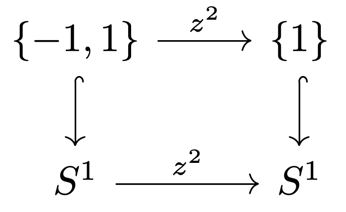
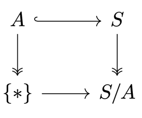

# 3 Connectedness

## The notion of connectedness

??? definition "Definition 3.1"
    ### Connected

    A topological space $X$ is **connected** if $\emptyset$ and $X$ are the only subsets of
    $X$ that are both open and closed.

??? proposition "Proposition 3.2"
    ### Connectivity vs nontrivial sums 

    $$X \text{ is connected } \iff X \text{ is not (homeomorphic to) a sum } X_0+X_1 \text{ of nonempty spaces.}$$

    ??? proof
        === "$\implies$"
            Assume $X \cong X_0 + X_1$ with $X_0, X_1 \neq \emptyset$.

            $\begin{align*}
                & \implies X_i \in \O_{X_i} \\
                & \implies X_i \in \O_X
            \end{align*}$

            Further, we have that $X\setminus X_1 = X_0 \in \O_X$, so $X_1$ is closed in
            $X$. Similarly, $X_0$ is closed in $X$. Thus, $X$ is not connected.

        === "$\impliedby$"
            Assume $X$ is not connected.

            $\begin{align*}
                & \implies \exists\ X_0\in\O\setminus\{\emptyset, X\} : X_0 \text{ is closed} \\
                & \implies X_1 := X\setminus X_0 \text{ is open and closed} \\
                & \implies X \cong X_0 + X_1
            \end{align*}$

??? theorem "Theorem 3.3"
    ### Constant maps to discrete spaces 

    $$X \text{ is connected } \iff \text{ All continuous maps } X \to Y
    \text{ to a discrete space } Y \text{ are constant.}$$

    ??? proof
        === "$\implies$"
            Assume $X$ is connected and $f: X \to Y$ is continuous. Further, let $y \in Y$.

            $\begin{align*}
                & \implies \{y\} \text{ is open and closed} \\
                & \implies f^{-1}(y) \text{ is open and closed} \\
                & \implies f^{-1}(y) \in \{\emptyset, X\} \\
                & \implies f \text{ is constant}
            \end{align*}$

        === "$\impliedby$"
            Assume $X$ is connected and $X \cong X_0 + X_1$ with $X_0, X_1 \neq \emptyset$.
            Define the function $f$ as

            $$
            \begin{align*}
                f : X &\to \{0, 1\} \\
                x &\mapsto \begin{cases}
                    0 & x \in X_0 \\
                    1 & x \in X_1
                \end{cases}
            \end{align*}
            $$

            Then, $f$ is continuous but not constant $\contradiction$.

??? proposition "Proposition 3.4"
    ### Unions of overlapping connected subsets 

    Let $(A_i)_{i\in I}$ be a cover of $X$ of connected subsets.

    $$\exists\, j\in I \ \forall i\in I : A_i \cap A_j \neq \emptyset
    \implies X \text{ is connected.}$$

    ??? proof
        Let $f : X \to \{0, 1\}$ be continuous.

        $\begin{align*}
            \implieshref{#t33}{T.3.3} & f|_{A_i} \text{ is constant } \forall i\in I \\
        \end{align*}$

        $\begin{align*}
            & A_i\cap A_j \neq \emptyset \\
            & \implies f \text{ is constant on } X \\
            & \implieshref{#t33}{T.3.3} X \text{ is connected}
        \end{align*}$

## Intervals

??? proposition "Proposition 3.5"
    ### Intervals are the connected subsets of ℝ 

    Let $A \subseteq \R$ be a subset.

    $$A \text{ is connected } \iff A \text{ is an interval.}$$

    ??? proof
        === "$\implies$"
            Assume $A$ is not an interval.

            $\begin{align*}
                & \implies \exists\, x < y < z : x, z \in A, y \notin A \\
                & \implies A = \{a \in A \mid a < y\} \cup \{a \in A \mid a > y\}
                \text{ is a union of nonempty sets} \\
                & \implies A \text{ is not connected}
            \end{align*}$

        === "$\impliedby$"
            Let $A$ be an interval and assume it can be composed as a sum $A = U + V$
            of nonempty sets with $u < v$ for all $u \in U, v \in V$. Fruther, let 
            $s := \sup(U\cap[u, v])$.

            $\begin{align*}
                & \implies v > s \in U \cap [u, v] \\
                & U \cap (u, v) \text{ is open} \\
                & \implies \exists\,\varepsilon > 0 : B_\varepsilon(s) \subseteq U \cap (u, v) \\
                & \implies s + \varepsilon \in U \cap [u, v] \quad \contradiction
            \end{align*}$

??? remark "Remark 3.6"
    ### Connected sets have connected images 

    - Let $f : X \to Y$ be a continuous map from a connected space $X$. Then,
    $\Im f \subseteq Y$ is connected.

    - Conversely, if $\Im f = A + B$, then $X = f^{-1}(A) + f^{-1}(B)$.

??? corollary "Corollary 3.7"
    ### Intermediate value theorem 

    $\begin{align*}
        \text{Let } & X \text{ be connected} \\
        & f : X \to \R \text{ continuous}
    \end{align*}$

    $$\implies \Im f \text{ is an interval.}$$

## Connectivity and closure

??? theorem "Theorem 3.8"
    ### Connected sets have connected closures 

    Let $A \subseteq X$ be connected. Then, any set $B$ satisfying
    $A \subseteq B \subseteq \overline{A}$ is connected.

    ??? proof
        Assume $B = B_0 + B_1$ is not connected.

        $\begin{align*}
            & \implies B_0, B_1 \in \O_B \\
            & \implies \exists\, U_0, U_1 \in \O_X : B_i = U_i \cap B \\
            & \implies A = (U_0 \cap A) + (U_1 \cap A)
        \end{align*}$

        Assume without loss of generality that $U_0 \cap A = \emptyset$.

        $\begin{align*}
            & \implies X \setminus U_0 \supseteq A \text{ and is closed} \\
            & \implies B \subseteq \overline{A} \subseteq X \setminus U_0 \\
            & \implies B_0 = U_0 \cap B = \emptyset \quad \contradiction
        \end{align*}$

## Connected components

??? definition "Definition 3.9"
    ### Connected component

    For $x \in X$, the union of all connected subsets $A \subseteq X$ with $x \in A$
    is called the **connected component** of $x$.

??? remark "Remark 3.10"
    - [P.3.4](#p34) $\implies$ any connected component is connected. By [T.3.8](#t38),
    it is also closed.
    - The connected components form a partition of $X$.
    - $x, y \in X$ is in the same component $\iff \exists\, B \subseteq X$ connected
    with $x, y \in B$.

??? theorem "Theorem 3.11"
    ### Connectedness of products 

    Let $X, Y$ be nonempty topological spaces.

    $$X \times Y \text{ is connected } \iff X, Y \text{ are connected.}$$

    ??? proof
        === "$\implies$"
            The projections $\pr_X, \pr_Y$ are continuous surjections. Thus, by
            [R.3.6](#r36), $X, Y$ are connected.

        === "$\impliedby$"
            Let $(x,y), (\hat x, \hat y) \in X \times Y$.

            $\begin{align*}
                & \implies \{x\} \times Y \cong Y, X \times \{\tilde y\} \cong X
                \text{ are connected} \\
                & (x, \tilde y) \in \{x\} \times Y \cap X \times \{\tilde y\} \\
                &\implieshref{#p34}{P.3.4}  \{x\} \times Y \cup X \times \{\tilde y\}
                \text{ is connected, and contains } (x, y), (\hat x, \hat y)
            \end{align*}$

            The same is true for the connected component of this subset, which must be
            all of $X \times Y$.

??? definition "Definition 3.12"
    ### Totally disconnected

    A topological space $X$ s.t. $\{x\}_{x\in X}$ are connected components is called
    **totally disconnected**.

??? example "Example 3.13"
    Any discrete space is totally disconnected.

    ??? proof
        Let $x \in X$ and $U \subseteq X : x \in U$. Then,
        $U = \{x\} \cup (U \setminus \{x\})$ is a union of two open and closed sets.
        Thus, $U$ is connected iff $U = \{x\}$.

    ---

    The Cantor set (which is not discrete) is totally disconnected.

    ---

    $\Q \subseteq \R$ is totally disconnected.

    ??? proof
        Let $A \subseteq \Q$ be a connected subset.

        $\begin{align*}
            \implieshref{#r36}{R.3.6} & A \text{ is a connected subset of } \R \\
            \implieshref{#p35}{P.3.5} & A \text{ is an interval} \\
            \implies & A \text{ is a singleton}
        \end{align*}$

??? lemma "Lemma 3.14"
    ### Finitely many components form a sum 

    Let $X$ be a topological space with finitely many connected components.

    $\implies$ They are open, and $X$ is a sum of these components.

    ??? proof
        Let $\{C_i\}_{i=1}^n$ be the connected components of $X$. By [R.3.10](#r310),
        these are closed. Each component is the complement of the union of the others,
        so we get

        $$C_j = X \setminus \bigcup_{i\neq j} C_i = \bigcap_{i\neq j} (X \setminus C_i)$$

        which is a finite intersection of open sets, so $C_j$ is open.

## Quasi-components

??? definition "Definition 3.15"
    ### Quasi-component

    The **quasi-component** of $x \in X$ consists of all points $y \in X$ s.t. $X$ is no
    sum $X = A + B$ with $x \in A, y \in B$.

    ??? remark
        Equivalently, it is the set of all $y\in X$ that lies in the same part as $x$
        for all decompositions $X = A + B$.

??? example "Example 3.16"
    Quasi-components and components are not the same:

    $\begin{align*}
        \text{Let } X = \left(\left\{\frac{1}{n}\right\} \times [0, 1]\right)
        \cup \Big\{(0, 0), (0, 1)\Big\} \subseteq \R^2
    \end{align*}$

    - $\Big\{(0, 0), (0, 1)\Big\}$ is a quasi-component
    - $\{(0, 0)\}, \{(0, 1)\}$ are connected components.

??? theorem "Theorem 3.17"
    ### Quasi-components are coarser than components 

    $\begin{align*}
        \text{Let } & x \in X \\
        & C \subseteq X \text{ be the connected component of } x \\
        & Q \subseteq X \text{ be the quasi-component of } x
    \end{align*}$

    $$\implies C \subseteq Q$$

    ??? proof
        Let $X = A + B : x \in A$.

        $\begin{align*}
            & \implies C = C \cap A + C \cap B \\
            & \implies C \cap B = \emptyset \\
            & \implies C \subseteq A \\
            & Q = \bigcap_{X = A+B : x \in A} A \\
            & \implies C \subseteq Q
        \end{align*}$

## Paths and path-connectedness

??? definition "Definition 3.18"
    ### Path-connected, path component

    A **path** in a space $X$ is a continuous map $f : [a, b] \subseteq \R \to X$.

    ---

    $X$ is **path-connected** if

    $$
    \begin{align*}
        \forall\, x, y \in X \ &\exists\, \gamma : [a, b] \to X \text{ path s.t.} \\
        & \gamma(a) = x, \gamma(b) = y
    \end{align*}
    $$

    We write $\gamma : x \leadsto y$.

    ---

    The **path component** of $x \in X$ is the set of all points $y \in X$ s.t.
    $\exists\, \gamma : x \leadsto y$.

??? theorem "Theorem 3.19"
    ### Path-connected implies connected 

    Any path-connected space is connected.

    ??? proof
        Assume $X = A + B : x \in A, y \in B$.

        $\begin{align*}
            & \implies \exists\, \gamma : [0, 1] \to X, x \leadsto y \\
            & [0, 1] = \gamma^{-1}(X) = \gamma^{-1}(A) \sqcup \gamma^{-1}(B) \\
            & \gamma \text{ is continuous} \\
            & \implies \gamma^{-1}(A), \gamma^{-1}(B) \neq \emptyset \\
            & \implies [0, 1] = \gamma^{-1}(A) + \gamma^{-1}(B) \quad\contradiction
        \end{align*}$

??? example "Example 3.20"
    **The comb spaces** 

    $\begin{align*}
        A = \bigcup_{n\in \N} \left(\left\{\frac{1}{n}\right\} \times (0, 1]\right)
        \cup \Big([0, 1] \times \{0\}\Big)
    \end{align*}$ is paht-connected.

    ---

    $C = A \cup \Big(\{0\} \times [0, 1]\Big) = \overline A$ (comb space) is path-connected.

    ---

    $D = A \cup \{(0, 1)\} = C \setminus (\{0\} \times (0, 1))$ (deleted comb space)
    is connected by [T.3.8](#t38), as $A \subseteq D \subseteq \overline A = C$.

    However, $D$ is not path-connected:

    ??? proof "Claim: Any path $\bm{\gamma : [0, 1] \to D}$ with $\bm{\gamma(0) = p = (0, 1)}$ must be constant."
        $\begin{align*}
            \text{Let } V := \bigcup_{n\in\N} \left(\left\{\frac{1}{n}\right\} \times (0, 1]\right)
            \cup \{p\} \in \Neigh_p
        \end{align*}$ be open. Further, choose any $t\in \gamma^{-1}\{p\}$.

        $\implies \exists\, U \subseteq [0, 1] \text{ open neighbourhood of } t : \gamma(U) \subseteq V$

        We can choose $U$ connected, as open intervals forma basis for $\R$.

        ??? proof "Claim: $\forall\, q\in V\setminus \{p\} : q \notin \gamma(U)$"
            Let $q \in V\setminus \{p\}$.

            $\implies \exists\, n, y : q = \left(\frac{1}{n}, y\right)$

            Let $r \in \left(\frac{1}{n+1}, \frac{1}{n}\right)$

            $\begin{align*}
                & \text{Let } q \in V\setminus \{p\} \\
                & \implies \exists\, n, y : q = \left(\frac{1}{n}, y\right) \\
                & \text{Let } r \in \left(\frac{1}{n+1}, \frac{1}{n}\right) \\
                & \implies \gamma(U) \subseteq V = V_p + V_q \subseteq
                \Big((-\infty, r) \times \R\Big) + \Big((r, \infty) \times \R\Big) \\
                & \gamma(U) \text{ is connected} \\
                & \implies \gamma(U) \subseteq V_p \\
                & \implies q \notin \gamma(U)
            \end{align*}$

        Thus, $\gamma(U) = \{p\}$, so $\gamma$ is constant on $U$. Any
        $t\in \gamma^{-1}\{p\}$ has a neighbourhood, so $\gamma^{-1}\{p\}$ is open
        and closed. Thus, $\gamma^{-1}\{p\} = [0, 1]$.

## Local notions of connectedness

??? definition "Definition 3.21"
    ### Locally (path-)connected

    $X$ is **locally (path-)connected** if

    $$
    \begin{align*}
        \forall\, x \in X, V_x \in \Neigh_x \ \exists\, &U_x \in \Neigh_x
        \text{ (path-)connected s.t.} \\
        &U_x \subseteq V_x
    \end{align*}
    $$

??? remark "Remark 3.22"
    Equivalently:

    - For all $x \in X$, the (path-)connected open neighbourhoods of $x$ form a
    neighbourhood basis of $x$.
    - The (path-)connected open sets form a basis for $X$.

??? example "Example 3.23"
    The deleted comb space $D$ is not locally connected:

    In [E.3.20](#e320), we constructed a decomposition $V = V_p + V_q$.

    $\begin{align*}
        \text{Let } & U \supseteq W \in \Neigh_x \\
        & q \in W \setminus \{p\}
    \end{align*}$

    Then, $W = W \cap V_p + W \cap V_q$ is a decomposition of $W$ into open sets,
    so $W$ is not connected.

???+ remark "Remark 3.24"
    Every CW-complex is locally path-connected.

???+ theorem "Theorem 3.24"
    ### Locally connected spaces have open components 

    Any (path-)component of a locally (path-)connected space is open.

    ???+ proof
        $\begin{align*}
            \text{Let } & x \in X \\
            & K \subseteq X \text{ be the (path-)component of } x
        \end{align*}$

        We want to show that $K$ is open:

        $\begin{align*}
            \text{Let } & y \in K \\
            & V \in \Neigh_y \text{ be open and (path-)connected}
        \end{align*}$

        $\begin{align*}
            & \implies V \cup K \text{ is (path-)connected} \\
            & \implies V \subseteq K \\
            & \implies K \in \Neigh_y
        \end{align*}$

???+ theorem "Theorem 3.26"
    ### From local to global path-connectedness 

    Let $X$ be locally path-connected.

    - $\forall\, x \in X :$ the connected component of $x$ is its path component.
    - $X \text{ is connected } \iff X \text{ is path-connected.}$

    ???+ proof
        $\begin{align*}
            \text{Let } & x \in X \\
            & K \subseteq X \text{ be the connected component of } x
            & P \subseteq X \text{ be the path component of } x
        \end{align*}$

        Then, we trivially have that $P \subseteq K$.

        Let $Q = K \setminus P$ be a locally path-connected subspace.

        $\begin{align*}
            \implies & Q \text{ is a union of its path components} \\
            \implieshref{#t325}{T.3.25} Q, P \text{ are open and closed} \\
        \end{align*}$

        $\begin{align*}
            & K = P + Q \\
            & \implies Q = \emptyset \\
            & \implies K = P
        \end{align*}$

## Functoriality of path-components

???+ theorem "Theorem 3.27"
    ### Functoriality of path-components 

    A continuous map $f : X \to Y$ induces a well-defined map
    
    $$\tilde f : \tilde X \to \tilde Y$$

    between the (path-)components of $X$ and $Y$.

    If $g : Y \to Z$ is another continuous map, then
    
    $$
    \begin{align*}
        \tilde g \circ \tilde f &= \wtilde{g \circ f} \\ \\
        \wtilde{\id}_X &= \id_{\tilde X}
    \end{align*}
    $$

This follows from the next lemma.

- Denote by $\pi_0(X)$ the set of path-components of $X$.
- For a continuous map $f : X \to Y$, denote the induced map on path-components by
$\pi_0(f) : \pi_0(X) \to \pi_0(Y)$.

???+ lemma "Lemma 3.28"
    ### Functoriality of equivalence classes 

    $\begin{align*}
        \text{Let } & \sim_X, \sim_Y, \sim_Z \text{ be equivalence relations on } X, Y, Z \\
        & \begin{rcases}
            f : X \to Y \\
            g : Y \to Z
        \end{rcases}
        \text{ be set maps inducing well-defined maps } \tilde f, \tilde g
        \text{ on the equivalence classes}
    \end{align*}$

    $$\implies g \circ f \text{ induces a well-defined map } \wtilde{g \circ f} = \tilde g \circ \tilde f$$

    ???+ proof
        Well-definedness of $\tilde f$ means that $f[x] \subseteq [f(x)] = \tilde f[x]$.

        Therefore, $g \circ f$ induces a well-defined map

        $$g \circ f[x] \subseteq g[f[x]] \subseteq [g(f(x))] = \wtilde{g \circ f}[x]$$

        Then, we have 

        $$\tilde g \circ \tilde f[x] = \tilde g[f(x)] = [g(f(x))] = \wtilde{g \circ f}[x]$$

???+ remark "Remark 3.29"
    Let $f : X \to Y$ be a continuous map.

    - $f \text{ is surjective } \implies \pi_0(f) \text{ is surjective}$
    - $f \text{ is injective } \centernot\implies \pi_0(f) \text{ is injective}$.
    Consider the inclusion $\{0, 1\} \hookrightarrow [0, 1]$.

???+ lemma "Lemma 3.30"
    ### Path-components of products 

    Let $X, Y$ be topological spaces.

    $$
    \implies \begin{align*}
        &\text{The projections } \pr_X, \pr_Y \text{ induce a bijection} \\
        &\pi_0(X \times Y) \to \pi_0(X) \times \pi_0(Y)
    \end{align*}
    $$

    ???+ proof
        === "Surjective"
            The induced map $[(x, y)] \mapsto ([x], [y])$ is surjective as
            $(x, y) \mapsto ([x], [y])$ is surjective.

        === "Injective"
            $\begin{align*}
                & [x_1] = [x_2], [y_1] = [y_2] \\
                & \implies \exists\, \gamma : x_1 \leadsto x_2, \rho : y_1 \leadsto y_2 \\
                & \implies (\gamma, \rho) : (x_1, y_1) \leadsto (x_2, y_2) \text{ is a path} \\
                & \implies [(x_1, y_1)] = [(x_2, y_2)]
            \end{align*}$

???+ lemma "Lemma 3.31"
    ### Path-components of sums 

    Let $X, Y$ be topological spaces.

    $$
    \implies \begin{align*}
        &\text{The inclusions } \operatorname{in}_X, \operatorname{in}_Y \text{ induce a bijection} \\
        &\pi_0(X) + \pi_0(Y) \to \pi_0(X + Y)
    \end{align*}
    $$

    ???+ proof
        === "Surjective"
            Every equivalence class in $\pi_0(X + Y)$ has
            
            - a representative $x \in X$ or $y \in Y$, and thus
            - a preimage in the disjoint union $\pi_0(X) + \pi_0(Y)$.

        === "Injective"
            Every path in $X + Y$ lies either in $X$ or $Y$.

???+ remark "Remark 3.32"
    $\bm{\pi_0}$ **does not preserve pullbacks or pushouts**.

    The pullback diagram

    

    is not sent to a pullback diagram under $\pi_0$.

    ---

    $\begin{align*}
        \text{Let } & A = \{0\} \times [0, 1] \\
        & S = A \cup \{(t, \sin\frac{1}{t}) \mid t \in (0, 1]\} \text{ (topologist's sine curve)}
    \end{align*}$

    $\implies \begin{cases}
        S \text{ is not path-connected} \\
        S/A \text{ is path-connected}
    \end{cases}$

    The pushout diagram

    

    is not sent to a pushout diagram under $\pi_0$.

    