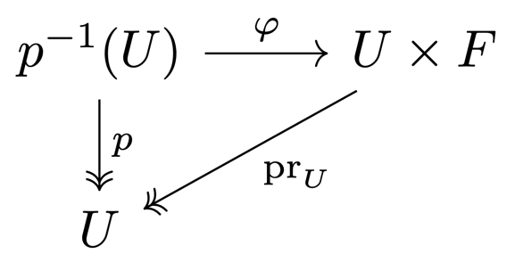

# 6 Compactness

    $\newcommand{\G}{\mathcal{G}}$

## Compact spaces

??? definition "Definition 6.1"
    ### Compact space

    A topological space $X$ is **compact** if for all open covers $\{U_i\}_{i\in I}$ of $X$,
    there exists a finite subcover $\{U_j\}_{j\in J \subseteq I}$ of $X$.

??? theorem "Theorem 6.2"
    ### Equivalent condition for compactness 

    Let $X$ be a topological space. The following statements are equivalent:

    $$
    \begin{align*}
        (1) & \quad X \text{ is compact} \\ \\
        (2) & \quad \left\{\begin{aligned}
            & \forall\, (A_i)_{i\in I} \text{ family of closed sets s.t. } \bigcap_{i\in I} A_i = \emptyset, \\
            & \exists\, J \subseteq I \text{ finite s.t. } \bigcap_{j\in J} A_j = \emptyset
        \end{aligned}\right. \\ \\
        (3) & \quad \text{Every filter on } X \text{ has a cluster point} \\ \\
        (4) & \quad \text{Every ultrafilter on } X \text{ converges}
    \end{align*}
    $$

    ??? proof
        === "$(1) \implies (2)$"
            $\begin{align*}
                \text{Let } & X \text{ be a compact space} \\
                & (A_i)_{i\in I} \text{ be such a family of closed sets}
            \end{align*}$
    
            $\begin{align*}
                \implies X &= X \setminus \bigcap_{i\in I} A_i \\
                &= \bigcup_{i\in I} (X \setminus A_i)
            \end{align*}$
    
            $\begin{align*}
                & \implies \exists J \subseteq I \text{ finite s.t. } X = \bigcup_{j\in J} (X \setminus A_j)
            \end{align*}$
    
            $\begin{align*}
                \implies \emptyset &= X \setminus \bigcup_{j\in J} (X \setminus A_j) \\
                &= \bigcap_{j\in J} A_j
            \end{align*}$

        === "$(2) \implies (3)$"
            Let $\F$ be a filter on $X$ and assume it has no cluster point.

            $\begin{align*}
                & \implies \bigcap_{F \in \F} \overline F = \emptyset \\
                & \implies \exists G \subseteq \F \text{ finite } : 
                \bigcap_{F \in G} \overline F = \emptyset \\
                & \implies \emptyset \in G \subseteq \F & \contradiction
            \end{align*}$

        === "$(3) \implies (4)$"
            $\begin{align*}
                & \text{Let } \F \text{ be an ultrafilter on } X \\
                & \overset{(3)}{\implies} \exists\, x \in X :
                x \in \bigcap_{F \in \F} \overline F \\
                & \implieshref{../5_convergence#t530}{T.5.30} \exists\, \G \supseteq \F : \G \to x
            \end{align*}$

            As $\F$ is maximal, we have $\F = \G$ and $\F \to x$.

        === "$(4) \implies (1)$"
            Let $\{U_i\}_{i\in I}$ be an open cover of $X$, and assume it has no finite
            subcover.

            Then, for all $L \subseteq I$ finite, we have that

            $$A_L := \bigcup_{\ell \in L} (X \setminus U_\ell) \neq \emptyset$$

            This family is closed under intersections:

            $$A_L \cap A_{L'}
            = \bigcup_{\ell \in L} (X \setminus U_\ell)
            \cap \bigcup_{\ell' \in L'} (X \setminus U_{\ell'})
            = \bigcup_{\ell \in L \cap L'} (X \setminus U_\ell)
            = A_{L \cap L'} \neq \emptyset$$

            By [T.5.38](../5_convergence#t538), we can extend the filter $\F$ generated by this
            family to an ultrafilter $\G$.

            $\begin{align*}
                \overset{(4)}{\implies} & \exists\, x \in X : \G \to x \\
                \iff & \Neigh_x \subseteq \G \\
                \implies & \exists\, i \in I : U_i \in \Neigh_x \\
            \end{align*}$
        
            By the construction of $\F \subseteq \G$, we have that
            $(X \setminus U_i) \in \F$, so $(X \setminus U_i) \cap U_i = \emptyset \in \G$.
            This is a contradiction.

## Properties of compact spaces

??? theorem "Theorem 6.3"
    ### Alexander's subbase theorem 

    A topological space $X$ is compact if every open cover of $X$ by elements of a subbasis
    $S$ for the topology on $X$ has a finite subcover.

    
    ??? proof
        Assume $X$ is not compact.

        $\begin{align*}
            \implieshref{#t62}{T.6.2} & \exists\, \F \text{ non-converging ultrafilter on } X \\
            \implies & \forall\, x \in X\ \exists\, U_x \in S\setminus \F \\
            \implies & \{U_x\}_{x \in X} \text{ is an open cover of } X
            \text{ with elements from } S \\
            \implies & \exists\, Y \subseteq X \text{ infinite } : X = \bigcup_{y \in Y} U_y \\
        \end{align*}$
    
        $\begin{align*}
            & \F \text{ is an ultrafilter and } U_y \notin \F \\
            & \implies X \setminus U_y \in \F \\
            & \implies \bigcap_{y \in Y} (X \setminus U_y) = \emptyset \in \F & \contradiction
        \end{align*}$

??? example "Example 6.4"
    Let $I = [0, 1] \subseteq \R$. A subbasis is

    $$S = \{[0, a) : a \in (0, 1)\} \cup \{(b, 1] : b \in (0, 1)\}$$

    $\begin{align*}
        \text{Let } & (U_i)_{i\in I} \text{ be an open cover of } I
        \text{ with elements from } S \\
        & t := \sup\{a | [0, a) \in \{U_i\}_{i\in I}\} \\
    \end{align*}$

    $\begin{align*}
        \implies & \exists\,
        \begin{cases}
            c < t : (c, 1] \in \{U_i\}_{i\in I} \text{ contains } t \\
            d > c : [0, d) \in \{U_i\}_{i\in I},  \text{ by the definition of } \sup
        \end{cases} \\
        \implies & [0, d) \cup (c, 1] = [0, 1]
    \end{align*}$

## Compact sets and continuous maps

??? proposition "Proposition 6.5"
    ### Surjections preserve compactness 

    $\begin{align*}
        \text{Let } & X \text{ be a compact space} \\
        & f: X \to Y \text{ be a continuous surjection} \\
    \end{align*}$

    $$\implies Y \text{ is compact}$$

    ??? proof
        $\begin{align*}
            & \text{Let } \{V_i\}_{i\in I} \text{ be an open cover of } Y \\
            & \implies \{f^{-1}(V_i)\}_{i\in I} \text{ is an open cover of } X \\
            & \implies \exists\, J \subseteq I \text{ finite } : X = \bigcup_{j\in J} f^{-1}(V_j) \\
        \end{align*}$

        $\begin{align*}
            \implies Y &= f\left(\bigcup_{j\in J} f^{-1}(V_j)\right) \\
            &= \bigcup_{j\in J} f\Big(f^{-1}(V_j)\Big) \\
            &\subseteq \bigcup_{j\in J} V_j \\
            &\subseteq Y
        \end{align*}$

        So $\{V_j\}_{j\in J}$ is a finite subcover of $Y$. Hence, $Y$ is compact.

??? corollary "Corollary 6.6"
    ### Compact sets have compact images 

    $\begin{align*}
        \text{Let } & f ; X \to Y \text{ be a continuous map} \\
        & A \subseteq X \text{ be a compact set} \\
    \end{align*}$

    $$\implieshref{#t65}{T.6.5} f(A) \subseteq Y \text{ is compact}$$

??? definition "Definition 6.7"
    ### Proper map

    A continuous map $f: X \to Y$ is **proper** if

    $$\forall\, K \subseteq Y \text{ compact } : f^{-1}(K) \text{ is compact}$$

??? remark "Remark 6.8"
    Some authors use a different definition. They say that a map $f: X \to Y$ is proper if
    it is a *closed map with compact fibers*.

??? proposition "Proposition 6.9"
    ### Closed maps with compact fibers are proper 

    ??? proof
        $\begin{align*}
            \text{Let } & K \subseteq Y \text{ be a compact set} \\
            & (U_i)_{i\in I} \text{ be an open cover of } f^{-1}(K)
        \end{align*}$

        $\begin{align*}
            & \implies \implies \forall\, i \in I\ \exists\, V_i \in \O_X :
            U_i = V_i \cap f^{-1}(K) \\
            & \implies \forall\, x \in K : (V_i \cap f^{-1}(x))_{i\in I}
            \text{ is an open cover of the compact space } f^{-1}(x) \\
            & \implies \exists\, J_x \subseteq I \text{ finite } :
            f^{-1}(x) = \bigcup_{j\in J_x} \Big(V_j \cap f^{-1}(x)\Big)
        \end{align*}$

        $\begin{align*}
            \text{Let } & O_x := \bigcup_{j\in J_x} V_j \\
            & L_x := X \setminus O_x
        \end{align*}$

        $\begin{align*}
            & \implies
            \begin{cases}
                O_x \in \O_X \\
                f^{-1}(x) \subseteq O_x \quad (i) \\
            \end{cases} \\
            & \implies L_x \subseteq X \text{ is closed} \\
            & \implies
            \begin{cases}
                f(L_x) \subseteq Y \text{ is closed} \\
                x \notin f(L_x)
            \end{cases} \\
            & \implies W_x := Y \setminus f(L_x) \in \Neigh_x^Y
            \text{ is an open neighborhood}
        \end{align*}$
        
        $\begin{align*}
            \implies f^{-1}(W_x) &= f^{-1}(Y) \setminus f^{-1}(f(L_x)) \\
            &= X \setminus f^{-1}\Big(f(X \setminus L_x)\Big) \\
            & \subseteq X \setminus L_x \\
            &= O_x
        \end{align*}$

        So we have an open cover $(W_x \cap K)_{x \in K}$ of $K$.

        $\begin{align*}
            & \implies \exists\, P \subseteq K \text{ finite } :
            K = \bigcup_{x\in P} (W_x \cap K) \\
        \end{align*}$
        
        $\begin{align*}
            \implies f^{-1}(K) &= f^{-1}\left(\bigcup_{x\in P} (W_x \cap K)\right) \\
            &= \bigcup_{x\in P} f^{-1}(W_x \cap K) \\
            &\subseteq \bigcup_{x\in P} O_x \\
            &= \bigcup_{x\in P} \bigcup_{j\in J_x} V_j \\
        \end{align*}$

        $\begin{align*}
            \implies f^{-1}(K)
            &= f^{-1}(K) \cap \left(\bigcup_{x\in P} \bigcup_{j\in J_x} V_j\right) \\
            &= \bigcup_{x\in P} \bigcup_{j\in J_x} U_j
        \end{align*}$

## Products of compact spaces

??? proposition "Proposition 6.10"
    ### Compact factors yield closed and proper projections 

    Let $X$ be compact. Then $\pr_Y : X \times Y \to Y$ is a closed and proper map.

    ??? proof
        $\begin{align*}
            \text{Let } & C \subseteq X \times Y \text{ be a closed set} \\
            & y \in Y \setminus \pr_Y(C)
        \end{align*}$

        $\begin{align*}
            & \implies \forall\, x \in X : (x, y) \notin C \\
            & \implies \forall\, x \in X\
            \exists\, U_x \in \Neigh_x^X, V_x \in \Neigh_y^Y \text{ open } :
            (U_x \times V_x) \cap C = \emptyset \\
            & X \text{ is compact} \\
            & \implies \exists\, (x_i)_{i=1}^n \subseteq X : X = \bigcup_{i=1}^n U_{x_i} \\
            & \implies V := \bigcap_{i=1}^n V_{x_i} \in \O_Y \\
            & \implies (X \times V) \cap C = \left[\left(\bigcup_{i=1}^n U_{x_i}\right)
            \times \left(\bigcap_{i=1}^n V_{x_i}\right)\right] \cap C = \emptyset \\
            & \implies y \in V \subseteq Y \setminus \pr_Y(C) \\
            & \implies \pr_Y(C) \text{ is closed}
        \end{align*}$

        The fibers of $\pr_Y$ are compact, so by [P.6.9](#p69), $\pr_Y$ is proper.

??? corollary "Corollary 6.11"
    ### Binary products of compact spaces are compact 

    Let $X$ and $Y$ be compact spaces. Then $X \times Y$ is compact.

??? theorem "Theorem 6.12"
    ### Tychonoff's theorem 

    A non-empty product space $\displaystyle X = \prod_{i\in I} X_i$ is compact $\iff$ every
    $X_i$ is compact.

    ??? proof
        === "$\implies$"
            Let $X$ be compact. The projections $\pr_i : X \to X_i$ are continuous
            surjections, so by [P.6.5](#p65), $X_i$ is compact.

        === "$\impliedby$"
            $\begin{align*}
                & \text{Let } \F \text{ be an ultrafilter on } X \\
                & \implieshref{../5_convergence#t540}{T.5.40}
                \pr_i(\F) \text{ is an ultrafilter on } X_i \\
                & \implieshref{#t62}{T.6.2} \pr_i(\F) \text{ converges in } X_i \\
                & \implieshref{../5_convergence#t528}{T.5.28} \F \text{ converges too} \\
                & \implieshref{#t62}{T.6.2} X \text{ is compact}                
            \end{align*}$

## Compactness and closure

??? theorem "Theorem 6.13"
    ### Closed sets in compact spaces 

    1. Every closed subset of a compact space is a compact space.
    2. Every compact subspace of a Hausdorff space is closed.

    ??? proof
        === "$(1)$"
            $\begin{align*}
                \text{Let } & C \subseteq X \text{ be a closed set} \\
                & \{U_i\}_{i\in I} \text{ be an open cover of } C
            \end{align*}$

            $\begin{align*}
                & \implies \exists\, V_i \in \O_X : U_i = V_i \cap C
                \text{ forming an open cover of } X \\
                & \implies \exists\, J \subseteq I \text{ finite } : X = \bigcup_{j\in J} V_j \\
                & \implies C \subseteq \bigcup_{j\in J} U_j
            \end{align*}$

        === "$(2)$"
            $\begin{align*}
                \text{Let } & K \subseteq X \text{ be a compact set} \\
                & y \in X \setminus K
            \end{align*}$

            $\begin{align*}
                & \!\overset{T_2}{\implies}
                \forall\, x \in K\ \exists\, U_x \in \Neigh_x, V_x \in \Neigh_y :
                U_x \cap V_x = \emptyset \\
                & (U_x \cap K)_{x \in K} \text{ is an open cover of } K \\
                & \implies \exists\, P \subseteq K \text{ finite } :
                K = \bigcup_{x\in P} (U_x \cap K) \\
                & \implies V:= \bigcap_{x\in P} V_x \in \Neigh_y \text{ is open} \\
                & V \text{ is disjoint from all } U_x, \text{ so } V \cap K = \emptyset \\
                & \implies V \subseteq X \setminus K \\
                & \implies K \text{ is closed}
            \end{align*}$
    
    
??? theorem "Theorem 6.14"
    ### Heine-Borel theorem 

    Let $K \subseteq \R^d$

    $$K \text{ is compact } \iff K \text{ is closed and bounded}$$

    ??? proof
        === "$\implies$"
            === "Closed"
                By [T.6.13](#t613), $K$ is closed.
            === "Bounded"
                $\begin{align*}
                    & (B_n(0))_{n\in\N} \text{ is an open cover of } K \\
                    & \implies \exists\, N \in \N : \bigcup_{n \le N} (B_n(0) \cap K) = K \\
                    & \implies K \subseteq B_N(0) \text{ is bounded}
                \end{align*}$

        === "$\impliedby$"
            $K$ is bounded, so there is an interval $[a, b] \subseteq \R$ such that
            $K \subseteq [a, b]^d$. This interval is compact, so by Tychonoff
            [T.6.13](#t613), $[a, b]^d$ is compact.

            $K$ is closed, so by [T.6.13](#t613), $K$ is compact.

??? corollary "Corollary 6.15"
    ### Extrema on compacta 

    A continuous function on a compact space attains its maximum and minimum.

??? theorem "Theorem 6.16"
    ### Every compact Hausdorff space is regular 

    ??? proof
        $\begin{align*}
            \text{Let } & A \subseteq X \text{ be closed} \\
            & x \in X \setminus A
        \end{align*}$

        $\begin{align*}
            \overset{T_2}{\implies} & \forall\, a \in A\
            \exists\, U_a \in \Neigh_x, V_a \in \Neigh_a : U_a \cap V_a = \emptyset \\
        \end{align*}$

        Additionally, by [T.6.13](#t613), $A$ is compact.

        $\begin{align*}
            & \implies \exists\, B \subseteq A \text{ finite } :
            A \subseteq \bigcup_{a \in B} V_a
        \end{align*}$

        $\begin{align*}
            \text{Let } & V :=  \bigcup_{a \in B} V_a \\ 
            & U := \bigcap_{a \in B} U_a
        \end{align*}$

        $\begin{align*}
            \implies & V, U \in \O \text{ s.t.} \\
            &\quad \begin{cases}
                x \in U \\
                A \subseteq V \\
                U \cap V = \emptyset
            \end{cases} \\
            \implies & X \text{ is } T_3
        \end{align*}$

        $T_1$ follows trivially from $T_2$.

??? theorem "Theorem 6.17"
    ### Every compact Hausdorff space is normal 

    ??? proof
        By [T.6.16](#t616), $X$ is regular. Let $A, B \subseteq X$ be closed and disjoint.
        Then, $A$ and $B$ are compact by [T.6.13](#t613).

        $\begin{align*}
            \overset{T_3}{\implies}
            & \forall\, c \in C\ \exists\, U_c, V_c \in \O \text{ s.t.} \\
            &\quad \begin{cases}
                c \in U_c \\
                D \subseteq V_c \\
                U_c \cap V_c = \emptyset
            \end{cases} \\
            \implies & \exists\, \tilde C \subseteq C \text{ finite } :
            C \subseteq \bigcup_{c \in \tilde C} U_c \\
        \end{align*}$

        $\begin{align*}
            \text{Let } & U := \bigcup_{c \in \tilde C} U_c \\
            & V := \bigcap_{c \in \tilde C} V_c
        \end{align*}$
        
        $\begin{align*}
            \implies & U, V \in \O \text{ s.t.} \\
            &\quad \begin{cases}
                A \subseteq U \\
                B \subseteq V \\
                U \cap V = \emptyset
            \end{cases} \\
            \implies & X \text{ is } T_4
        \end{align*}$

??? lemma "Lemma 6.18"
    ### Closed map lemma 

    $\begin{align*}
        \text{Let } & X \text{ be compact} \\
        & Y \text{ be Hausdorff} \\
        & f: X \to Y \text{ be continuous} \\
    \end{align*}$

    $$\implies f \text{ is closed}$$

    ??? proof
        Let $C \subseteq X$ be closed.

        $\begin{align*}
            \implieshref{#t613}{T.6.13} & C \text{ is compact} \\
            \implieshref{#c66}{C.6.5} & f(C) \text{ is compact} \\
            \implieshref{#t613}{T.6.13} & f(C) \text{ is closed}
        \end{align*}$

## Locally compact Hausdorff spaces

??? definition "Definition 6.19"
    ### Locally compact space

    A topological space $X$ is **locally compact** if

    $$\forall\, x \in X\ \exists\, K \in \Neigh_x \text{ closed } : K \text{ is compact}$$

??? theorem "Theorem 6.20"
    ### Locally compact Hausdorff spaces are regular 

    ??? proof
        By [P.4.6](../4_separation#p46), it suffices to show that the closed neighborhoods
        form a neighborhood basis.
    
        $\begin{align*}
            \text{Let } & x \in X \\
            & U \in \Neigh_x^X
        \end{align*}$

        $\begin{align*}
            \implies & \exists\, K \in \Neigh_x \text{ compact} \\
            \implieshref{#t613}{T.6.13} & K \text{ is closed} \\
        \end{align*}$

        Both $K$ and $U$ are neighborhoods of $x$, so $U \cap K \in \Neigh_x$. Furthermore,
        by [T.6.16](#t616), $X$ is regular.

        $\begin{align*}
            & \implieshref{../4_separation#p46}{P.4.6}
            \exists\, V \in \Neigh_x^K \text{ closed } : V \subseteq U \cap K \\
        \end{align*}$

        As $V$ is closed in $K$ and $K$ is closed in $X$, $V$ is closed in $X$. Additionally,
        $V \in \Neigh_x^K$ and $K \in \Neigh_x^X$, so $V \in \Neigh_x^X$.

        Hence, we have a closed neighborhood $V$ of $x$ contained in $U$.

??? theorem "Theorem 6.21"
    ### Compact neighborhood basis 

    In a locally compact Hausdorff space, the compact neighborhoods form a neighborhood basis.

    ??? proof
        $\begin{align*}
            \text{Let } & x \in X \\
            & U \in \Neigh_x
        \end{align*}$

        By [T.6.20](#t620), $X$ is regular, so by [P.4.6](../4_separation#p46), there is
        $V \in \Neigh_x$ closed and contained in $U$.

        As $X$ is locally compact, there is a compact neighborhood $K \in \Neigh_x$.
        Then, $K \cap V \subseteq U$ is another compact neighborhood of $x$.

??? remark "Remark 6.22"
    The Hausdorff condition is crucial for [T.6.21](#t621).

    $\begin{align*}
        \text{Let } & X = \R \cup \{\infty\} \\
        & \O = \{\R \setminus A \mid A \subseteq \R \text{ countable}\} \cup \{\emptyset, X\}
    \end{align*}$

    Then, $X$ is compact. Further, $\R \in \O$, but does not contain any compact
    neighborhood.

??? proposition "Proposition 6.23"
    ## Products and quotient maps 

    $\begin{align*}
        \text{Let } & K \text{ be a locally compact Hausdorff space} \\
        & f : X \to Y \text{ be a quotient map}
    \end{align*}$

    $$\implies f \times \id_K : X \times K \to Y \times K \text{ is a quotient map}$$

    ??? proof
        $\begin{align*}
            \text{Let } & g : Y \times K \to W \text{ be a map} \\
            & h = g \circ (f \times \id_K) : X \times K \to W
        \end{align*}$

        We assume that $h$ is continuous. By [T.2.38](../2_constructions#t238), we need to
        show that $g$ is continuous. Then, $f \times \id_K$ is a quotient map.

        $\begin{align*}
            \text{Let } & (q, k) \in Y \times K \\
            & U \in \Neigh_{q(q, k)}^W \text{ open} \\
            & p \in X : f(p) = q
        \end{align*}$

        $\begin{align*}
            & \implies h(p, k) = g(q, k) \\
            & h \text{ is continuous} \\
            & \implies \exists\, N \in \Neigh_k^K \text{ compact } : h(p, N) \subseteq U
            & \text{Let } A := \{y \in Y \mid g(y, N) \subseteq U\}
        \end{align*}$

        ??? proof "Claim: $A$ is open"
            $\begin{align*}
                f^{-1}(A) &= \{x \in X \mid g\Big(f(x), N\Big) \subseteq U\} \\
                &= \{x \in X \mid h(x, N) \subseteq U\} \\
                X \setminus f^{-1}(A) &= \{x \in X \mid h(x, N) \nsubseteq U\} \\
                &= \pr_X\Big(X \times N \setminus h^{-1}(U)\Big)
            \end{align*}$

            By [P.6.10](#p610), $\pr_X$ is a closed map.

            $\begin{align*}
                & \implies X \setminus f^{-1}(A) \text{ is closed} \\
                & \implies f^{-1}(A) \text{ is open} \\
                & \iff A \text{ is open}
            \end{align*}$

        Hence $A \times N$ is a neighborhood of $(q, k)$ s.t. $h(A \times N) \subseteq U$.
        Thus, $g$ is continuous.

??? definition "Definition: Locally closed"
    A **locally closed** set is a set that is the intersection $U \cap C$ of an open set $U$
    and a closed set $C$.

??? lemma "Lemma 6.24"
    ### Locally closed an locally compact 

    In a locally compact Hausdorff space, any locally closd set is a locally compact space.

    ??? proof
        Let $x \in U \cap C$.

        $\begin{align*}
            \implies & \exists K \in \Neigh_x \text{ compact } : K \subseteq U \\
            \implieshref{#t613}{T.6.13} & K \cap C \text{ is compact}
        \end{align*}$

        Hence, $K \cap C \in \Neigh_x$ is a compact neighborhood contained in $U \cap C$.

## One-point compactification

??? definition "Definition 6.25"
    ### One-point compactification

    $\begin{align*}
        \text{Let } & X \text{ be a locally compact Hausdorff space} \\
        & X^* := X \cup \{\infty\} \\
        & \mathcal C := \{L \cup \{\infty\} \mid L \subseteq X \text{ closed}\} \cup
        \{K \mid K \subseteq X \text{ compact}\} \text{ be the closed sets of } X^*
    \end{align*}$

    If $X$ is not compact, $X^*$ is called the **one-point compactification** of $X$.

??? remark "Remark 6.26"
    $\mathcal C$ is a topology on $X^*$, and $X$ is a subspace of $X^*$.

??? theorem "Theorem 6.27"
    ### Properties of one-point compactification 

    For a non-compact $X$, the space $X^*$ is a compactification of $X$:

    1. $X^*$ is a compact Hausdorff space.
    2. If $X$ is not compact, then $X$ is dense in $X^*$.

    ??? proof
        === "$(1)$"
            We need to separate $x$ from $\infty$ for all $x \in X$.

            $\begin{align*}
                & \text{Let } x \in X \\
                & \implies \exists\, K \in \Neigh_x^X \text{ compact} \\
                & \implies K \text{ and } X \setminus K
                \text{ separate } x \text{ and } \infty
            \end{align*}$

        === "$(2)$"
            === "$\bm X^*$ is compact"
                $\begin{align*}
                    & \text{Let } (U_i)_{i\in I} \text{ be an open cover of } X^* \\
                    & \implies \exists\, n \in I : \infty \in U_n \\
                    & \implies K \subseteq X \text{ compact } : U_n = X^* \setminus K \\
                    & (U_i \cap K)_{i \in I} \text{ is an open cover of } K \\
                    & \implies \exists\, J \subseteq I \text{ finite } :
                    K = \bigcup_{j\in J} (U_j \cap K) \\
                    & \text{Let } J^* := J \cup \{n\}
                \end{align*}$

                $\begin{align*}
                    \implies \bigcup_{j \in J^*} U_j
                    &\supseteq \left(\bigcup_{j \in J} U_j\right) \cup U_n
                    &= K \cup (X^* \setminus K) \\
                    &= X^*
                \end{align*}$

                So $(U_j)_{j\in J^*}$ is a finite subcover of $X^*$.

            === "$\bm{\overline X = X^*}$"
                $\begin{align*}
                    & \text{Let } U \in \Neigh_\infty^{X^*} \text{ be open} \\
                    & \implies \exists\, K \subseteq X \text{ compact }
                    : U = X^* \setminus K \\
                    & X \text{ is not compact, so } X \neq K \\
                    & \implies U \cup X = X \setminus K \neq \emptyset \\
                    & \implies \infty \in \overline X \\
                    & \implies \overline X = X^*
                \end{align*}$

??? remark "Remark 6.28"
    
    A map $f : X \to Y$ between locally compact Hausdorff spaces is proper $\iff f$ extends
    to a continuous map $f^* : X^* \to Y$ by $f^*(\infty_X) = \infty_Y$.

??? proposition "Proposition 6.29"
    ### Images of proper maps 

    $\begin{align*}
        \text{Let } & X, Y \text{ be locally compact Hausdorff spaces} \\
        & f : X \to Y \text{ be a proper map}
    \end{align*}$

    $$\implies f \text{ is closed and } f(X) \subseteq Y \text{ is locally compact}$$

    ??? proof
        By [R.6.28](#r628), $f$ extends to a continuous map $f^* : X^* \to Y$.

        === "Closed"
            $\begin{align*}
                & X^* \text{ is compact and } Y \text{ is Hausdorff} \\
                & \implieshref{#t618}{T.6.18} f^* \text{ is closed} \\
                & \text{Let } C \subseteq X \text{ be closed} \\
                & \overset{\text{DEF } X^*}{\implies} C \cup \{\infty\} \subseteq X^* \text{ is closed} \\
                & \,\implies f^*(C \cup \{\infty\}) = f(C) \cup \{f(\infty)\}
                \subseteq Y^* \text{ is closed} \\
                & \overset{\text{DEF } Y^*}{\implies} f(C) \text{ is closed}
            \end{align*}$

        === "Locally compact"
            Again, by [L.6.18](#l618), $f^*$ is closed, so $f^*(X^*)$ is closed in $Y^*$.

            $\begin{align*}
                & Y^*\setminus Y = \{\infty\} \text{ is closed in } Y^* \\
                & \implies Y \text{ is open in } Y^* \\
                & \implies f(X) = f^*(X^*) \cap Y \text{ is locally closed in } Y \\
                & \!\implieshref{#l624}{L.6.24} f(X) \text{ is locally compact} 
            \end{align*}$

## Fiber bundles

??? definition "Definition 6.30"
    ### Fiber bundle

    A **fiber bundle** consists of

    - a *base space* $B$, a *fiber* $F$, and a *total space* $E$,
    - and a continuous surjection $p : E \to B$

    such that for all $b \in B$, there is

    - an open neighbourhood $U \in \Neigh_b^B$ (trivializing neighborhood),
    - and a homoemorphism $\phi : p^{-1}(U) \to U \times F$ such that$\pr_U \circ\, \phi = p$.

    

??? example "Example 6.31"
    | | Base space | Fiber |
    | --- | --- | --- |
    | Annulus, Möbius strip | $S^1$ | $[-1, 1]$ |
    | Torus, Klein surface/bottle | $S^1$ | $S^1$ |

??? proposition "Proposition 6.32"
    ### Fiber bundles with compact fibers are proper 

    Let $p : E \to B$ be a fiber bundle with fiber $F$.

    $$p \text{ is proper } \iff F \text{ is compact}$$

    ??? proof
        === "$\implies$"
            Any fiber $p^{-1}\{x\}$ of a proper map $p$ is compact.

        === "$\impliedby$"
            $\begin{align*}
                & \pr_U : U\times F \to U \text{ is a closed map} \\
                & \phi \text{ is a homeomorphism} \\
                & \implies p = \pr_U \circ \phi : p^{-1}(U) \to U \text{ is closed} \\
                & \implies p : E \to B \text{ is closed} \\
                & \implieshref{#p69}{P.6.9} p \text{ is proper}
            \end{align*}$

??? example "Example 6.33"
    The one-point compactification of $\C \cong \R^2$ is homeomorphic to the sphere $S^2$
    via the inverse stereographic projection.

    The division operator $(z, w) \mapsto \frac{z}{w}$ extends to a continuous, surjective
    map

    $$p : S^3 \hookrightarrow \R^4 \cong \C^2 \to \C \cup \{\infty\} \cong S^2$$

    by defining $\frac{z}{0} = \infty$ for $z \neq 0$ (the Hopf map):

    $$
    \begin{pmatrix}
        x \\ y \\ u \\ v
    \end{pmatrix} \mapsto
    \begin{pmatrix}
        2(xu + yv) \\
        2(yu - xv) \\
        x^2 + y^2 - u^2 - v^2
    \end{pmatrix}
    $$

    We have that
    $p(z, w) = p(\tilde z, \tilde w) \iff (\tilde z, \tilde w) = e^{i\theta}(z, w)$.

    The Hopf map yields a fiber bundle with fiber $S^1$ (Hopf fibration), which has many
    interesting properties:

    - any two fibers are linked circles in $S^3$.
    - the Hopf map cannot be continuously extended to a constant map.

    <embed src="https://samuelj.li/hopf-fibration/" width="100%" height="500vh"/>