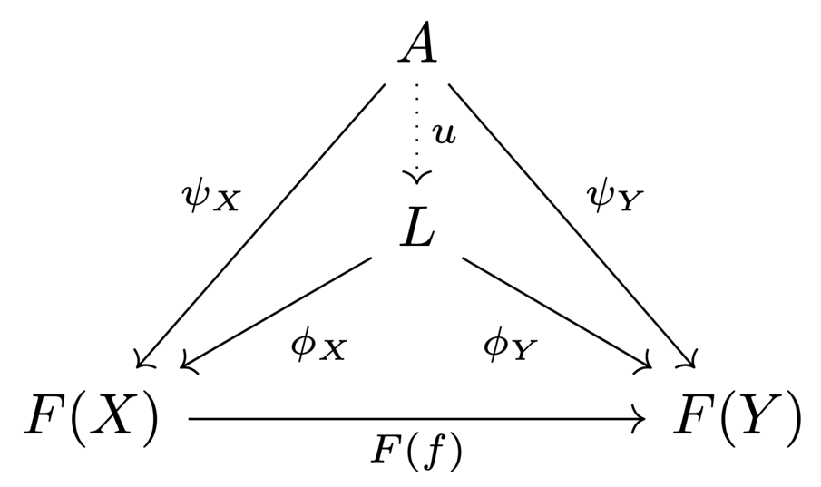
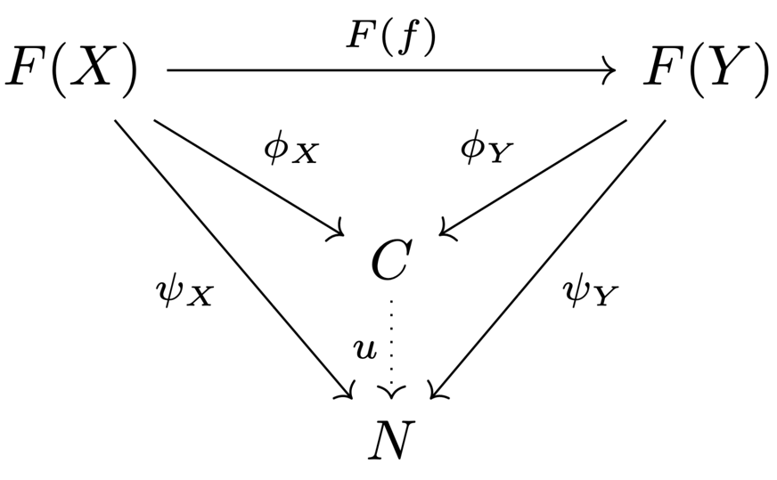

# 7 Categories

    $\newcommand{\J}{\mathcal{J}}$

## Categories

??? example "Example 7.1"
    Many areas of mathematics deal with objects of a certain type that are related pairwise
    through certain types of maps (or other structures):
    
    - **Set theory**: sets and maps
    - **Linear algebra**: vector spaces and linear maps
    - **Algebra**: groups and homomorphisms, rings and homomorphisms, modules and homomorphisms
    - **Topology**: topological spaces and continuous maps
    - **Metric geometry**: metric spaces and 1 -Lipschitz maps
    - **Differential topology**: manifolds and smooth maps
    
    The common framework for all these examples is the concept of a *category*.

??? definition "Definition 7.2"
    ### Category

    A category $\Cat$ consists of the following data:
    
    - A class of objects $Ob(\Cat)$.
    - A class $\Hom_\Cat(X, Y)$ of morphisms for each pair $X, Y$ of $Ob(\Cat)$,
    including a special *identity* morphism $\Id_X \in \Hom(X, X)$ for each
    object $X$.
    - A *composition* operation
    $\circ ∶ \Hom(X, Y) \times \Hom(Y, Z) \to \Hom(X, Z)$, satisfying
    $\Id \circ f = f \circ Id = f$ and
    $(f \circ g) \circ h = f \circ (g \circ h)$.

??? remark "Remark 7.3"
    - The identity morphism is unique for every object.
    - A morphism $f ∶ X \to Y$ is an *isomorphism* if there is another morphism
    $f^{−1} ∶ Y \to X$ such that $f^{−1} \circ f = \Id_X$ and $f \circ f^{−1} = \Id_Y$.
    - A *full subcategory* of a category $\Cat$ is a category $\Cat′$ whose objects are a
    subclass of $\Ob(\Cat)$, and $\Hom_{\Cat′}(X, Y) = \Hom_\Cat (X, Y)$.
    - Every category $\Cat$ has an *opposite category* $\Cat^\op$:
        - The objects are the same: $\Ob(\Cat^\op) = \Ob(\Cat)$.
        - The morphisms are formally reversed: $\Hom_{\Cat^\op} (X, Y) = \Hom_\Cat (Y, X)$.

??? remark "Remark 7.4"
    Often, the class of objects is not a set.

    - For example, there is no set of all sets.
    - If the objects of a category form a set, it is a *small category*.

    ---

    Often, the classes of morphisms $\Hom(X, Y)$ are sets. Then, we talk about a
    *locally small category*.

    ---

    In Zermelo-Fraenkel set theory, the notoin of a class is informal. Classes are
    described indirectly by logical formulas.

    We omit such set-theoretic questions in this course.

??? example "Example 7.5"
    The following examples can also be viewed as categories:

    1. A group can be viewed as a certain category with one object:
        - The morphisms are the elements of the group, and every morphism is invertible.
        - Composition is defined as the group operation.
        - The identity morphism is the neutral element of the group.
    2. More generally, a *monoid* is a category with one object.
        - Classically, a monoid is a set with an associative operation and a neutral element.
    3. A *groupoid* is a small category where every morphism is invertible.
    4. A poset $(P, \le)$ is a category:
        - The objects are $P$.
        - There is a single morphism $x \to y$ if $x \le y$, and no morphism $x \to y$ if
    $x \not\le y$.

## Functors

??? definition "Definition 7.6"
    ### Functor

    A **functor** is a structure-preserving mapping between two categories. A functor
    $F$ from $\Cat$ to $\D$ assigns

    - to each object $X$ of $\Cat$ an object $F(X)$ of $\D$, and
    - to each morphism $f ∶ X \to Y$ of $\Cat$ a morphism $F(f) ∶ F(X) \to F(Y)$ of $\D$,
        - respecting identities: $F(\Id) = \Id$,
        - and composition: $F(f \circ g) = F(f) \circ F(g)$.

    As an important consequence, functors preserve isomorphisms.

??? example "Example 7.7"
    The *free functor* $F : \bm{\operatorname{Set}} \to \bm{\operatorname{Vect}}_k$ assigns to
    a set $B$ the vector space freely generated by the basis $B$.

    ---

    The *forgetful functor* $U : \bm{\operatorname{Vect}}_k \to \bm{\operatorname{Set}}$ assigns
    to a vector space $V$ the set of its vectors, forgetting the vector space structure.

    ---

    If $P, Q$ are posets, then a functor $P \to Q$ is an order-preserving map.

    ---

    For any locally small category $\Cat$ and any object $X$ of $\Cat$, we have a functor
    $\Hom(X, −) ∶ \Cat \to \bm{\operatorname{Set}}$ given by assigning

    - to any object $Y : \Cat$ the set of morphisms $\Hom(X, Y)$, and
    - to any morphism $f ∶ Y \to Z$ the map given by postcomposition with $f$:

    $$
    \begin{align*}
        \Hom(X, Y) &\to \Hom(X, Z) \\
        g &\mapsto g \circ f
    \end{align*}
    $$ 

    similarly, by precomposition, we obtain a functor
    $\Hom(−, X) ∶ \Cat^\op \to \bm{\operatorname{Set}}$.

    ---

    A commutative diagram in $\Cat$ encodes a functor $F$ from some poset $P$ to $\Cat$:

    

## Natural transformations

Given two categories $\Cat, \D$, the functors from $\Cat$ to $\D$ form a category.

??? definition "Definition 7.8"
    ### Natural transformation

    Let $F, G$ be functors from $\Cat$ to $\D$. A **natural transformation** $\eta$ from $F$ to $G$
    assigns to every $X$ in $\Cat$ a morphism $\eta_X ∶ F(X) \to G(X)$ in $\D$, such that for every
    morphism $f ∶ X \to Y$ in $\Cat$, the following diagram commutes:

    

    - We sometimes write $\eta ∶ F \Rightarrow G$.
    - If $\eta_X$ is an isomorphism for every $X$, we call $\eta$ a **natural isomorphism**, and say that $F$
    and $G$ are isomorphic.

??? definition "Definition 7.9"
    ### Equivalence of categories

    An **equivalence** of two categories $\Cat$ and $\D$ consists of two functors $F ∶ \Cat \to \D$ and
    $G ∶ \D \to \Cat$ such that $G \circ F$ anf $F \circ G$ are naturally isomorphic to the identity functors.

??? definition "Definition: Fully faithful, essentially surjective"
    A functor $F ∶ \Cat \to \D$ is **fully faithful** if for every pair of objects $X, Y \in \Cat$, the functor
    $F$ induces a bijection $\Hom_\Cat(X, Y) \cong \Hom_\D(F(X), F(Y))$.

    A functor $F ∶ \Cat \to \D$ is **essentially surjective** if every object $Z$ in $\D$, is isomorphic to some
    object of the form $F(X)$ for some $X$ in $\Cat$.

??? proposition "Proposition 7.10"
    ### Single-functor equivalence 

    A functor $F ∶ \Cat \to \D$ between locally small categories yields an equivalence of categories $\iff$
    $F$ is fully faithful and essentially surjective.

??? example "Example 7.11"
    The category $\bm{\operatorname{vect}}_k$ of finite-dimensional vector spaces is equivalent to the category
    $\bm{\operatorname{Mat}}_k$ of finite-dimensional matrices over $k$.

    - objects $\{k^n \mid n \in \N\}$
    - morphisms $k^n \to k^m$ the $m \times n$-matrices over $k$.

    The functor $L$ sending a matrix to the corresponding linear map is fully faithful and essentially
    surjective.

## Limits

??? definition "Definition 7.12"
    ### Diagram

    Let $\J$ be a small category. A functor $F ∶ \J \to \Cat$ is also called a **diagram** of shape $\J$.

    A cone over $F$ consists of

    - an object $A$ in $\Cat$ (the **apex** of the cone),
    - and a morphism $\psi_X : A \to F(X)$ for every object $X$ in $\J$

    such that for every morphism $f ∶ X \to Y$ in $\J$, the following diagram commutes:

    

    ---

    A **limit** over $F$ is a terminal cone $(L, \phi)$: every other cone $(A, \psi)$ over $F$ factors uniquely
    through $(L, \phi)$.

    ---

    There is a dual notion of a **colimit** (all arrows are reversed).

    

??? example "Example 7.13"
    A pullback is a limit over a diagram of the shape $A \to B \gets C$ (a cospan); 
    a pushout is a colimit over a diagram of the shape $A \gets B \to C$ (a span).

    ---

    A product is a limit over a diagram with a *discrete* indexing category (only identity morphisms); 
    a coproduct (sum) is a limit of a colimit over such a diagram. 

## Adjoint functors

??? example "Example 7.14"
    Recall that a linear map $f ∶ V \to W$ is determined uniquely by its restriction to a basis $B$ of $V$,
    and vice versa.

    - Using the free functor $F$, we have a canonical isomorphism $V \cong F(B)$.
    - Using the forgetful functor $U$, the above statemant can thus be written as
    $\Hom_{\bm{\operatorname{Vect}}_k}(F(B), W) \cong \Hom_{\bm{\operatorname{Set}}}(B, U(W))$.

    ---

    Let $X$ be a locally path-connected space, and $Y$ be a discrete space. Then, $f : X \to Y$ is continuous
    $\iff f$ is constant on each path-connected component of $X$.

    Using the discrete topology functor $D$ and the full subcategory $\bm{\operatorname{lpcTop}}$ of locally
    path-connected spaces, the above can be written as
    $\Hom_{\bm{\operatorname{Set}}}(\pi_0(X), P) \cong \Hom_{\bm{\operatorname{lpcTop}}}(X, D(P))$.

    ---

    A *Galois connection* between two posets $(P, \le), (Q, \le)$ consists of to order-preserving maps
    $f ∶ P \to Q, g ∶ Q \to P$ such that $f(x) \le y \iff x \le g(y) \forall x \in P, y \in Q$.

    Interpreting $P, Q$ as categories, the above can be written as
    $\Hom_Q(f(x), y) \cong \Hom_P(x, g(y))$.

??? definition "Definition 7.15"
    An **adjunction** between two locally small categories $\Cat, \D$ consists of two functors
    $F ∶ \Cat \to \D$ and $G ∶ \D \to \Cat$ such that for all objects $X$ in $\Cat$ and $Y$ in $\D$,
    there is a bijection

    $$\eta_{X, Y} ∶ \Hom_\D(F(X), Y) \overset{\cong}{\to} \Hom_\Cat(X, G(Y))$$

    and these are natural in $X$ and $Y$: they assemble to natural isomorphisms

    $$
    \begin{align*}
        \eta_{X, −} ∶ \Hom_\D(F(X), −) &\overset{\cong}{\Rightarrow} \Hom_\Cat(X, G(−)) \text{ for any fixed } X, \\
        \eta_{−, Y} ∶ \Hom_\D(F(-), Y) &\overset{\cong}{\Rightarrow} \Hom_\Cat(-, G(Y)) \text{ for any fixed } Y.
    \end{align*}
    $$

    In this case, $F$ is **left adjoint** to $G$, and $G$ is **right adjoint** to $F$, written as $F \dashv G$.

??? theorem "Theorem 7.16"
    ### Right adjoint preserves limits 

    $\begin{align*}
        \text{Let } & G ∶ \D \to \Cat \text{ be right adjoint functor} \\
        & (L, \phi) \text{ be a limit over a diagram } H ∶ \J \to \D.
    \end{align*}$

    Then, $(G(L), G(\phi))$ is a limit over the diagram $G \circ H ∶ \J \to \Cat$.

    Dually, left adjoints preserve colimits.