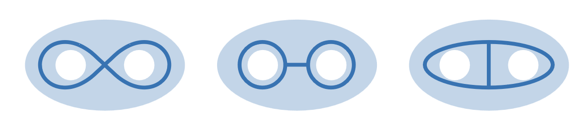
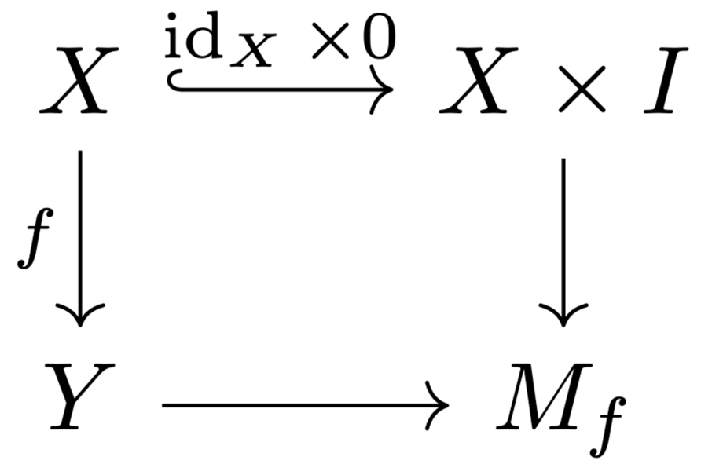
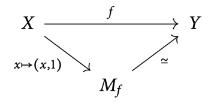
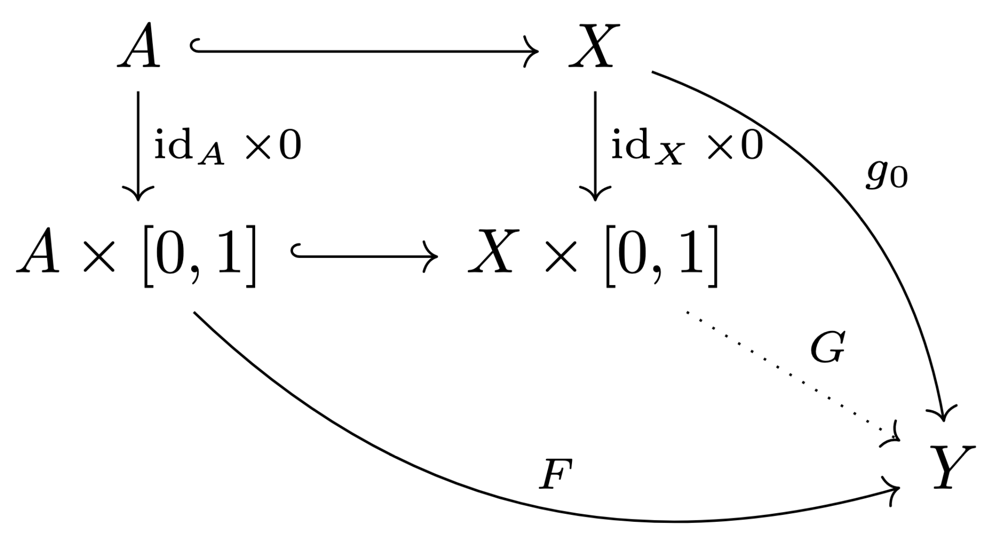
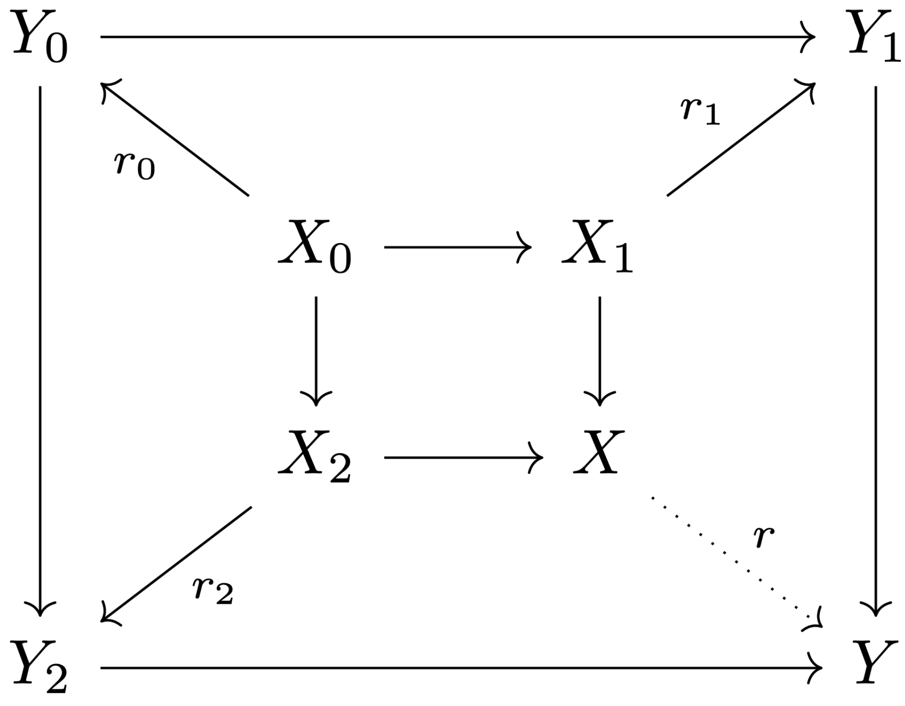
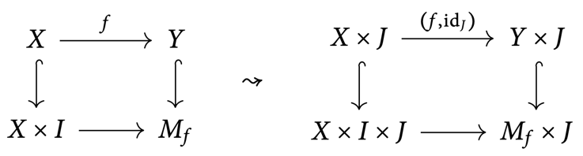
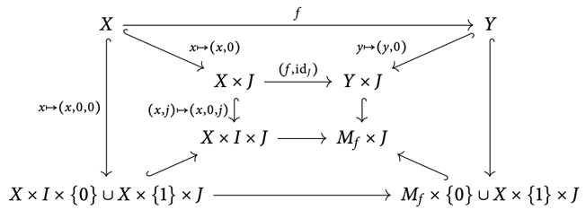
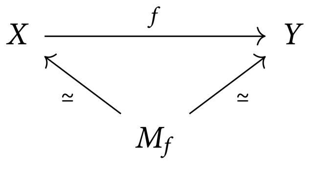

# 8 Homotopies

## Homotopies

???+ definition "Definition 8.1"
    ### Homotopy

    $\begin{align*}
        \text{Let } & X, Y \text{ be topological spaces} \\
        & f_0, f_1 : X \to Y \text{ be continuous maps} \\
    \end{align*}$

    $f_0, f_1$ are **homotopic** $(f_0 \simeq f_1)$ if

    $$
    \begin{align*}
        & \exists\, F : X \times [0, 1] \to Y \text{ continuous s.t.} \\
        & \quad
        \begin{cases}
            f_0(x) = F(x, 0) \\
            f_1(x) = f(x, 1)
        \end{cases}
    \end{align*}
    $$

    $F$ is called a **homotopy** from $f_0$ to $f_1$.

???+ remark "Remark 8.2"
    Homotopy is an equivalence relation on the set of continuous maps $X \to Y$.

    Denoty by $[X, Y]$ the set of equivalence classes, and the homotopy class of $f$ by $[f]$.

???+ example "Example 8.3"
    The identity map $S^1 \to S^1$ and the map $z \mapsto z^2$ are not homotopic.

    ---

    $[z \mapsto z^n]$ are disctinct homotopy classes which generated $[S^1, S^1]$.

???+ definition "Definition 8.4"
    ### Nullhomotopic and essential maps

    A map is **nullhomotopic** if it is homotopic to a constant map, and **essential**
    otherwise.

???+ example "Example 8.5"
    1. The identity map is essential on $S^1$, and nullhomotopic on $\R^n$.
    2. The inclusion $S^1 \hookrightarrow S^2$ is nullhomotopic. In fact, any map
    $S^1 \to S^2$ is nullhomotopic.

## Homotopy equivalence

???+ definition "Definition 8.6"
    ### Homotopy equivalence

    $X, Y$ are **homotopy equivalent** $(X \simeq Y)$ if

    $$
    \begin{align*}
        & \exists\, f : X \to Y, g : Y \to X \text{ s.t.} \\
        & \quad
        \begin{cases}
            g \circ f \simeq \text{id}_X \\
            f \circ g \simeq \text{id}_Y
        \end{cases}
    \end{align*}
    $$

    $f$ and $g$ are called **homotopy equivalences**.

???+ example "Example 8.7"
    1. The circle, the cylinder, and the Moebius strip are homotopy equivalent.
    2. 

    

???+ remark "Remark 8.8"
    $\simeq$ is an equivalence relation. The equivalence classes are called **homotopy types**.

    ---

    Lt $f : X \to Y, g: Y \to X$ be homotopy equivalences. Then for all topological spaces
    $T$, there exists bijections

    $$[X, T] \rightleftarrows [Y, T] \text{ and } [T, X] \rightleftarrows [T, Y]$$

    These are induced by pre-/post-composition with $f$ or $g$.

    ---

    Homotopy classes form the morphisms of a category $\operatorname{hoTop}$, where

    - objects are topoogical spaces
    - the identities are $[\id_X]$

    Two spaces are equivalent in $\operatorname{hoTop} \iff$ they are homotopy equivalent.

???+ definition "Definition 8.9"
    ### Contractible space

    A space is **contractible** if it is homotopy equivalent to a one-point space $*$.

???+ remark "Remark 8.10"
    If $X$ is contractible, then for all topological spaces $T$, we have

    $$[X, T] \cong [*, T] \cong * \cong [T, *] \cong [T, X]$$

???+ example "Example 8.11"
    1. $\R^n$ is contractible.
    2. $S^n$ is not contractible.
    3. The *dunce hat* is contractible.

## Retracts and deformation retracts

???+ definition "Definition 8.12"
    ### Relative homotopy

    $\begin{align*}
        \text{Let } & A \subseteq X \text{ be a subspace} \\
        & f_0, f_1 : X \to Y
    \end{align*}$

    $f_0, f_1$ are **homotopic relative** to $A$ $(f_0 \simeq f_1 \rel A)$ if

    $$
    \begin{align*}
        & \exists\, F : X \times [0, 1] \to Y
        \text{ homotopy from } f_0 \text{ to } f_1 \text{ s.t.} \\
        & \quad f_0(a) = F(a, t) = f_1(a) \quad \forall a \in A, t \in [0, 1]
    \end{align*}
    $$

???+ definition "Definition 8.13"
    ### Retract, (strong) deformation retraction

    $\begin{align*}
        \text{Let } & i : A \hookrightarrow X \text{ be an inclusion} \\
        & r : X \to A \text{ be a retraction} \quad (r \circ i = \id_A)
    \end{align*}$

    $A$ is called a **retract** of $X$.

    If $i \circ r \simeq \id_X (\rel A)$, we say that the homotopy is a (**strong**)
    **deformation retraction**, and $A$ is a (**strong**) **deformation retract** of $X$. In
    particular, $X$ and $A$ are homotopy equivalent.

???+ example "Example 8.14"
    
    

???+ theorem "Theorem 8.15"
    ### Retracts and extensions of maps 

    Let $A \subseteq X.$

    $$A \text{ is a retract of } X \iff \text{ any map on } A \text{ extends to } X.$$

    ???+ proof
        === "$\implies$"
            $\begin{align*}
                \text{Let } & r : X \to A \text{ be a retraction} \\
                & i : A \hookrightarrow X \text{ be an inclusion} \\
                & f : A \to Y \text{ be a map}
            \end{align*}$
            
            Then, on $A$, we have
    
            $$(f \circ r) \circ i = f \circ (r \circ i) = f \circ \id_A = f,$$

            so $f \circ r$ is an extension of $f$ to $X$.

        === "$\impliedby$"
            $\id_A$ extends to a map $r : X \to A$, and $r$ is a retraction.

???+ theorem "Theorem 8.16"
    ### Deformation retracts and unique extensions of maps 

    Let $A \subseteq X$ be a subspace.

    $$A \text{ is a (strong) deformation retract of } X \iff \text{ any map on } A
    \text{ extends to } X \text{ uniquelly up to homotopy} (\rel A).$$

    ???+ proof
        === "$\implies$"
            $\begin{align*}
                \text{Let } & r : X \to A \text{ be a retraction } :
                i \circ r \simeq \id_X \rel A \\
                & f_0, f_1 : X \to Y \text{ be to extensions of} \\
                & f = f_0 \circ i  f:1 \circ i : A \to Y
            \end{align*}$

            $$\implies f \simeq f_0 \circ i \circ r = f_1 \circ i \circ r \simeq f_1 \rel A$$

        === "$\impliedby$"
            $\id_A$ extends to a map $r : X \to A$. Both $i \circ r$ and $\id_X$ are extensions
            of $i : A \hookrightarrow X$. By hypothesis, they are homotopic relative to $A$,

???+ remark "Remark 8.17"
    Even if $i : A \hookrightarrow X$ is a homotopy equivalence, $A$ is not always a
    deformation retract on $X$. For example, there may exist $r : X \to A$ such that
    $r \circ i \simeq \id_A$, but $r$ may not fix the points of $A$.

## Homotopy extension property

???+ definition "Definition 8.18"
    ### Mapping cylinder

    Let $f : X \to Y$ be a continuous map. The **mapping cylinder** of $f$ is the
    adjunction space $M_f$ of the pushout square

    

???+ remark "Remark 8.19"
    $Y$ is a strong deformation retract of $M_f$. Hence, any map $f : X \to Y$ factors
    into an inclusion and a homotopy equivalence:

    

???+ definition "Definition 8.20"
    ### Homotopy extension property (HEP)

    Let $(A \subseteq X)$ be a closed subspace. The pair $(X, A)$ has the **homotopy
    extension property** if

    - for all spaces $Y$
    - for all homotopies $F : A \times [0, 1] \to Y$ from $f_0$ to $f_1$
    - for any map $g_0 : X \to Y$ extending $f_0$,

    there exists a homotopy $G : X \times [0, 1] \to Y$ from $g_0$ to some $g_1$
    extending $F$:

    

???+ lemma "Lemma 8.21"
    ### HEP and inclusion mapping cylinder 

    Let $R = A \times [0, 1] \cup X \times \{0\}$.

    $$\text{The pair } (X, A) \text{ has the HEP} \iff R \text{ is a deformation retract of }
    X \times [0,1]$$

    ???+ proof
        === "$\implies$"
            $\begin{align*}
                \text{Let } & F : A \times [0, 1] \hookrightarrow R \\
                & g_0 : X \cong X \times \{0\} \hookrightarrow R \text{ be inclusions}
            \end{align*}$

            $\begin{align*}
                \overset{\text{HEP}}{\implies} & \exists\, G : X \times [0, 1] \to R
                \text{ extension of } F, g_0 \\
                \implies & G \text{ is retraction of the inclusion }
                R \hookrightarrow X \times [0, 1]
            \end{align*}$

        === "$\impliedby$"
            $\begin{align*}
                \text{Let } & r : X \times [0, 1] \to R \text{ be a retraction of} \\
                & i : R \hookrightarrow X \times [0, 1]
            \end{align*}$

            $R$ is the pushout of of $A \subseteq X$ and $A \times [0, 1]$. Hence, for
            the homotopy $F : A \times [0, 1] \to Y$ from $f_0$ to $f_1$ and the extension
            $g_0 : X \to Y$ of $f_0$, we get by the universal property of the pushout the map
            $k : R \to Y$.

            The homotopy $k \circ r : X \times [0, 1] \to Y$ extends $k$, and thus $F$ and
            $f_0$.

???+ corollary "Corollary 8.22"
    ### Products preserve the HEP 

    If $(X, A)$ has the HEP, then so does $W \times X, W \times A)$ for all spaces $W$.

    ???+ proof
        If $r : X \times I \to R$ is a retraction, then so is
        $\id_W \times r : W \times (X \times I) \to W \times R$.

## Deformation retractions via the homotopy extension property

???+ theorem "Theorem 8.23"
    ### Strong deformation retract from HEP 

    If $(X, A)$ has the HEP and $i : A \hookrightarrow X$ is a homotopy equivalence, then
    $A$ is a strong deformation retract of $X$.

    ???+ proof
        **Step 1:** $A$ is a deformation retract of $X$.

        Let $g : X \to A$ be a homotopy inverse of $i$.

        $\begin{align*}
            \implies & g \circ i \simeq \id_A \\
            \overset{\text{HEP}}{\implies}
            & \exists\, r : X \to A \text{ retraction } : g \simeq r
        \end{align*}$

        $\begin{align*}
            & i \circ r \simeq i \circ g \simeq \id_X \\
            & \implies r \text{ is another homotopy inverse of } i \\
            & \implies r \text{ is a deformation retraction: }
            r \circ i = \id_A, i \circ r \simeq \id_X
        \end{align*}$

        **Step 2:** $A$ is a strong deformation retract of $X$.

        $\begin{align*}
            \text{Let } & I = [0, 1] \\
            & J = [-1, 1] \\
            & F : X \times I \to X \text{ be a homotopy from } i \circ r  \text{ to } \id_X
        \end{align*}$

        Define

        $$
        \begin{align*}
            G : (A \times J) \times I & \to X \\
            (a, s, t) & \mapsto F(a, \max(|s|, t))
        \end{align*}
        $$

        $$
        \begin{align*}
            \Phi : X \times J & \to X \\
            (x, s) & \mapsto
            \begin{cases}
                F(r(x), |s|), & s \le 0 \\
                F(x, s), & s \ge 0
            \end{cases}
        \end{align*}
        $$

        Then, $\Phi$ is well defined:

        $$\Phi(x, o) = F(r(x),0) = r(r(x)) = r(x) = F(x, 0)$$

        Note that

        $$
        \begin{align*}
            G(a, s, 0) & = F(a, |s|) = \Phi(a, s) \\
            G(a, s, t) & = a, & t = 1 \lor s = \pm 1
        \end{align*}
        $$

        By [C.8.22](#c822), $(X \times J, A \times J)$ inherits the HEP from $(X, A)$,
        so $G, \Phi$ extends to a homotopy $H : (X \times J) \times I \to X$.

        Note that

        $$
        \begin{align*}
            H(x, -1, 0) & = \Phi(x, -1) = F(r(x), 1) = r(x) \\
            H(x, 1, 0) & = \Phi(x, 1) = F(x, 1) = x
        \end{align*}
        $$

        Now, consider the restriction of $H$ to

        $$\{(x, s, t) \in X \times J \times I \mid t = 1 \lor s = \pm 1\} \cong X \times I$$

        Reparametrizing yields a homotopy from $r$ to $\id_X$ relative to $A$.

## Homotopy equivalences and gluing

???+ lemma "Lemma 8.24"
    ### Inclusion mapping cylinder is strong deformation retract 

    If $(X, A)$ has the HEP, then the inclusion mapping cylinder
    $R = A \times [0, 1] \cup X \times \{0\}$ is a strong deformation retract of
    $X \times [0, 1]$.

    ???+ proof
        ???+ proof "Claim: $R \hookrightarrow X \times I$ is a homotopy equivalence"
            Both $R, X \times I$ deformation retract to $X \times \{0\}$.

        Let
        $S := R \times I \times J \cup X \times 
        \Big(I \times \{0\} \cup \{0\} \times J\Big)$.

        ???+ proof "Claim: $S$ is a retract of $(X \times I) \times J$"
            We can reformulate $S$ as

            $$S = A \times I \times J \cup X \times \Big(I \times \{0\} \cup \{0\} \times J\Big)$$

            Additionally, $(I \times \{0\}) \cup (\{0\} \times J) \cong I \times \{0\}$,
            so we have

            $$S \cong A \times I \times J \cup X \times I \times \{0\}$$

            By [C.8.22](#c822), $(X \times I, A \times I)$ has the HEP. Then, by
            [L.8.21](#l821), $S$ is a retraction of $(X \times I) \times J$.

        This somehow implies that $(X \times I, R)$ has the HEP, and by [T.8.23](#t823),
        $R$ is a strong deformation retract of $X \times I$.

???+ theorem "Theorem 8.25"
    ### Homotopic attaching maps yields homotopy equivalent spaces 

    $(X, A)$ has the HEP and $f \simeq g : A \to B \iff B \cup_f X \simeq B \cup_g X$.

    ???+ proof
        By [L.8.24](#l824), $A \times I \cup X \times \{0\}$ is a strong deformation retract
        of $X \times I$.

        Let $F : A \times I \to B$ be a homotopy from $f$ to $g$. Then,
        $B \cup_F (A \times I \cup X \times \{0\})$ is a strong deformation retract of
        $B \cup_F (X \times I)$.

        Additionally, as $F(A \times I) \subseteq B$, we have

        $$B \cup_F (A \times I \cup X \times \{0\}) \cong B \cup_f (X \times \{0\})$$

        Similarly can be done for $B \cup_g (X \times \{0\})$ and
        $B \cup_F (A \times I \cup X \times \{0\})$.

???+ corollary "Corollary 8.26"
    The dunce hat is contractible.

## Homotopy equivalence by deformation retractions

???+ lemma "Lemma 8.27"
    ### Pushout and retractions 

    In any category,

    - retractions preserve pushouts
    - pushouts preserve retractions.

    So given any commutative diagram

    

    where the inner square is a pushout and the $r_i$ are retractions, we have

    $$\text{The outer square is a pushout} \iff r \text{ is a retraction.}$$

???+ lemma "Lemma 8.28"
    ### HEP of a mapping cylinder and domain 

    $\begin{align*}
        \text{Let } & f : X \to Y \text{ be a continuous map} \\
        & M_f \text{ be the mapping cylinder of } f
    \end{align*}$

    $$\implies (M_f, X) \text{ has the HEP}$$

    ???+ proof
        $$(M_f, X) \text{ has the HEP} \iffhref{#l821}{L.8.21}
        R = X \times I \cup M_f \times \{0\} \text{ is a retract of } M_f \times I$$

        We construct a retraction

        $$M_f \times J \surjectiveto M_f \times \{0\} \cup X \times \{1\} \times J$$

        By [P.6.31](../6_compactness#p623), taking products with $J$ preserves the pushout
        property of the mapping cylinder:

        

        We construct the retraction of $M_f \times J$ via compatible retractions of the
        remaining spaces in the pushout square. We have the pushout square of subspaces

        

        The projections $X \times J \surjectiveto X$ and $Y \times J \surjectiveto Y$ are
        retractions.

        Additionally, there is a retraction
        $I \times J \surjectiveto I \times \{0\} \cup \{1\} \times J$, which we can restrict
        to $\{0\} \times J \surjectiveto \{0\} \times \{0\}$.

        Taking products with $X$ yields a retraction
        $X \times I \times J \surjectiveto X \times I
        \times \{0\} \cup X \times \{1\} \times J$.

        These retractions commute with the pushout squares, so by [L.8.27](#l827), the
        map $M_f \times J \surjectiveto M_f \times \{0\} \cup X \times \{1\} \times J$ is
        a retraction.

???+ theorem "Theorem 8.29"
    ### Deformation retracts from homotopy equivalence 

    If $X \simeq Y$, then there is a space $Z$ having both $X$ and $Y$ as strong deformation
    retracts.

    ???+ proof
        Let $f : X \to Y$ be a homotopy equivalence.

        Then, by [R.8.19](#r819), $Z = M_f$ has $Y$ as a strong deformation retract.
        Additionally, $X \hookrightarrow M_f$ is a homotopy equivalence.

        By [L.8.28](#l828), $(M_f, X)$ has the HEP, so by [T.8.23](#t823), $X$ is a strong
        deformation retract of $M_f$.

        This yields the following diagram, which commutes up to homotopy:

        

